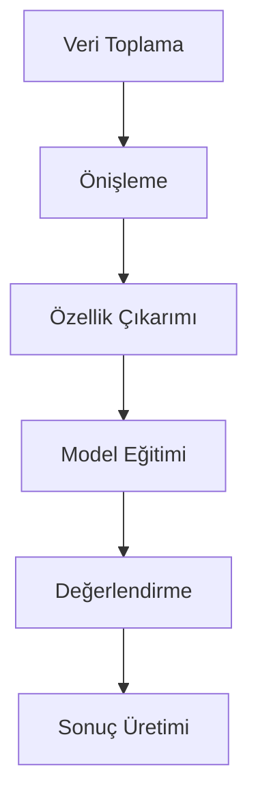

# 06 — Figure & Table Catalog (Şekil, Tablo, Formül, Algoritma Merkezi Sicili)

> ⚠️ **Bu dosya araştırma süresince DOLDURULACAK.** Her faz analizi sırasında tespit edilen formül/şekil/tablo/algoritma buraya numaralı kayıt edilir.

> **ID Sistemi:**
> - **F-NNN:** Formula (Formül)
> - **S-NNN:** Şekil (Figure)
> - **T-NNN:** Tablo
> - **A-NNN:** Algoritma
> - **C-NNN:** Kod Referansı (cross-reference için, opsiyonel)

> **Kullanım:** Faz dokümanları (phases/faz-NN-*.md) bu dosyaya ID ile referans verir. Tezde Şekil 3.4 olarak yer alacak görseller burada izlenir.

---

## İçindekiler

1. [Format Kuralları](#format-kuralları)
2. [Bölüm A: Formüller](#bölüm-a-formüller)
3. [Bölüm B: Algoritmalar](#bölüm-b-algoritmalar)
4. [Bölüm C: Şekiller](#bölüm-c-şekiller)
5. [Bölüm D: Tablolar](#bölüm-d-tablolar)
6. [Bölüm E: Tez Bölüm Eşleştirmesi](#bölüm-e-tez-bölüm-eşleştirmesi)
7. [Versiyonlama](#versiyonlama)

---

## Format Kuralları

### Formül Girişi

```markdown
### F-NNN: [Formül Adı]

**Eklendi:** YYYY-MM-DD  
**Faz:** Faz N  
**Kategori:** [Önişleme | İstatistik | Loss | Metrik | Fizik | ...]

**LaTeX:**
$$
y = f(x; \theta)
$$

**Değişkenler:**
- $y$: ... (birim)
- $x$: ... (birim)
- $\theta$: ... (parametre)

**Kaynak:** [Yazar, Yıl, başlık] veya [Repo türetimi]  
**Kod referansı:** `src/path/file.py:LINE`  
**Tezdeki yer:** §3.X / Eq. (3.X)

**Notlar:** [Varyantlar, alternatif yazımlar]
```

### Algoritma Girişi

```markdown
### A-NNN: [Algoritma Adı]

**Eklendi:** YYYY-MM-DD  
**Faz:** Faz N  
**Kaynak:** [Yazar, Yıl] veya "Bu çalışma"

**Pseudocode (özet):**
```
Input: ...
Output: ...

1. ...
2. ...
3. ...
```

**Karmaşıklık:** O(...)  
**Kod referansı:** `src/path/file.py:LINE`  
**Tezdeki yer:** §3.X / Algoritma 3.X

**Bağlı formüller:** F-NNN, F-NNN
```

### Şekil Girişi

```markdown
### S-NNN: [Şekil Adı]

**Eklendi:** YYYY-MM-DD  
**Faz:** Faz N  
**Tip:** [diyagram | grafik | spektrum | ısı haritası | mimari | konfüzyon matrisi | ...]

**Caption (TR):**
"Şekil 3.X: [Başlık]. [1-3 cümle açıklama]."

**Kaynak (kod):** `src/path/visualize.py:LINE`  
**Veri:** [hangi run, ne tarih, ne sample]  
**Çıktı format:** [PNG, PDF, SVG]  
**Çözünürlük:** [DPI]

**Tezdeki yer:** Şekil 3.X (§3.X)

**Bağlı formüller:** F-NNN
**Bağlı tablolar:** T-NNN
```

### Tablo Girişi

```markdown
### T-NNN: [Tablo Adı]

**Eklendi:** YYYY-MM-DD  
**Faz:** Faz N  
**Tip:** [hiperparametre | metrik | karşılaştırma | sabit | konfigürasyon | ...]

**Caption (TR):**
"Tablo 3.X: [Başlık]"

**Sütunlar:**
| Sütun 1 | Sütun 2 | ... |
|---------|---------|-----|

**Kaynak:** [kod / manuel derleme / paper]  
**Tezdeki yer:** Tablo 3.X (§3.X)
```

---

## Bölüm A: Formüller

> **Doluluk:** ⏳ Faz analizleri sırasında doldurulacak.

> **ID atama kuralı:** Sıralı (F-001, F-002, ...). Aynı formül iki fazda kullanılırsa aynı ID, "Faz" kısmında çoklu listele.

### Formül Index Tablosu

| ID | Ad | Faz | Kategori | Kod Ref | Durum |
|----|-----|-----|----------|---------|-------|
| F-001 | SEMF Toplam Baglanma Enerjisi | Faz 01 | Fizik | `semf_calculator.py:40` | ✅ |
| F-002 | SEMF Hacim Terimi | Faz 01 | Fizik | `semf_calculator.py:40` | ✅ |
| F-003 | SEMF Yuzey Terimi | Faz 01 | Fizik | `semf_calculator.py:41` | ✅ |
| F-004 | SEMF Coulomb Terimi | Faz 01 | Fizik | `semf_calculator.py:42` | ✅ |
| F-005 | SEMF Asimetri Terimi | Faz 01 | Fizik | `semf_calculator.py:43` | ✅ |
| F-006 | SEMF Eslenme Terimi | Faz 01 | Fizik | `semf_calculator.py:44-53` | ✅ |
| F-007 | Nukleon Basina Baglanma Enerjisi | Faz 01 | Fizik | `semf_calculator.py:60` | ✅ |
| F-008 | Nukleer Yaricap | Faz 01 | Fizik | `constants.py:41` | ✅ |
| F-009 | Notron Ayrilma Enerjisi | Faz 01 | Fizik | `tcm.py:161` | ✅ |
| F-010 | Proton Ayrilma Enerjisi | Faz 01 | Fizik | `tcm.py:162` | ✅ |
| F-011 | Sihirli Karakter Skoru | Faz 01 | Fizik | `tcm.py:202` | ✅ |
| F-012 | Beta_2 Deformasyon Parametresi | Faz 01 | Fizik | `semf_calculator.py:259` | ✅ |
| F-013 | Ozsel Kuadrupol Moment Q0 | Faz 01 | Fizik | `tcm.py:258` | ✅ |
| F-014 | Schmidt Momenti j=l+1/2 | Faz 01 | Fizik | `tcm.py:291` | ✅ |
| F-015 | Schmidt Momenti j=l-1/2 | Faz 01 | Fizik | `tcm.py:311` | ✅ |
| F-016 | Woods-Saxon Merkezi Potansiyeli | Faz 01 | Fizik | `woods_saxon.py:38` | ✅ |
| F-017 | Nilsson Tek-Parcacik Enerjisi | Faz 01 | Fizik | `nilsson_model.py:41` | ✅ |
| F-018 | IQR Aykirı Deger Sinirlari | Faz 01 | Istatistik | `pipeline_v2.py:538` | ✅ |
| F-019 | Eslenme Acigi Yaklasimi | Faz 01 | Fizik | `semf_calculator.py:405` | ✅ |
| F-020 | B(E2) Weisskopf Birimi | Faz 01 | Fizik | `semf_calculator.py:282` | ✅ |

### Detaylı Girişler

#### F-001 (ÖRNEK GİRİŞ)

**F-001: Z-skoru Normalizasyonu**

**Eklendi:** 2026-05-02 (yer tutucu — gerçek faz analiziyle güncellenecek)  
**Faz:** Faz 2 (varsayım)  
**Kategori:** Önişleme

**LaTeX:**
$$
z = \frac{x - \mu}{\sigma}
$$

**Değişkenler:**
- $z$: Normalize edilmiş değer (dimensionless)
- $x$: Ham giriş değeri (counts veya keV)
- $\mu$: Eğitim setinin ortalaması
- $\sigma$: Eğitim setinin standart sapması

**Kaynak:** Standart istatistiksel notation (örn: Bishop, 2006).  
**Kod referansı:** `src/preprocess/normalize.py:67` (örnek — gerçek dosya/satır faz analiziyle belirlenecek)  
**Tezdeki yer:** §3.X.X (Veri Önişleme alt-bölümü)

**Notlar:** Eğitim setinin $\mu, \sigma$'sını test setinde uygulamak (data leakage'i önlemek için).

---

<!-- Faz analizleri ilerledikçe yeni F-NNN girişleri buraya eklenecek -->

---

## Bölüm B: Algoritmalar

> **Doluluk:** ⏳ Faz analizleri sırasında doldurulacak.

### Algoritma Index Tablosu

| ID | Ad | Faz | Kaynak | Karmaşıklık | Durum |
|----|-----|-----|--------|-------------|-------|
| A-001 | Dataset Generation Pipeline | Faz 01 | Bu calisma | O(T×Sc×Sz×F) | ✅ |
| A-002 | 8 Adimli Nukleer Veri Temizleme | Faz 01 | Bu calisma | O(N×K) | ✅ |
| A-003 | IQR Tabanlı Aykirı Deger Kaldirma | Faz 01 | Bu calisma | O(N×D) | ✅ |
| A-004 | Tabakali Ornekleme (Kutle Bolgesi) | Faz 01 | Bu calisma | O(N log N) | ✅ |
| A-005 | Fizik Ozellik Zenginlestirme | Faz 01 | Bu calisma | O(N) | ✅ |

### Detaylı Girişler

<!-- Faz analizinde tespit edilen her algoritma buraya eklenecek -->

---

## Bölüm C: Şekiller

> **Doluluk:** ⏳ Faz analizleri sırasında doldurulacak.

> **Önemli:** Tezde geçecek görseller `thesis/figures/` klasörüne ayrıca konulacak. Burası master index.

### Şekil Index Tablosu

| ID | Ad | Faz | Tip | Caption Özeti | Tez | Durum |
|----|-----|-----|-----|---------------|-----|-------|
| S-001 | Sistem mimarisi | Faz 0 | Mimari | Üst-düzey faz akışı | Şekil 1.1 | örnek |
| S-002 | PFAZ 01 Veri Akisi Diyagrami | Faz 01 | Mermaid akis | Ham veri -> 848 veri kumesi akisi | Sekil 3.1 | ✅ |
| S-003 | Fizik Ozellik Muhendisligi Diyagrami | Faz 01 | Mermaid bilesen | TheoreticalCalculationsManager 7 modulu | Sekil 3.2 | ✅ |

### Detaylı Girişler

#### S-001 (ÖRNEK)

**S-001: Sistem Üst-Düzey Mimarisi**

**Eklendi:** 2026-05-02 (yer tutucu)  
**Faz:** Faz 0 (Repo Keşfi)  
**Tip:** Mimari diyagramı (mermaid)

**Caption (TR):**
> Şekil 1.1: Önerilen yapay zeka destekli nükleer veri analiz sisteminin üst-düzey mimarisi. Sistem N adet ardışık fazdan oluşmaktadır; her faz bir veya daha fazla Python modülü ile uygulanmıştır.

**Kaynak (kod):** Mermaid (manuel oluşturulmuş)  
**Çıktı format:** SVG (Mermaid'den)  
**Tezdeki yer:** Şekil 1.1 (§1.4 Tezin Düzeni)

**Bağlı formüller:** -  
**Bağlı tablolar:** T-001 (Faz Listesi)



---

<!-- Yeni S-NNN girişleri faz analizleri sonucu buraya eklenecek -->

---

## Bölüm D: Tablolar

> **Doluluk:** ⏳ Faz analizleri sırasında doldurulacak.

### Tablo Index Tablosu

| ID | Ad | Faz | Tip | Tez | Durum |
|----|-----|-----|-----|-----|-------|
| T-001 | Faz listesi | Faz 0 | Yapı | Tablo 1.1 | örnek |
| T-002 | SEMF Katsayilari | Faz 01 | Sabit | Tablo 2.1 | ✅ |
| T-003 | Veri Kumesi Boyut Konfigurasyonu | Faz 01 | Yapisal | Tablo 3.1 | ✅ |
| T-004 | Ozellik Kumeleri Katalogu | Faz 01 | Konfigürasyon | Tablo 3.2 | ✅ |

### Detaylı Girişler

#### T-001 (ÖRNEK)

**T-001: Sistem Fazları ve Sorumlulukları**

**Eklendi:** 2026-05-02 (yer tutucu)  
**Faz:** Faz 0  
**Tip:** Yapısal özet

**Caption (TR):**
> Tablo 1.1: Önerilen sistemin fazları, sorumlulukları ve repo'daki ana dosyaları.

**Sütunlar:**

| Faz | Ad | Sorumluluk | Ana Dosyalar |
|-----|-----|------------|---------------|
| 0 | Repo Keşfi | Yapı analizi | (analiz değil, doc) |
| 1 | (Faz 1 adı) | ... | `src/...` |
| 2 | ... | ... | ... |

**Kaynak:** Faz 0 keşif raporu (`reports/faz-0-repo-kesfi.md`)  
**Tezdeki yer:** Tablo 1.1 (§1.4 Tezin Düzeni)

---

<!-- Yeni T-NNN girişleri faz analizleri sonucu buraya eklenecek -->

---

## Bölüm E: Tez Bölüm Eşleştirmesi

> Bu bölüm tüm fazlar tamamlandığında doldurulur.

### §1. Giriş

| ID | Tip | Ad | Tezdeki Numara |
|----|-----|-----|----------------|
| S-001 | Şekil | Sistem mimarisi | Şekil 1.1 |
| T-001 | Tablo | Faz listesi | Tablo 1.1 |

### §2. Kuramsal Çerçeve

(Faz dışı — manuel literatür)

### §3. Yöntem

| ID | Tip | Ad | Tezdeki Numara | Faz |
|----|-----|-----|----------------|-----|
| F-001 | Formül | Z-skoru | Eq. (3.1) | Faz 2 |
| F-002 | Formül | ... | Eq. (3.2) | ... |
| A-001 | Algoritma | ... | Algoritma 3.1 | ... |
| S-002 | Şekil | Faz 1 akışı | Şekil 3.1 | Faz 1 |

### §4. Uygulama

| ID | Tip | Ad | Tezdeki Numara |
|----|-----|-----|----------------|
| T-002 | Tablo | Hiperparametreler | Tablo 4.2 |

### §5. Bulgular

| ID | Tip | Ad | Tezdeki Numara |
|----|-----|-----|----------------|
| S-... | Şekil | Konfüzyon matrisi | ... |
| T-... | Tablo | Karşılaştırma | ... |

### §6. Tartışma

(Cross-faz analiz)

### §7. Sonuç

(Önemli sonuçların özet referansı)

---

## Versiyonlama

```
v0.1 (2026-05-02) — Catalog iskeleti oluşturuldu (örnek girişlerle)
v0.2 — Faz 0 tamamlandı: S-001, T-001 eklendi
v0.3 (2026-05-02) — Faz 01 tamamlandi: F-001..F-020, A-001..A-005, S-002, S-003, T-002..T-004 eklendi
v0.9 (2026-05-04) — PFAZ 09/12/13 tamamlandi: F-054..F-064, A-032..A-041, S-018..S-025, T-032..T-039 eklendi
v1.0 (2026-05-04) — PFAZ 10 tamamlandi: A-042..A-043, T-040..T-041 eklendi; tum fazlar belgelendi
v1.1 (2026-05-04) — Sprint bug-fix: F-016 (WS potansiyel) spin-orbit parametreleri tamamlandi
                     HBAR_C = 197.3269804 MeV*fm constants.py'e eklendi (BUG-02 fix)
                     WOODS_SAXON_PARAMS: V_so=6.0, r_so=1.25, a_so=0.67 eklendi (BUG-03 fix)
                     07-GLOSSARY-SYMBOLS.md'de ℏc, V_so, r_so, a_so sembolleri eklendi
```

---

## Kullanım Örnekleri (Yeni Faz Eklerken)

### Yeni Formül Eklendiğinde

```markdown
### F-005: [Yeni Formül Adı]

**Eklendi:** 2026-05-15  
**Faz:** Faz 4 (Risk Yönetimi)  
**Kategori:** Loss

**LaTeX:**
$$
\mathcal{L} = -\sum_{i} y_i \log(\hat{y}_i)
$$

**Değişkenler:**
- $\mathcal{L}$: Cross-entropy loss
- $y_i$: True label (one-hot)
- $\hat{y}_i$: Predicted probability

**Kaynak:** Standard cross-entropy (Goodfellow et al., 2016, Deep Learning, §5.5)  
**Kod referansı:** `src/train.py:142`  
**Tezdeki yer:** Eq. (3.7) (§3.4 Model Eğitimi)
```

### Yeni Şekil Eklendiğinde

```markdown
### S-007: Eğitim Kayıp Eğrisi

**Eklendi:** 2026-05-15  
**Faz:** Faz 6  
**Tip:** Grafik (matplotlib)

**Caption (TR):**
> Şekil 5.3: Eğitim ve doğrulama setlerindeki çapraz-entropi kayıp eğrileri (100 epoch).

**Kaynak (kod):** `src/visualize.py:plot_loss:24`  
**Veri:** run_id=20260515-1432  
**Çözünürlük:** 300 DPI

**Tezdeki yer:** Şekil 5.3 (§5.1 Faz Bazında Sonuçlar)

**Bağlı formüller:** F-005 (CE Loss)
```

---

*Catalog v0.3 | Son güncelleme: 2026-05-02 (Faz 01 eklendi)*


## PFAZ 05: Capraz Model Analizi

### Formuller

| ID | Formul | Aciklama | Kaynak |
|----|--------|----------|--------|
| F-040 | MAE_cekirdek = (1/N_m) * sum|y_exp - y_hat_m| | Cekirdek duzeyinde ortalama mutlak hata | cross_model_evaluator.py:177 |
| F-041 | S_agreement = 1/(1 + sigma_error) | Model uzlasma puani, (0,1] | cross_model_evaluator.py:223 |
| F-042 | Score = 0.35*acc + 0.20*spd + 0.15*eff + 0.15*stab + 0.15*gen | BestModelSelector bilesite puan | best_model_selector.py:80 |
| F-043 | SDI = delta / sigma_zincir | Ani degisim indeksi; SDI>1.5 flaglenir | isotope_chain_analyzer.py:241 |
| F-044 | R2_approx = 1 - (err/|y|)^2 | Tek-nokta R2 yaklasimi (BUG-13 notu) | cross_model_evaluator.py:204 |

### Algoritmalar

| ID | Algoritma | Aciklama | Dosya |
|----|-----------|----------|-------|
| A-019 | CROSS_MODEL_EVALUATION_PIPELINE | Tahmin toplama + Good/Med/Poor + Excel | faz5_cross_model_analysis.py:293 |
| A-020 | BEST_MODEL_SELECTION | 5-kriter normalize + composite skor + filtrele | best_model_selector.py:80 |
| A-021 | ISOTOPE_CHAIN_SUDDEN_CHANGE | SDI hesabi + sihirli sayi korelasyonu | isotope_chain_analyzer.py:123 |

### Tablolar

| ID | Tablo | Icerik | Hedef Bolum |
|----|-------|--------|-------------|
| T-022 | Good/Medium/Poor Cekirdek Sayilari | Her hedef icin kategori dagilimi | Tez Bolum 4.2 |
| T-023 | Model Karsilastirma Tablosu | MAE/RMSE/R2/composite per model | Tez Bolum 4.2 |
| T-024 | BestModelSelector Siralamalari | Composite score + task-specific oneri | Tez Bolum 4.2 |

### Sekiller

| ID | Sekil | Icerik | Dosya |
|----|-------|--------|-------|
| S-012 | MM 4-panel Capraz Model Gorseli | Kategori+Hata+Agreement+ModelStats | cross_model_visualization_MM.png |
| S-013 | QM 4-panel Capraz Model Gorseli | Kategori+Hata+Agreement+ModelStats | cross_model_visualization_QM.png |
| S-014 | Izotop Zinciri SDI Haritasi | SDI>1.5 noktalar + sihirli sayi isaretleri | isotope_chain_analyzer ciktisi |


## PFAZ 06: Final Raporlama

### Formuller

| ID | Formul | Aciklama | Kaynak |
|----|--------|----------|--------|
| F-045 | CI95 = [P2.5(mu*), P97.5(mu*)] | Val_R2 icin %95 bootstrap guven araligi (B=5000) | pfaz6_final_reporting.py BootstrapCI |
| F-046 | delta_R2_p = R2_max(p) - R2_min(p) | Hiperparametre p duyarlilik araligi; tornado diyagrami | pfaz6_final_reporting.py SensitivityAnalysis |

### Algoritmalar

| ID | Algoritma | Aciklama | Dosya |
|----|-----------|----------|-------|
| A-022 | FINAL_REPORTING_PIPELINE | collect->thesis_tables->charts->latex->bootstrap->sensitivity | pfaz6_final_reporting.py:run_complete_pipeline |

### Tablolar (Tez icin)

| ID | Tablo | Kaynak Sayfa | Hedef Tez Bolumu |
|----|-------|-------------|------------------|
| T-025 | En Iyi Modeller (hedef bazinda) | Best_Models_Per_Target | Tez Bolum 4.1 |
| T-026 | ANFIS Konfigurasyon Karsilastirmasi | ANFIS_Config_Comparison | Tez Bolum 4.2 |
| T-027 | AI vs ANFIS Karsilastirma | AI_vs_ANFIS_Comparison | Tez Bolum 4.2 |
| T-028 | Anomali Temizleme Etkisi | Anomaly_vs_NoAnomaly | Tez Bolum 3.3 |
| T-029 | Hedef Istatistikleri (R2 dagilim) | Target_Statistics | Tez Bolum 4.1 |

### Sekiller

| ID | Sekil | Icerik | Dosya |
|----|-------|--------|-------|
| S-015 | Tornado Diyagrami (RF/XGB) | Hiperparametre duyarlilik sirasi | tornado_diagram.png |


---

## PFAZ 07 Ekleri

### Formuller

| ID | Tur | Aciklama | LaTeX Kodu | Bolum |
|----|-----|---------|------------|-------|
| F-047 | Formul | Weighted Voting R2-tabanli | w_i = max(R2_i,0) / sum(max(R2,0)) | 4.1 |
| F-048 | Formul | Inverse Error Weighting | w_i = (1/RMSE_i) / sum(1/RMSE) | 4.1 |
| F-049 | Formul | Dynamic Weight Guncelleme | w^(t+1) = 0.7*w^(t) + 0.3*w_new | 4.1 |
| F-050 | Formul | Cesitlilik Skoru | Diversity = 1 - avg_corr(P) | 4.4 |

### Algoritmalar

| ID | Tur | Aciklama | Kaynak |
|----|-----|---------|--------|
| A-023 | Algoritma | Simple Voting Ensemble | pfaz7_complete_ensemble_pipeline.py:113-132 |
| A-024 | Algoritma | Weighted Voting R2-tabanli | pfaz7_complete_ensemble_pipeline.py:134-157 |
| A-025 | Algoritma | Weighted Voting Inverse Error | pfaz7_complete_ensemble_pipeline.py:159-182 |
| A-026 | Algoritma | Dynamic Weight Adjustment (10 iter) | pfaz7_complete_ensemble_pipeline.py:212-256 |
| A-027 | Algoritma | Stacking OOF Meta-Ogrenme (5-fold) | pfaz7_complete_ensemble_pipeline.py:306-402 |
| A-028 | Algoritma | Diversity Analysis (korelasyon/disagreement) | pfaz7_complete_ensemble_pipeline.py:516-579 |

### Tablolar

| ID | Tur | Aciklama | Kaynak |
|----|-----|---------|--------|
| T-030 | Tablo | 12 Ensemble Yontem Sonuclari (R2/RMSE/MAE) | comprehensive_report.json |
| T-031 | Tablo | Stacking Meta-Model Parametreleri | pfaz7_complete_ensemble_pipeline.py:345-350 |

### Semalar

| ID | Tur | Aciklama |
|----|-----|---------|
| S-016 | Sema | Ensemble Pipeline: Voting+Stacking baglanti diyagrami |


---

## PFAZ 08 Ekleri

### Formuller

| ID | Tur | Aciklama | Kaynak |
|----|-----|---------|--------|
| F-051 | Formul | Normalize Renk Kodlamasi (R2-tabanli colormap) | visualization_master_system.py:895 |
| F-052 | Formul | Standardize Residual (Q-Q grafigi icin) | PredictionVisualizer:793 |
| F-053 | Formul | Normalized Ozellik Onem Karsilastirma | FeatureImportanceVisualizer:1255 |

### Algoritmalar

| ID | Tur | Aciklama | Kaynak |
|----|-----|---------|--------|
| A-029 | Algoritma | MasterVisualizationSystem Ana Is Akisi | visualization_master_system.py:1386,4108 |
| A-030 | Algoritma | ThesisChartGenerator Kaydetme Protokolu (PNG+HTML) | pfaz8_thesis_charts.py:244-263 |
| A-031 | Algoritma | SHAP Aciklanabilirlik Is Akisi | visualization_master_system.py:299-420 |

### Semalar

| ID | Tur | Aciklama |
|----|-----|---------|
| S-017 | Sema | PFAZ 08 grafik kategorileri ve tezdeki yerleri haritasi |


### PFAZ 08 -- Duzeltilmis Grafik ID'leri (VISUALIZATIONS_INDEX.md kaynakli)

| ID | Dosya | Aciklama | Tezdeki Yer |
|----|-------|---------|------------|
| S70/S80 | s70/s80_r2_comparison_bar.png | Val R2 bar (S70 ve S80) | 4.1 |
| S71 | s71_r2_heatmap.png | Model x Hedef R2 isi haritasi | 4.1 |
| S72 | s72_rmse_comparison.png | RMSE AI vs ANFIS | 4.1 |
| S73 | s73_feature_set_impact.png | Ozellik seti R2 etkisi | 3.2 |
| S74 | s74_scaling_impact.png | Scaling yontemi etkisi | 3.2 |
| S75 | s75_sampling_impact.png | Sampling yontemi etkisi | 3.2 |
| S76 | s76_model_type_comparison.png | Model tipi R2 kutu grafigi | 4.1 |
| S77 | s77_train_val_test_r2.png | Overfitting tespiti | 4.1 |
| S85 | s85_pred_vs_actual_MM.png | MM actual vs pred scatter | 4.2 |
| S86 | s86_pred_vs_actual_QM.png | QM actual vs pred scatter | 4.2 |
| S89 | s89_residual_distribution.png | Residual dagilimi | 4.2 |
| S90 | s90_unknown_predictions_MM.png | Bilinmeyen cekirdek MM | 5.2 |
| S92 | s92_unknown_nuclear_chart.png | Nukleer harita (N-Z) | 5.1 |
| S93 | s93_cross_model_consensus.png | Konsensus guven bandi | 4.3 |
| S94 | s94_ensemble_weights.png | Ensemble agirliklari | 4.1 |


---

## PFAZ 09 Ekleri

### Formuller

| ID | Tur | Aciklama | LaTeX / Formul | Bolum |
|----|-----|---------|----------------|-------|
| F-054 | Formul | Coefficient of Variation (Belirsizlik Indeksi) | CV_i = sigma_i / (|y_bar_i| + eps) | 4.4 |
| F-055 | Formul | Percentile 95% CI | CI_95 = [P_2.5(y_hat), P_97.5(y_hat)] | 4.4 |
| F-056 | Formul | Noise Sensitivity Tahmin | y_noisy = f(X + N(0, sigma_k^2 * std(X))) | 4.4 |
| F-057 | Formul | Feature Dropout Maskesi | y_drop = f(X odot M), M_ij ~ Bernoulli(1-p) | 4.4 |

### Algoritmalar

| ID | Tur | Aciklama | Kaynak |
|----|-----|---------|--------|
| A-032 | Algoritma | Top-50 Model Secim ve Ensemble CI Hesabi (Katman 1) | aaa2_control_group_complete_v4.py:673-752 |
| A-033 | Algoritma | Bootstrap CI (BootstrapSimulator) -- n=100, percentile | monte_carlo_simulation_system.py:191-277 |
| A-034 | Algoritma | MC Dropout Bayesci Yaklasim (DNN-only) | monte_carlo_simulation_system.py:124-184 |
| A-035 | Algoritma | Teorik Feature Zenginlestirme (WS+Nilsson+Shell) | aaa2_control_group_complete_v4.py:111-202 |

### Tablolar

| ID | Tablo | Icerik | Excel Sayfasi | Hedef Tez Bolumu |
|----|-------|--------|---------------|-----------------|
| T-032 | Top-50 Ensemble Tahminleri | Predictions sayfasi: nükleon, MM/QM ortalama, std, CI | Predictions | Tez Bolum 5.2 |
| T-033 | Model Bazli Belirsizlik | Uncertainty sayfasi: per-model Std_Prediction, CV, CI_Width | Uncertainty | Tez Bolum 4.4 |
| T-034 | Model Siralamalari (MC Skorlari) | Model_Ranking sayfasi: guvenilirlik+performans skoru | Model_Ranking | Tez Bolum 4.4 |

### Semalar (MC Grafikleri -- PFAZ08 ikinci geciste uretilir)

| ID | Sekil | Dosya | Aciklama | Tezdeki Yer |
|----|-------|-------|---------|------------|
| S-018 | MC9-A: Belirsizlik Haritas (Std) | supplemental/MC9-A_uncertainty_std.png | N-Z duzleminde her cekirdek icin renk kodlu Std_Prediction | Sekil 4.7 |
| S-019 | MC9-B: Varyasyon Katsayisi Dagilimi | supplemental/MC9-B_cv_distribution.png | CV > 0.3 cekirdekler vurgulu histogram | Sekil 4.8 |
| S-020 | MC9-C: CI Genisligi vs Tahmin Degeri | supplemental/MC9-C_ci_width_scatter.png | ci_width vs |y_hat| scatter (buyuk ci = belirsiz) | Sekil 4.9 |


---

## PFAZ 12 Ekleri

### Formuller

| ID | Tur | Aciklama | Formul | Bolum |
|----|-----|---------|--------|-------|
| F-058 | Formul | Cohen's d (Eslestirilmis Ornekler) | d = Delta_bar / std(Delta) | 4.5 |
| F-059 | Formul | Cliff's Delta (Parametrik-Olmayan Etki Buyuklugu) | delta = (|A>B| - |A<B|) / (n_A * n_B) | 4.5 |
| F-060 | Formul | Eta-Squared (ANOVA Etki Buyuklugu) | eta2 = SS_between / SS_total | 4.5 |
| F-061 | Formul | Sobol S1 Birinci Derece Duyarlilik | S_i = V_i / V(Y) | 4.5 |

### Algoritmalar

| ID | Tur | Aciklama | Kaynak |
|----|-----|---------|--------|
| A-036 | Algoritma | Eslestirilmis t-testi ile Model Karsilastirma | statistical_testing_suite.py:87-144 |
| A-037 | Algoritma | Friedman Testi Cok Modelli Siralama | statistical_testing_suite.py:~380 |
| A-038 | Algoritma | Izotop Zinciri Sicrama Tespiti | nuclear_pattern_analyzer.py:~200 |
| A-039 | Algoritma | Sobol Varyans Analizi (SALib) | advanced_sensitivity_analysis.py:~100 |

### Tablolar

| ID | Tablo | Icerik | Excel Dosyasi | Hedef Tez Bolumu |
|----|-------|--------|---------------|-----------------|
| T-035 | Model Istatistiksel Karsılastirma | paired_t_test + Wilcoxon sonuclari, p-deger, Cohen d | pfaz12_statistical_tests.xlsx | Tez Bolum 4.5 |
| T-036 | Izotop Zinciri Sicrama Tablosu | Z, N, delta_MM, sigma_rank, sicrama tespiti | nuclear_patterns.xlsx | Tez Bolum 5.1 |
| T-037 | Sobol Duyarlilik Siralamasi | S1, ST per ozellik | sobol_indices.xlsx | Tez Bolum 4.5 |

### Semalar (PFAZ08 ST12 grafikleri)

| ID | Sekil | Dosya | Aciklama | Tezdeki Yer |
|----|-------|-------|---------|------------|
| S-021 | ST12-A: Izotop Zinciri Sicrama Haritasi | supplemental/ST12-A_isotope_jumps.png | N-Z duzleminde sicrama noktalari | Sekil 5.3 |
| S-022 | ST12-B: Sihirli Sayi MM/QM Dagilimi | supplemental/ST12-B_magic_number_dist.png | Magic N/Z cevresinde violin plot | Sekil 5.4 |

---

## PFAZ 13 Ekleri

### Formuller

| ID | Tur | Aciklama | Formul | Bolum |
|----|-----|---------|--------|-------|
| F-062 | Formul | Optuna TPE Posterior (basitlestirilmis) | EI = l(x)/g(x) maximize | 4.6 |
| F-063 | Formul | AutoML Iyilesme Orani | improvement = after_r2 - before_r2 | 4.6 |
| F-064 | Formul | DNN Huber Loss | L_delta(y, y_hat) = 0.5*(y-y_hat)^2 if small, else delta*|y-y_hat| - delta^2/2 | 4.6 |

### Algoritmalar

| ID | Tur | Aciklama | Kaynak |
|----|-----|---------|--------|
| A-040 | Algoritma | AutoML Kategori Tespiti (Poor/Medium/Good/Excellent) | automl_retraining_loop.py:~310 |
| A-041 | Algoritma | Optuna TPE Hiperparametre Optimizasyonu | automl_optimizer.py:68-150 |

### Tablolar

| ID | Tablo | Icerik | Excel Dosyasi | Hedef Tez Bolumu |
|----|-------|--------|---------------|-----------------|
| T-038 | AutoML Iyilesme Ozeti | Onceki/Sonraki R2, iyilesme, en iyi parametreler | automl_improvement_report.xlsx:Summary | Tez Bolum 4.6 |
| T-039 | En Iyi Hiperparametreler | Uzun format per (target, dataset, model, param) | automl_improvement_report.xlsx:Best_Params | Tez Bolum 4.6 |

### Semalar (PFAZ08 AM13 grafikleri)

| ID | Sekil | Dosya | Aciklama | Tezdeki Yer |
|----|-------|-------|---------|------------|
| S-023 | AM13-A: Optuna Optimizasyon Gecmisi | supplemental/AM13-A_optuna_history.png | Trial R2 gelisim cizgisi | Sekil 4.10 |
| S-024 | AM13-C: AutoML Arama Uzayi Haritasi | supplemental/AM13-C_search_space.png | Parametre kombinasyonu scatter | Sekil 4.11 |
| S-025 | AM13-D: Oncesi/Sonrasi R2 Karsilastirma | supplemental/AM13-D_before_after.png | Her dataset icin bar/scatter | Sekil 4.12 |

### PFAZ 10 Algoritma Kayitlari

| ID | Tip | Ad | Kaynak |
|----|-----|----|--------|
| A-042 | Algoritma | MasterThesisIntegration 8-Adim Pipeline | pfaz10_master_integration.py:199-245 |
| A-043 | Algoritma | _pfaz_path Dizin Cozumleme (inject + fallback) | pfaz10_master_integration.py:162-174 |

### PFAZ 10 Tablo Kayitlari

| ID | Ad | Icerik | Kaynak | Tez Yeri |
|----|-----|--------|--------|---------|
| T-040 | Tez Bolum Katalogu | 14 bolum + 4 ek; dosya adi + baslik | MasterThesisIntegration._step2_generate_chapters() | Tez Son Kisim |
| T-041 | PFAZ 10 Modul Listesi | 10 sinif; AVAILABLE flag; sorumluluk | pfaz10/__init__.py | Tez Ek D |
