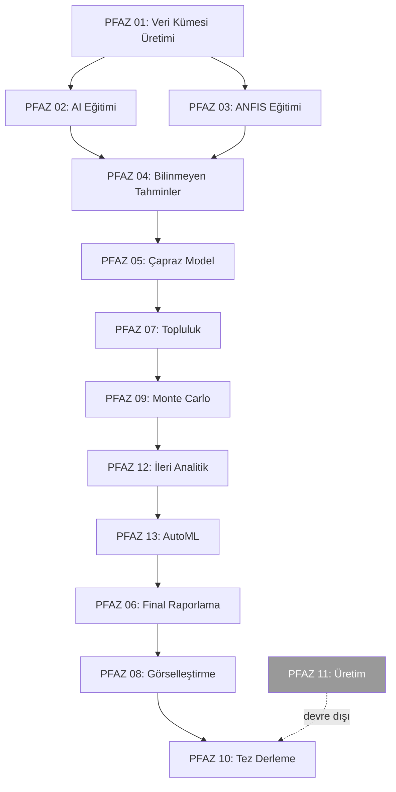

# Phases — Faz İndeksi

> **Bu klasör:** `quantizedeli/v10` repo'sunun her fazı için üretilen analiz dokümanlarını barındırır.

> **Şablon:** Her faz dokümanı `../03-PHASE-DOC-TEMPLATE.md`'deki 17 bölümlü yapıyı izler.

> **Güncelleme:** Bu README her faz tamamlandığında güncellenir.

---

## Faz Listesi

| # | PFAZ | Faz Adı | Durum | Doküman | Ana Sınıf | Analiz Tarihi |
|---|------|---------|-------|---------|-----------|---------------|
| 0 | — | Repo Keşfi | ✅ Tamamlandı | `../reports/faz-0-repo-kesfi.md` | (analiz değil) | 2026-05-02 |
| 1 | pfaz01 | Veri Kümesi Üretimi | ✅ Tamamlandı | `faz-01-veri-kumesi-uretimi.md` | `DatasetGenerationPipelineV2` | 2026-05-02 |
| 2 | pfaz02 | Yapay Zeka Eğitimi | ✅ Tamamlandı | `faz-02-yapay-zeka-egitimi.md` | `ParallelAITrainer` | 2026-05-03 |
| 3 | pfaz03 | ANFIS Eğitimi | ✅ Tamamlandı | `faz-03-anfis-egitimi.md` | `ANFISParallelTrainerV2` | 2026-05-03 |
| 4 | pfaz04 | Bilinmeyen Çekirdek Tahminleri | ✅ Tamamlandı | `faz-04-bilinmeyen-cekirdek.md` | `UnknownNucleiPredictor` | — |
| 5 | pfaz05 | Capraz Model Analizi | Kod Hazir (Cikti Yok) | `faz-05-capraz-model.md` | `CrossModelEvaluator` | 2026-05-04 |
| 6 | pfaz06 | Final Raporlama | Kod Hazir (Cikti Yok) | `faz-06-final-raporlama.md` | `FinalReportingPipeline` | 2026-05-04 |
| 7 | pfaz07 | Topluluk & Meta-Modeller | ✅ Tamamlandi | `faz-07-topluluk-modeller.md` | `EnsemblePipeline` | 2026-05-04 |
| 8 | pfaz08 | Gorsellestirme | ✅ Tamamlandi | `faz-08-gorsellestirme.md` | `MasterVisualizationSystem` | 2026-05-04 |
| 9 | pfaz09 | Monte Carlo Analizi | ✅ Tamamlandi (Analiz) | `faz-09-monte-carlo.md` | `MonteCarloSimulationSystem` | 2026-05-04 |
| 10 | pfaz10 | Tez Derleme (LaTeX) | 🔄 Sprint 14 Rewrite | `faz-10-tez-derleme.md` | `MasterThesisIntegration` v6.0.0 | 2026-05-14 |
| 11 | pfaz11 | Üretim Dağıtımı | ⛔ Atlandı | — | (kasıtlı devre dışı) | — |
| 12 | pfaz12 | İleri İstatistiksel Analitik | ✅ Aktif (Sprint 13 BUG-95/97) | `faz-12-ileri-analitik.md` | `StatisticalTestingSuite` | 2026-05-14 |
| 13 | pfaz13 | AutoML Yeniden Egitim | ✅ Aktif (Sprint 4 BUG-32) | `faz-13-automl.md` | `AutoMLRetrainingLoop` | 2026-05-14 |

**Durum simgeleri:**
- ⏳ Beklemede (analiz başlamadı)
- 🔄 Devam ediyor
- ✅ Tamamlandı
- ❌ Açık sorular var (kullanıcı doğrulaması bekliyor)
- ⛔ Atlandı (kalıcı olarak devre dışı)

---

## Faz Bağımlılık Grafiği

Pipeline'ın doğru yürütme sırası — `main.py:PIPELINE_EXECUTION_ORDER = [1,2,3,4,5,7,9,12,13,6,8,10,11]` (Bug #39 düzeltmesi):

**Kritik bağımlılıklar:**
- PFAZ 6 (Raporlama) → PFAZ 9 ve 13'ün çıktılarına muhtaç
- PFAZ 10 (Tez) → PFAZ 12 ve 13'ün içeriklerine muhtaç
- PFAZ 8 (Görselleştirme, 2. geçiş) → PFAZ 9/12/13 verilerini kullanır

---

## Analiz Sırası (Önerilen)

| Öncelik | PFAZ | Gerekçe |
|---------|------|---------|
| **1** | PFAZ 01 | Temel veri + özellik mühendisliği — her şeyin başlangıcı |
| **2** | PFAZ 02 | Ana AI modelleri — tezin birincil katkısı |
| **3** | PFAZ 03 | ANFIS — hibrit yaklaşımın ikinci ayağı |
| 4 | PFAZ 07 | Topluluk yöntemleri |
| 5 | PFAZ 09 | Monte Carlo belirsizlik analizi |
| 6 | PFAZ 12 | İstatistiksel doğrulama testleri |
| 7 | PFAZ 04 | Bilinmeyen çekirdek tahminleri |
| 8 | PFAZ 05 | Çapraz model karşılaştırması |
| 9 | PFAZ 06 | Raporlama sistemi |
| 10 | PFAZ 13 | AutoML yeniden eğitim |
| 11 | PFAZ 08 | Görselleştirme kataloğu |
| 12 | PFAZ 10 | LaTeX tez yapısı |

---

## Her Faz Dokümanı İçin Beklenen İçerik

`03-PHASE-DOC-TEMPLATE.md`'deki 17 bölüm (tamamı zorunlu):

1. Genel Bakış
2. Motivasyon
3. Bağlam (önceki/sonraki fazlar + mermaid diyagramı)
4. Girdi/Çıktı Spec'i
5. Yöntem
6. Algoritmalar (pseudocode + A-NNN ID)
7. Formüller (LaTeX + F-NNN ID)
8. Değişkenler & Parametreler
9. Kısaltmalar & Semboller
10. Uygulama Detayları
11. Hesaplama Karmaşıklığı
12. Doğrulama & Test
13. Sınırlamalar
14. Sonuçlar
15. Tezdeki Yeri
16. Kaynaklar
17. Açık Sorular

---

## Faz Tamamlama Kontrol Listesi

Bir faz dokümanı oluşturulduktan sonra:

- [ ] Bu README'de faz satırı güncellendi (durum ✅, doküman path, tarih)
- [ ] `../06-FIGURE-TABLE-CATALOG.md` — yeni F-NNN/S-NNN/T-NNN/A-NNN ID'ler eklendi
- [ ] `../07-GLOSSARY-SYMBOLS.md` — yeni kısaltma/sembol eklendi
- [ ] `../reports/faz-NN-analiz-notu.md` — özet rapor yazıldı
- [ ] Açık sorular kullanıcıya iletildi
- [ ] `/save-session "Faz NN tamamlandı"` çağrıldı

---

## Faz Bilgi Kartları

### Faz 0: Repo Keşfi

**Doküman:** [faz-0-repo-kesfi.md](../reports/faz-0-repo-kesfi.md)  
**Tarih:** 2026-05-02  
**Durum:** ✅

**Tek-cümle özet:** 267 nükleer çekirdek için manyetik ve kuadrupol moment tahmin eden, 13 fazlı (PFAZ 01-13) AI + ANFIS hibrit sisteminin mimari keşfi.

**Temel bulgular:**
- Proje: Nuclear Physics AI Project v2.0.0 — Geliştirici: Kemal Bey
- Veri: `data/aaa2.txt` — 267 çekirdek, 12 ham sütun → 44+ mühendislik özelliği
- Modeller: RF, GBM, XGBoost, DNN, BNN, PINN + ANFIS (8 konfigürasyon)
- Çıktı: 848 veri kümesi, 18 sayfalık Excel raporu, LaTeX tez
- PFAZ 12 ve 13 failed; PFAZ 11 kasıtlı skipped

---

### Faz 1: Veri Kümesi Üretimi

**Doküman:** [faz-01-veri-kumesi-uretimi.md](faz-01-veri-kumesi-uretimi.md)  
**Tarih:** 2026-05-02  
**Durum:** ✅

**Tek-cümle özet:** 12 ham sütunlu `aaa2.txt`'den SEMF/Woods-Saxon/Nilsson/Schmidt fizik zenginleştirmesi ile 44+ özellik türetilerek 848 veri kümesi üretilir.

**Temel bulgular:**
- Ana sınıf: `DatasetGenerationPipelineV2` — 9 bileşen sınıfı orkestre eder
- Aktif hedefler: **yalnızca MM ve QM** (Beta_2 ve MM_QM tanımlı ama aktif değil)
- 4 ölçekleme yöntemi: NoScaling, Standard (z-skor), Robust (medyan/IQR), MinMax [0,1]
- DISCRETE_FEATURES (ölçeklenmeyen): A, Z, N, Nn, Np, SPIN, PARITY, magic_*, magic_n, magic_p
- Özellik mühendisliği: `TheoreticalCalculationsManager` → 7 fizik alt-modülü → 44+ özellik
- 24 özellik kısaltması: FEATURE_ABBREV sözlüğü (feature_combination_manager.py)
- SHAP sıralaması: MM: A>Z>S>MC>BEPA>B2E; QM: Z>B2E>A>MC>S
- Veri kümesi kombinasyon ağacı: 2h×(boyuta göre) kombinasyon → 848+ dataset
- Tespit edilen bug'lar: [1-KRİTİK] Q=0 filtre, [2-YÜKSEK] HBAR_C eksik, [3-ORTA] V_so eksik, [4-DÜŞÜK] MAT key
- `DataEnricher` aktif pipeline'a bağlı değil
- Tanımlanan formüller: F-001..F-020 | Algoritmalar: A-001..A-005 | v2.0: 950 satır

---

*phases/README.md v1.0 | Son güncelleme: 2026-05-14 (Sprint 4-14 etkileri tüm faz dökümanlarına işlendi)*

---

### PFAZ 02: Yapay Zeka Modeli Egitimi

| Alan | Deger |
|------|-------|
| Dosya | phases/faz-02-yapay-zeka-egitimi.md |
| Durum | Analiz tamamlandi, PC'de hesaplama devam ediyor |
| Ana Sinif | ParallelAITrainer (parallel_ai_trainer.py) |
| Aktif Modeller | RF, XGBoost, LightGBM, CatBoost, SVR, DNN (6 tip) |
| Konfigurasyonlar | 50 (20 RF + 15 XGBoost + 15 DNN) |
| Kalite Esigi | R2_MIN_SAVE_THRESHOLD = 0.5 |
| DNN Kisiti | train_size >= 200 gerekli |
| Cikti | outputs/trained_models/{dataset}/{model}/{config}/ |
| Raporlar | training_summary.json + .xlsx, seed_tracking_report |
| Buglar | seed=42 sabit (DUSUK), DNN kapali (TASARIM), LightGBM/CatBoost konfigurasyonsuz (ORTA) |

### PFAZ 03: ANFIS Egitimi

| Alan | Deger |
|------|-------|
| Dosya | phases/faz-03-anfis-egitimi.md |
| Durum | Tamamlandi (completed 100%, pfaz_status.json) |
| Ana Sinif | ANFISParallelTrainerV2 (anfis_parallel_trainer_v2.py) |
| ANFIS Turu | Takagi-Sugeno 1. Dereceden (Python, MATLAB opsiyonel) |
| Konfigurasyon | 8 (CFG001-005: Grid, CFG006-008: SubClust) |
| MF Turleri | Gaussian, GenBell, Ucgen, Yamuk |
| Hibrit Ogrenme | LSE (Katman 4) + L-BFGS-B/LBFGS (Katman 1-2) |
| Adaptif n_mfs | n_rules < max(4, n_train/3) kisiti |
| Outlier Filtre | IQR (3x) + z-skor (3sigma) cift filtre |
| R2 Kayit Esigi | val_R2 >= 0.5 |
| Cikti | outputs/anfis_models/{dataset}/{config}/ |
| Analiz Tarihi | 2026-05-03 |

### PFAZ 04: Bilinmeyen Cekirdek Tahminleri

| Alan | Deger |
|------|-------|
| Dosya | phases/faz-04-bilinmeyen-cekirdek.md |
| Durum | completed 100% |
| Ana Sinif | UnknownNucleiPredictor + SingleNucleusPredictor |
| Test seti = bilinmeyen | PFAZ01 test.csv (S70:%15, S80:%10) |
| Degradasyon | Val_R2 - Test_R2 |
| GS Formulu | (Test_R2 / Val_R2) * 100 |
| Top-N Consensus | Top-25 model ortalama tahmini |
| Giris min | Yalnizca Z ve N (diger ozellikler otomatik turetilir) |
| Excel | Unknown_Nuclei_Results.xlsx (7 sayfa) |
| Analiz Tarihi | 2026-05-03 |

### PFAZ 07: Topluluk ve Meta-Modeller

| Alan | Deger |
|------|-------|
| Dosya | phases/faz-07-topluluk-modeller.md |
| Durum | Tamamlandi (gercek cikti mevcut) |
| Ana Sinif | EnsemblePipeline (pfaz7_complete_ensemble_pipeline.py, 1106 satir) |
| Ensemble Yontemleri | 12 (5 Voting + 6 Stacking + 1 AdaBoost) |
| En Iyi Sonuc | stacking_mlp R2=0.9794, RMSE=0.5625 |
| En Kotu | adaboost R2=0.8282 |
| Ortalama R2 | 0.9616 (12 yontem ortalamasi) |
| Stacking CV | 5-fold OOF, meta-modeller: Ridge/Lasso/EN/RF/GBM/MLP |
| Gercek Cikti | ensemble_results/evaluation/comprehensive_report.json |
| Analiz Tarihi | 2026-05-04 |

### PFAZ 08: Gorsellestirme Sistemi

| Alan | Deger |
|------|-------|
| Dosya | phases/faz-08-gorsellestirme.md |
| Durum | Kod tamam (2026-04-04), gercek PNG/HTML YOK |
| Ana Sinif | MasterVisualizationSystem (4531 satir) + ThesisChartGenerator (1691 satir) |
| Grafik Sayisi | 70+ (PNG + HTML cift cikti) |
| DPI | 300 (tez) / 150 (supplemental) |
| Opsiyonel Kutuphaneler | SHAP, Plotly (yoksa sessizce atlanir) |
| Analiz Tarihi | 2026-05-04 |

### PFAZ 09: Monte Carlo Belirsizlik Analizi

| Alan | Deger |
|------|-------|
| Dosya | phases/faz-09-monte-carlo.md |
| Durum | Kod tamam (2026-04-04), gercek cikti YOK (PFAZ02 bekliyor) |
| Ana Siniflar | AAA2ControlGroupAnalyzerComplete (1046 satir) + MonteCarloSimulationSystem (1259 satir) |
| Katman 1 | Top-50 model, ensemble CI, 267 cekirdek |
| Katman 2 | Top-10 model, 5 MC teknigi (MCD/BS/NS/FDS/EUA) |
| CI Yontemi | Percentile: [P_2.5, P_97.5] -- normal dagilim varsayimi yok |
| n_bootstrap | 100 (oneride: 1000) |
| n_mc_dropout | 100 (DNN-only) |
| n_noise | 5 seviye x 100 ornek |
| n_feature_drop | 3 olasilik x 500 ornek |
| Excel | AAA2_Complete_{target}.xlsx: Predictions + Uncertainty + PerModel_Top25 + Model_Ranking + Analysis_5..15 |
| Analiz Tarihi | 2026-05-04 |

### PFAZ 12: Ileri Istatistiksel Analitik

| Alan | Deger |
|------|-------|
| Dosya | phases/faz-12-ileri-analitik.md |
| Durum | FAILED (progress=0, import hatasi) |
| Ana Siniflar | StatisticalTestingSuite + NuclearPatternAnalyzer + AdvancedSensitivityAnalysis + BayesianModelComparison |
| Testler | paired_t, Wilcoxon, ANOVA, Friedman, Tukey HSD, pairwise_Wilcoxon |
| Etki Buyuklugu | Cohen's d, Cliff's delta, eta-squared |
| alpha | 0.05 |
| NuclearBandAnalyzer | 1174 satir; __init__.py export YOK (BUG-31) |
| Sobol | S1, ST, S2 indeksleri; SALib; problem: A/Z/SPIN |
| ROPE | 5% (BayesianModelComparison) |
| Analiz Tarihi | 2026-05-04 |

### PFAZ 13: AutoML Yeniden Egitim

| Alan | Deger |
|------|-------|
| Dosya | phases/faz-13-automl.md |
| Durum | FAILED (progress=0, SyntaxError: automl_retraining_loop.py:43) |
| Ana Sinif | AutoMLRetrainingLoop (1015 satir) + AutoMLOptimizer (475 satir) |
| Kategori Sinirlari | Poor<0.70, Medium<0.90, Good<0.95, Excellent>=0.95 |
| n_per_category | 25; n_trials=30 |
| Optimizer | Optuna TPE + MedianPruner; 7 model türü |
| DNN Ozellikleri | Huber loss, EarlyStopping patience=10, R2<-2.0 pruning |
| Excel | automl_improvement_report.xlsx (3 sayfa: Summary, Best_Params, Overview) |
| KRITIK FIX | automl_retraining_loop.py:43 tek satir silmekle cozulur |
| Analiz Tarihi | 2026-05-04 |

### PFAZ 10: Tez Derleme (LaTeX Entegrasyonu)

| Alan | Deger |
|------|-------|
| Dosya | phases/faz-10-tez-derleme.md |
| Durum | RUNNING (progress=50) -- kismi tamamlanma; PFAZ12+13 FAILED sebebiyle |
| Ana Sinif | MasterThesisIntegration v5.0.0 (pfaz10_master_integration.py) |
| Adim Sayisi | 8 adim (1:veri topla, 2:bolum uret, 3:sekil kopyala, 4:tablo, 5:bib, 6:main.tex, 7:QC, 8:PDF opsiyonel) |
| Bolumler | 14 bolum + 4 ek; EN+TR ozet, kisaltmalar, semboller, 11+12=PFAZ12/13 icerigi |
| compile_pdf | False (varsayilan) -- pdflatex gerekmez |
| Cikis | outputs/thesis/ (chapters/, appendices/, figures/, tables/, main.tex, compile.bat) |
| Veri Kaynagi | Tum PFAZ ciktilari (1-9, 12, 13); pfaz_path() inject+fallback |
| Modüller | 10 sinif; 9 AVAILABLE flag; MasterThesisIntegration zorunlu |
| Buglar | BUG-37 (Linux yolu), BUG-38 (MC K=1000 tutarsizligi) |
| Analiz Tarihi | 2026-05-04 |

---

## Sprint Ozeti (2026-05-07 / 2026-05-14)

| Sprint | Tarih | Konu | Etkilenen Dosyalar |
|--------|-------|------|--------------------|
| Sprint 1 | 2026-05-08 | Cift R2 Filtresi (val + cv + gap) | parallel_ai_trainer.py, config.json |
| Sprint 2 | 2026-05-09 | Config Senkronizasyonu (Robust/N75 kaldir) | repo+truba+desktop config.json |
| Sprint 3 | 2026-05-09 | Belge Senkronizasyonu | faz-01/02, pipeline-hatalari.md |
| Sprint 4 | 2026-05-11 | TRUBA hazirlik + BUG-02/03/31/32/38 | constants.py, monte_carlo, automl_retraining |
| Sprint 5 | 2026-05-11 | Inter-PFAZ data flow audit + BUG-42..46 | main.py, pfaz08, pfaz03, pfaz01 |
| Sprint 6 | 2026-05-12 | 8 kategori parallel scan -> BUG-47..61 | 14 dosya tarama |
| Sprint 7 | 2026-05-12 | BUG-47..61 fix (15 bug, 14 dosya) | hardcoded path, optuna leak, silent except |
| Sprint 8 | 2026-05-12 | BUG-62/63/64 -- Sprint 1/2/4 eksik fix'ler + CV gate gercek | parallel_ai_trainer.py constructor, MC defaults |
| Sprint 9A | 2026-05-13 | v10 sync | truba+v10 config |
| Sprint 9B | 2026-05-13 | TRUBA 4 job script (weka flag, 110 CPU) | truba/slurm_jobs/* |
| Sprint 10 | 2026-05-13 | TRUBA QA raporu (BUG-65..74) | pfaz13, pfaz08, main.py |
| Sprint 11+12 | 2026-05-13 | Cikti tamligi + BUG-75..84 (PFAZ8 helper-based, -c 110->112) | pfaz3/6/8/9, training_configs_50.json |
| Sprint 13 | 2026-05-14 | Codex audit + BUG-85..99 + KURAL 29-33 | PIPESTATUS, strict_truba, RobustnessTester, BootstrapCI+ANFIS |
| Sprint 14 | 2026-05-14 | PFAZ10 REWRITE (MM/QM odakli, 6 bolum) + phases/research doc guncelleme | pfaz_modules/pfaz10_*, docs/thesis-toolkit/{phases,research}/* |

**BUG sayisi (2026-05-14):**
- Toplam: 99 (BUG-01..99)
- Duzeltildi: ~75 (Sprint 1-13 kapsaminda)
- Gecersiz: 4 (BUG-01, 04, 12, 16)
- Bekliyor / Tez notu: ~20 (TRUBA cikisi sonrasi degerlendirilecek)

**KURAL sayisi (2026-05-14):** 33 toplam (KURAL 1-33)
- KURAL 18: "Belge != gercek fix" -- kod dogrulama zorunlu
- KURAL 19: Inter-PFAZ veri akisi her sprint sonu denetlenir
- KURAL 25: TRUBA `-C weka` flag zorunlu
- KURAL 29: Plan sun, onay bekle, sonra hareket et
- KURAL 30: Runtime behavior simulation (3 senaryo)
- KURAL 31: Single Source of Truth (ayni bilgi iki yerde olmaz)
- KURAL 32: VARSAYIM YASAGI -- "muhtemelen" yerine grep/view
- KURAL 33: Cross-layer failure chain audit
