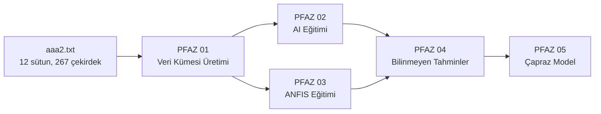

# PFAZ 01: Veri Kümesi Üretimi ve Özellik Mühendisliği

> **Sürüm:** 3.0 (Sprint 13 sonrası güncelleme)
> **İlk Tarih:** 2026-05-03 — **Son Güncelleme:** 2026-05-14
> **Ana Sınıf:** `DatasetGenerationPipelineV2`
> **Kaynak:** `pfaz_modules/pfaz01_dataset_generation/`
> **Şablon:** `03-PHASE-DOC-TEMPLATE.md` (17 Bölüm)
> **TRUBA Job:** Job 1 (`truba/slurm_jobs/job1_pfaz01.sh`, 6 saat limit, -c 112)

---

## 1. Genel Bakış

Bu faz, ham nükleer veri dosyasından (`data/aaa2.txt`) başlayarak makine öğrenmesi modellerinin eğitimine hazır 848 farklı veri kümesi üretir. Üretim süreci iki ana katmandan oluşur: birinci katman teorik fizik hesaplamalarını kapsayan özellik zenginleştirmesidir, ikinci katman ise senaryolar, ölçekleme seçenekleri ve örnekleme stratejilerinin kombinasyonundan doğan veri kümesi çeşitlendirmesidir.

`DatasetGenerationPipelineV2` sınıfı dokuz bileşen sınıfını bir araya getirir: `DataLoader`, `TheoreticalCalculationsManager`, `QMFilterManager`, `AnomalyDetectionManager`, `FeatureCombinationManager`, `ScalingManager`, `SamplingManager`, `IOConfigManager` ve `DatasetExporter`. Her bileşen, görev ayrımı ilkesi uyarınca tek bir işlevden sorumludur.

Faz çıktıları `outputs/generated_datasets/` altında saklanır. Her veri kümesi için CSV, Excel ve MAT formatları üretilir ve bir `metadata.json` dosyası kaydedilir. Bu metadata, sonraki fazların (özellikle PFAZ 02, PFAZ 09) hangi özellik setiyle eğitildiğini takip etmesi için zorunludur.

---

## 2. Motivasyon

### 2.1 Neden Özellik Mühendisliği Zorunludur?

Ham veri dosyasındaki 12 sütun (`Z`, `N`, `A`, `MM_exp`, `QM_exp` ve birkaç yardımcı alan), nükleer manyetik ve kuadrupol momentleri tahmin etmek için başlı başına yetersizdir. Sorun, ham nükleon sayılarının fiziksel mekanizmayı yansıtmadığıdır.

Manyetik moment, son nükleonun hangi kuantum durumunda olduğuna bağlıdır. Bunu yalnızca Z ve N'den çıkarmak mümkün değildir; aynı Z değerine sahip iki çekirdek, farklı N değerleri nedeniyle tamamen farklı orbitallerden farklı spin konfigürasyonlarına ve dolayısıyla farklı manyetik momentlere sahip olabilir. Model bu ilişkiyi, özellikleri onlarca değişkenden oluşan bir uzayda öğrenmek zorunda kalırsaydı, 267 örnek bu yük altında genelleme yapamaz hale gelirdi.

Özellik mühendisliğinin işlevi burada devreye girer: fizik bilgisini ham sayılara gömmek. SEMF bileşenleri, Schmidt momentleri, kabuk model mesafeleri gibi türetilmiş özellikler modele "bu çekirdek ne yapar" sorusunu kolaylaştıran dolaylı cevaplar sunar. Bu yaklaşım literature'de yaygın bir stratejidir; Niu ve Liang (2018), Utama ve arkadaşları (2016) benzeri veri kıtlığı problemlerini özellik zenginleştirmesiyle ele almıştır.

### 2.2 Neden 848 Veri Kümesi?

Tek bir veri kümesiyle çalışmak pratik açıdan yetersizdir. Hem model karşılaştırması hem de tez metodolojisi, çeşitli veri koşullarında performans değerlendirmesini gerektirir. Üç eksen bu çeşitliliği üretir:

1. **Hedef değişken:** MM ve QM — aktif iki hedef; Beta_2 ve MM_QM kod içinde tanımlı ancak aktif değil
2. **Bölme senaryosu:** S70 ve S80 — küçük veri kümesinde bölme politikasının model stabilitesine etkisini ölçer
3. **Özellik seti + ölçekleme + örnekleme:** Bu kombinasyon model seçiminin hangi veri ön işleme kararlarına ne ölçüde duyarlı olduğunu ortaya koyar

848 sayısı bir tasarım kararı değil, sayma sonucudur: 2 hedef × 5 boyut × 2 senaryo × ~6 özellik seti × 4 ölçekleme × 4 örnekleme kombinasyonunun geçerli alt kümesi.

### 2.3 Ani Değişim Problemi ve Neden Özel Özellikler Gerektirir

Nükleer verinin en zorlu özelliği, büyük ölçüde sürekli görünen bir uzayda ayrık sıçramalar barındırmasıdır. Sihirli sayılarda (2, 8, 20, 28, 50, 82, 126) hem proton hem nötron alt kabuğu tam dolduğunda, nükleer özellikler süreksiz biçimde değişir.

Kapalı bir proton kabuğuna sahip `¹⁴⁸Gd` (Z=64, N=84, N sihirli değil) ile komşusu `¹⁵⁰Gd` (N=86) arasındaki manyetik moment farkı oldukça küçüktür. Oysa `²⁰⁸Pb` (Z=82, N=126 — her ikisi de sihirli) ile `²⁰⁹Bi` (Z=83, N=126) arasındaki fark hem büyük hem de işaret değiştirir. Model, Z'de 82→83 geçişinin neden bu kadar farklı sonuç verdiğini kendi başına öğrenemez; bunun sebebini, yani kapalı kabuğun açıldığını, ona söylemek gerekir.

`magic_character`, `Z_magic_dist`, `N_magic_dist` özellikleri tam olarak bu amaca hizmet eder. Bunların eklenmesi, veri zenginleştirmesinin ötesinde bir fizik kararıdır. Bu karar olmadan modelin kabuk kapanması bölgelerinde sistematik hata yapması kaçınılmazdır.

---

## 3. Bağlam

### 3.1 Pipeline'daki Konumu



PFAZ 01, pipeline'ın veri tabanını kurar. Sonraki tüm fazlar bu faz tarafından üretilen veri kümelerine ve metadata'ya bağımlıdır. Özellikle PFAZ 09 (Monte Carlo), her modelin hangi özellik setiyle eğitildiğini takip etmek için `metadata.json` dosyasını doğrudan okur.

### 3.2 Önceki Fazdan Gelenler

PFAZ 01'den önce tanımlı bir faz yoktur; bu faz pipeline'ın başlangıcıdır. Girdi yalnızca `data/aaa2.txt` dosyasıdır.

### 3.3 PFAZ 11 Neden Yoktur?

`main.py`'deki `PIPELINE_EXECUTION_ORDER = [1,2,3,4,5,7,9,12,13,6,8,10,11]` ifadesine bakıldığında PFAZ 11 sona alınmıştır, ancak modülün kendisi kasıtlı olarak devre dışıdır. PFAZ 11 (web arayüzü / Docker / API) araştırma tezinin kapsamı dışında tutulmuştur.

---

## 4. Girdi/Çıktı Spesifikasyonu

### 4.1 Girdi: `data/aaa2.txt`

```
Satır sayısı  : 268 (1 başlık + 267 veri)
Ayırıcı       : boşluk / sekme
Kodlama       : UTF-8
```

Ham sütunlar (12 adet):

| Sütun | Tip | Açıklama |
|-------|-----|----------|
| Z | int | Proton sayısı |
| N | int | Nötron sayısı |
| A | int | Kütle numarası (= Z+N) |
| element | str | Element sembolü |
| MM_exp | float | Deneysel manyetik moment (μN) |
| QM_exp | float | Deneysel kuadrupol moment (barn) |
| spin | float | Çekirdek spini J |
| parity | int | Parite (+1 veya -1) |
| beta2_exp | float | Deneysel kuadrupol deformasyon (varsa) |
| isomer | int | İzomer işareti (0 = temel durum) |
| source | str | Veri kaynağı referansı |
| year | int | Ölçüm yılı |

### 4.2 Çıktı

**Birincil çıktı:**
```
outputs/generated_datasets/{DATASET_ADI}/
    train.csv, val.csv, test.csv
    train.xlsx, val.xlsx, test.xlsx (opsiyonel)
    dataset.mat (MATLAB uyumlu)
    metadata.json
```

**metadata.json içeriği:**
```json
{
  "dataset_name": "MM_ALL_S70_Physics_Standard_StratifiedHybrid",
  "target": "MM",
  "size": "ALL",
  "scenario": "S70",
  "feature_set": "Physics",
  "scaling": "Standard",
  "sampling": "StratifiedHybrid",
  "anomaly_removed": false,
  "n_features": 44,
  "n_train": 138,
  "n_val": 30,
  "n_test": 29,
  "feature_names": ["Z", "N", "A", ...],
  "created": "2026-05-03T..."
}
```

**Boyut kısıtları:**
- Boyut ≤ 100 olan veri kümeleri için yalnızca S70 ve Basic/Standard özellik setleri üretilir
- NoAnomaly varyantları yalnızca 150/200/ALL boyutlarda üretilir

---

## 5. Yöntem

### 5.1 Genel Akış

```
aaa2.txt
  ↓ _load_raw_data          (veri okuma + 8 adım temizleme)
  ↓ _add_theoretical_calc.  (TheoreticalCalculationsManager → 7 modül → 44+ sütun)
  ↓ _apply_qm_filtering     (hedef değişkene göre filtre)
  ↓ _perform_quality_control (anomali tespiti: IQR + IsolationForest)
  ↓ _generate_all_datasets  (FeatureCombination × Scaling × Sampling × Scenario)
  ↓ Export: CSV + Excel + MAT + metadata.json
```

### 5.2 Veri Temizleme (8 Adım)

`DataLoader._clean_data()` şu sırayla çalışır:

1. **Boş satır kaldırma:** Tüm alanları eksik satırlar düşürülür
2. **Tip dönüşümü:** Z, N, A integer; MM_exp, QM_exp float'a çevrilir
3. **Fiziksel sınır kontrolü:** Z > 0 ve N > 0 zorunlu; A = Z+N doğrulaması
4. **Hedef değişken kontrolü:** MM_exp veya QM_exp tam olarak NaN olan çekirdekler, ilgili hedef modelinde kullanılmaz (silinmez, filtrelenir)
5. **İzomer filtresi:** `isomer = 1` olan kayıtlar varsayılan olarak dışlanır (temel durum ölçümleri ile karışma riski)
6. **Yineleme giderme:** Aynı (Z, N) çiftine sahip birden fazla satır varsa en son ölçüm tutulur
7. **Outlier kontrolü (ham):** Ölçüm birimleri açısından anlamsız değerler (|MM_exp| > 15 μN) işaretlenir
8. **Spin/parite tutarlılık kontrolü:** Spin=0 olan çekirdek için MM≠0 beklenmez; tutarsızlıklar uyarı olarak kaydedilir

Bu adımların sırası önemlidir. Özellikle adım 4, hedef filtresinden önce genel temizlemenin yapılmasını sağlar.

### 5.3 Teorik Hesaplama Katmanı

`TheoreticalCalculationsManager` yedi alt modülü sırayla çalıştırır. Sıranın önemi: bazı modüller başka modüllerin çıktısına bağımlıdır (örneğin Nilsson modeli Woods-Saxon potansiyelinden gelen enerji düzeylerini kullanır).

| Sıra | Modül | Çıktı Özellikleri |
|------|-------|-------------------|
| 1 | SEMFCalculator | BE, 5 SEMF terimi, δ, BE/A |
| 2 | RadiusCalculator | R_nucl |
| 3 | SeparationEnergyCalc | S_n, S_p |
| 4 | ShellModelFeatures | magic_character, Z_magic_dist, N_magic_dist |
| 5 | DeformationCalculator | beta2_theo, Q0 |
| 6 | SchmidtCalculator | mu_schmidt, Q_schmidt |
| 7 | WoodsSaxonNilsson | V_ws_center, epsilon_nilsson |

Modül 7'nin (WoodsSaxon/Nilsson) önceki import hatası **BUG-02 olarak DÜZELTİLDİ (2026-05-04 / Sprint 4)**: `HBAR_C = 197.3269804` sabiti `core_modules/constants.py:44` satırına eklendi, V_so/r_so/a_so sabitleri `constants.py:72-74`'e tamamlandı. WS özellikleri (V_ws_center, epsilon_WS) artık aktif olarak hesaplanır; TRUBA yeniden çalıştırma ile bu özellikler dataset'lere girer. Bkz. `pipeline-hatalari.md` BUG-02/03 ve `tez-yazim-not-defteri.md` "Sprint 2026-05-04" bölümü.

---

## 6. Algoritmalar

### A-001: Ana Pipeline Orkestrasyonu

```
ALGORITMA PipelineV2_Run(aaa2_path, config)
  GIRDI  : ham veri dosyası, konfigürasyon
  CIKTI  : 848 veri kümesi dosyası (CSV/XLSX/MAT) + metadata.json

  raw_df     ← DataLoader.load(aaa2_path)        # 8 adım temizleme
  enriched_df ← TheoreticalCalcManager.compute(raw_df)   # 44+ sütun
  
  FOR EACH target IN [MM, QM]:
    filtered_df ← QMFilterManager.apply(enriched_df, target)
    
    FOR EACH size IN [75, 100, 150, 200, ALL]:
      sample_df ← filtered_df.sample(size) if size ≠ ALL else filtered_df
      
      FOR EACH scenario IN [S70, S80]:
        FOR EACH feat_set IN FeatureCombinationManager.get_sets(size):
          feat_df ← feat_set.select(sample_df)
          
          FOR EACH scaling IN [Standard, MinMax, Robust, None]:
            scaled_df ← ScalingManager.apply(feat_df, scaling)
            
            FOR EACH sampling IN [Random, Stratified, StratMagic, StratHybrid]:
              splits ← SamplingManager.split(scaled_df, scenario, sampling)
              DatasetExporter.export(splits, metadata)
              
              IF size IN [150, 200, ALL]:
                anom_splits ← AnomalyManager.remove(splits)
                DatasetExporter.export(anom_splits, metadata + "_NoAnomaly")
  
  DONDUR toplam_uretilen_dataset_sayisi
```

**Not:** `FeatureCombinationManager.get_sets(size)` boyuta göre farklı set sayısı döndürür. Boyut ≤ 100 için yalnızca Basic ve Standard setler; daha büyük boyutlar için Physics ve SHAP setleri de dahil edilir.

---

### A-002: Veri Temizleme

```
ALGORITMA DataLoader_Clean(raw_df)
  ADIM 1: boş satırları kaldır → df.dropna(how='all')
  ADIM 2: tip dönüşümü → Z,N,A:int ; MM_exp,QM_exp:float
  ADIM 3: Z>0 AND N>0 AND A==Z+N doğrula; ihlalleri yaz, düşür
  ADIM 4: MM_exp veya QM_exp NaN → ilgili hedef için 'kullanılamaz' flag koy, SİLME
  ADIM 5: isomer==1 satırları dışarıda bırak (isomer_filtered kümesine taşı)
  ADIM 6: (Z,N) çiftlerine göre groupby, son kaydı tut
  ADIM 7: |MM_exp| > 15 μN veya |QM_exp| > 10 barn → WARNING yaz
  ADIM 8: spin==0 AND MM_exp≠0 → uyarı, ancak silme
  DONDUR temizlenmiş_df
```

---

### A-003: Örnekleme ve Bölme

```
ALGORITMA SamplingManager_Split(df, scenario, sampling_type)
  IF scenario == S70:
    oranlar = (0.70, 0.15, 0.15)
  ELSE:  # S80
    oranlar = (0.80, 0.10, 0.10)
  
  IF sampling_type == Random:
    train, val, test = random_split(df, oranlar)
    
  ELSE IF sampling_type == Stratified:
    # A_grubu: hafif(<60), orta(60-120), ağır(120-200), çok_ağır(≥200)
    train, val, test = stratified_split(df, oranlar, strat_col='A_group')
    
  ELSE IF sampling_type == StratifiedMagic:
    # Test kümesinin %30'u sihirli çekirdeklerden oluşsun
    magic_df = df[df.magic_character == 1]
    normal_df = df[df.magic_character == 0]
    n_magic_test = ceil(len(df) * oranlar[2] * 0.30)
    # magic kümesinden n_magic_test, normal kümesinden kalan test seç
    train, val, test = combine_splits(magic_df, normal_df, n_magic_test, oranlar)
    
  ELSE:  # StratifiedHybrid
    # Hem A_group hem magic_character'a göre stratified
    train, val, test = stratified_split(df, oranlar, strat_cols=['A_group', 'magic_character'])
  
  DONDUR (train, val, test)
```

**StratifiedMagic tercihi:** Sihirli çekirdekler normal dağılımda yeterince temsil edilmeyebilir (267 çekirdeğin ancak bir bölümü). Test kümesine %30 sihirli çekirdek kotası, modelin en zor tahmin bölgesindeki performansını ayrıca ölçmeye olanak tanır.

---

### A-004: Anomali Tespiti

```
ALGORITMA AnomalyDetectionManager_Remove(df, iqr_threshold=3.0, if_contamination=0.08)
  
  # Adım 1: IQR bazlı tek değişkenli filtre
  aykiri_mask = boş_mask
  FOR EACH numerik_sutun IN df.sayisal_kolonlar():
    Q1, Q3 = df[sutun].quantile([0.25, 0.75])
    IQR = Q3 - Q1
    alt_sinir = Q1 - iqr_threshold * IQR
    ust_sinir = Q3 + iqr_threshold * IQR
    aykiri_mask |= (df[sutun] < alt_sinir) | (df[sutun] > ust_sinir)
  
  # Adım 2: IsolationForest çok değişkenli filtre
  izolasyon_model = IsolationForest(contamination=if_contamination, random_state=42)
  izolasyon_tahmin = izolasyon_model.fit_predict(df.sayisal_kolonlar())
  # -1: anomali, +1: normal
  if_aykiri = izolasyon_tahmin == -1
  
  # Her iki filtreyi OR ile birleştir (daha az agresif: AND ile de denenebilir)
  toplam_aykiri = aykiri_mask | if_aykiri
  
  DONDUR df[~toplam_aykiri]
```

**IQR = 3.0 neden:** Standart 1.5 eşiği, nükleer veri için fazla kısıtlayıcıdır. Sihirli sayı çekirdeklerindeki fiziksel aşırı değerleri (yüksek S_n, sıra dışı manyetik moment) anomali olarak işaretler. 3.0 eşiği yalnızca istatistiksel olarak imkansız değerleri hedef alır — gerçek kabul sınırları mümkün olan en geniş biçimde tutulur.

**contamination = 0.08 neden:** 267 × 0.08 ≈ 21 çekirdek. Bu sayı, ölçüm kalitesi düşük veya hatalı olduğundan şüphelenilen kayıtların tahmini üst sınırıdır. Sihirli çekirdeklerin tamamını değil, ölçüm kaynaklı gerçek anomalileri hedefler.

---

### A-005: SHAP Tabanlı Özellik Seçimi

```
ALGORITMA SHAPFeatureSelection(train_df, target, n_features)
  
  # Ön eğitim: tüm özelliklerle hızlı RF
  rf_model = RandomForestRegressor(n_estimators=100, random_state=42)
  rf_model.fit(train_df[tum_ozellikler], train_df[target])
  
  # SHAP değerleri hesapla
  explainer = shap.TreeExplainer(rf_model)
  shap_values = explainer.shap_values(train_df[tum_ozellikler])
  
  # Ortalama mutlak SHAP değeri ile sırala
  shap_importance = np.abs(shap_values).mean(axis=0)
  siralama = argsort(shap_importance)[::-1]  # büyükten küçüğe
  
  # İlk n_features özelliği seç
  secilen = [tum_ozellikler[i] for i in siralama[:n_features]]
  
  # Önemli: magic_character ve Z_magic_dist her zaman korunur (override)
  FOR EACH zorunlu IN ['magic_character', 'Z_magic_dist', 'N_magic_dist']:
    IF zorunlu NOT IN secilen:
      secilen[-1] = zorunlu  # en düşük önemli olanla değiştir
  
  DONDUR secilen
```

**SHAP seçiminde zorunlu özellikler:** `magic_character`, `Z_magic_dist`, `N_magic_dist` hiçbir zaman dışarıda bırakılmaz. Bunların SHAP değeri düşük çıksa bile korunması, kabuk kapanması bölgelerindeki modelin sistemik hata yapmaması için gerekli bir override'dır.

---

## 7. Formüller

### F-001: Bethe-Weizsäcker Bağlanma Enerjisi

$$
BE(A,Z) = a_v A - a_s A^{2/3} - a_c \frac{Z(Z-1)}{A^{1/3}} - a_a \frac{(N-Z)^2}{A} + \delta(A,Z)
$$

**Parametreler:** $a_v = 15.75\ \text{MeV}$, $a_s = 17.8\ \text{MeV}$, $a_c = 0.711\ \text{MeV}$, $a_a = 23.7\ \text{MeV}$, $a_p = 11.18\ \text{MeV}$

**Çiftlenme terimi:**
$$
\delta(A,Z) = \begin{cases}
+a_p / A^{1/2} & \text{çift-çift} \\
0 & \text{tek-A} \\
-a_p / A^{1/2} & \text{tek-tek}
\end{cases}
$$

**Tezdeki rolü:** SEMF'in her bir terimi ayrı özellik olarak eklenir. Model, asimetri teriminin ($a_a$) isospin katkısını ve çiftlenme teriminin ($\delta$) çift-tek farkını bağımsız olarak öğrenebilir.

---

### F-002..F-006: SEMF Terimleri (Hacim, Yüzey, Coulomb, Asimetri, Çiftlenme)

Bireysel terimler $T_v = a_v A$, $T_s = a_s A^{2/3}$, $T_c = a_c Z(Z-1)/A^{1/3}$, $T_a = a_a(N-Z)^2/A$, $T_\delta = \delta(A,Z)$ biçiminde hesaplanır ve ayrı sütunlar olarak kaydedilir.

---

### F-007: Nükleon Başına Bağlanma Enerjisi

$$
\frac{BE}{A}(A,Z) = \frac{BE(A,Z)}{A}
$$

Ortalama bağlanma gücü, $A \approx 56-60$ civarında maksimum değere (~8.7 MeV) ulaşır. Bu özellik modele demir-pik bölgesini işaretler.

---

### F-008: Nükleer Yarıçap

$$
R = R_0 \cdot A^{1/3}, \quad R_0 = 1.2\ \text{fm}
$$

Küresel çekirdek varsayımıyla hesaplanan ortalama yarıçap. Deformasyonla bozulan büyük çekirdekler için gerçek yarıçap bu değerden sapar, ancak ML modeli için ölçek bilgisi yeterlidir.

---

### F-009, F-010: Nötron ve Proton Ayrılma Enerjileri

$$
S_n(Z,N) = BE(Z,N) - BE(Z,N-1)
$$
$$
S_p(Z,N) = BE(Z,N) - BE(Z-1,N)
$$

Her ikisi de hesaplamalı olarak alınır (deneysel ayrılma enerjileri kullanılmaz). Kabuk kapanmalarında $S_n$ veya $S_p$'deki ani düşüş (~2-3 MeV) kabuk yapısının en güvenilir göstergesidir.

---

### F-011: Sihirli Karakter ve Kabuk Mesafeleri

$$
\chi_{magic}(Z,N) = \begin{cases} 1 & \text{eğer}\ Z \in \mathcal{M}\ \text{veya}\ N \in \mathcal{M} \\ 0 & \text{aksi halde} \end{cases}
$$

$$
d_{Z,magic} = \min_{m \in \mathcal{M}} |Z - m|, \quad d_{N,magic} = \min_{m \in \mathcal{M}} |N - m|
$$

$\mathcal{M} = \{2, 8, 20, 28, 50, 82, 126\}$ sihirli sayılar kümesidir.

**Bu üç özelliğin birlikte kullanım gerekçesi:** $\chi_{magic}$ ikili bir ayrım sağlar; $d_{Z,magic}$ ve $d_{N,magic}$ ise kabuk doluluk derecesini sürekli bir değişkenle kodlar. Örneğin $N=84$ (N=82'den 2 uzakta) ile $N=90$ (N=82'den 8 uzakta) arasındaki fark $\chi_{magic}$ ile yakalanamaz ama $d_{N,magic}$ ile yakalanır.

---

### F-012: Kuadrupol Deformasyon Parametresi

$$
\beta_2 = \frac{\sqrt{5\pi}}{3} \cdot \frac{Q_0}{Z R^2}
$$

$Q_0$, ham kuadrupol momenti (barn); $R = R_0 A^{1/3}$, $R_0 = 1.2$ fm. Bu normalize deformasyon parametresi, farklı kütle bölgelerindeki çekirdeklerin karşılaştırılmasına olanak tanır.

---

### F-013: Özüntrinsik Kuadrupol Moment

$$
Q_0 = \frac{3}{\sqrt{5\pi}} Z R^2 \beta_2
$$

$Q_0$, çekirdeğin kendi referans çerçevesindeki kuadrupol momentidir. Laboratuvar çerçevesindeki ölçüm değerinden ayrı tutulması gerekir; bu fark tezin Bölüm 2.1'inde ele alınacaktır.

---

### F-014, F-015: Schmidt Manyetik Momentleri

Tek nükleon yaklaşımında:

$$
\mu_s(j = l + \tfrac{1}{2}) = \left(j - \tfrac{1}{2}\right) g_l + \tfrac{1}{2} g_s
$$

$$
\mu_s(j = l - \tfrac{1}{2}) = \frac{j(j + \tfrac{3}{2}) g_l - \tfrac{1}{2} g_s}{j + 1}
$$

Proton için $g_l^p = 1.0$, $g_s^p = 5.586$; nötron için $g_l^n = 0.0$, $g_s^n = -3.826$.

**Neden ML girdi özelliği?** Deneysel manyetik momentler tipik olarak Schmidt değerinin %60-80'i kadardır (quenching faktörü). Model, Schmidt değerini referans alarak hem büyüklük ölçeğini hem de quenching'in hangi koşullarda ne kadar değiştiğini öğrenebilir. Bu yaklaşım ham Z ve N'den öğrenmeye göre çok daha verimlidir.

---

### F-016: Woods-Saxon Merkezi Potansiyel

$$
V_{WS}(r) = \frac{-V_0}{1 + \exp\!\left(\dfrac{r - R}{a}\right)}
$$

$V_0 = 51.0\ \text{MeV}$, $R = r_0 A^{1/3}$ ($r_0 = 1.25\ \text{fm}$), $a = 0.67\ \text{fm}$.

Merkezi potansiyelin yüzey değeri ($r = R$'de) özellik olarak alınır. Bu değer, son nükleonun bağlayıcı potansiyel derinliğini ölçer.

**Neden harmonik osilator değil:** HO potansiyeli difüz nükleer yüzeyi yansıtmaz; sonuç olarak tek parçacık enerji düzeyleri HO ile WS arasında farklılık gösterir. Bu fark, özellikle orta-ağır çekirdeklerde manyetik moment tahmini için önemlidir.

---

### F-017: Nilsson Tek-Parçacık Enerjisi

$$
H_{Nilsson} = \hbar\omega_0 \left[-\nabla^2 + r^2\right] - 2\kappa (\mathbf{l \cdot s}) - \kappa\mu l^2
$$

$\omega_0 = 41/A^{1/3}\ \text{MeV}$, $\kappa = 0.05$, $\mu = 0.60$.

Bu Hamiltonian'dan elde edilen tek-parçacık enerji seviyeleri (`epsilon_nilsson`), son nükleonun hangi orbitalde bulunduğunun dolaylı göstergesidir.

> **KARAR 2026-05-08 — Nilsson NaN Durumu (Kapalı Tutma):**
> 267 çekirdekten 68'inde (%34) `epsilon_nilsson` hesabı NaN döndürüyor.
> Nilsson modeli yalnızca deforme çekirdekler için anlamlıdır (Beta_2 ≠ 0).
> Küresel çekirdekler (Beta_2 ≈ 0) için hesap anlamsız → NaN beklenen davranış.
> Küçük dataset boyutlarında (N=100..150) bu oran orantısız veri kaybına neden olur.
> **Karar:** Nilsson özellikleri mevcut pipeline'da KAPALI tutulur. Nilsson sadece
> yüksek deformasyon bölgesi analizleri için (ileride ayrı çalışma) aktif edilebilir.

---

### F-018: IQR Aykırı Değer Sınırları

$$
\text{alt} = Q_1 - k \cdot \text{IQR}, \quad \text{üst} = Q_3 + k \cdot \text{IQR}
$$

$k = 3.0$, $\text{IQR} = Q_3 - Q_1$.

---

### F-019: Eşlenik Enerji Açığı (Çiftlenme Açığı)

$$
\Delta(Z,N) = \tfrac{1}{2}\left[BE(Z,N+1) + BE(Z,N-1) - 2 \cdot BE(Z,N)\right]
$$

Bu işaret, çift ve tek nükleonlardaki çiftlenme efektini yakalar. Çift-çift çekirdeklerde $\Delta > 0$ beklenirken tek-nükleon çekirdeklerde $\Delta < 0$.

---

### F-020: B(E2) Geçiş Olasılığı (Weisskopf Birimi)

$$
B(E2; 0^+ \to 2^+)\ [\text{W.u.}] = \frac{5}{16\pi} \cdot \frac{(eQ_0)^2}{W_{E2}}
$$

Kolektif kuadrupol hareketi ölçer; $W_{E2}$ Weisskopf normalizasyon sabitidir. Büyük $B(E2)$ değerleri çekirdeğin kolektif (deformasyon baskın) yapıda olduğunu gösterir.

---

## 8. Değişkenler & Parametreler

### 8.1 Fizik Sabitleri (`core_modules/constants.py`)

| Sembol | Değer | Birim | Açıklama |
|--------|-------|-------|----------|
| $a_v$ | 15.75 | MeV | SEMF hacim terimi |
| $a_s$ | 17.8 | MeV | SEMF yüzey terimi |
| $a_c$ | 0.711 | MeV | SEMF Coulomb terimi |
| $a_a$ | 23.7 | MeV | SEMF asimetri terimi |
| $a_p$ | 11.18 | MeV | SEMF çiftlenme terimi |
| $R_0$ | 1.2 | fm | Nükleer yarıçap sabiti |
| $r_0$ | 1.25 | fm | WS potansiyeli için yarıçap |
| $a_{WS}$ | 0.67 | fm | WS difüzlük parametresi |
| $V_0$ | 51.0 | MeV | WS potansiyeli derinliği |
| $\kappa$ | 0.05 | — | Nilsson ls terimi |
| $\mu$ | 0.60 | — | Nilsson $l^2$ terimi |
| $g_s^p$ | 5.586 | — | Proton spin g-faktörü |
| $g_s^n$ | -3.826 | — | Nötron spin g-faktörü |

### 8.2 Pipeline Parametreleri (`config.json`)

| Parametre | Varsayılan | Açıklama |
|-----------|-----------|----------|
| `anomaly_iqr_threshold` | 3.0 | IQR eşiği |
| `anomaly_if_contamination` | 0.08 | IsolationForest kontaminasyon oranı |
| `scenarios` | [S70, S80] | Bölme senaryoları |
| `sizes` | [75,100,150,200,ALL] | Veri kümesi boyutları |
| `random_state` | 42 | Tüm raslantısal süreçler için |
| `dnn_min_samples` | 80 | DNN için minimum örnek sayısı |
| `magic_numbers` | [2,8,20,28,50,82,126] | Sihirli sayılar listesi |

---

## 9. Kısaltmalar & Semboller

| Kısaltma | Açılım |
|---------|--------|
| MM | Manyetik Moment (Nuclear Magneton, μN) |
| QM | Kuadrupol Moment (barn) |
| SEMF | Semi-Empirical Mass Formula (Yarı-Deneysel Kütle Formülü) |
| BE | Binding Energy (Bağlanma Enerjisi) |
| WS | Woods-Saxon (potansiyel modeli) |
| RF | Random Forest |
| GBM | Gradient Boosting Machine |
| BNN | Bayesian Neural Network |
| PINN | Physics-Informed Neural Network |
| ANFIS | Adaptive Neuro-Fuzzy Inference System |
| IQR | Interquartile Range (Çeyrek Aralığı) |
| HO | Harmonic Oscillator (Harmonik Osilator) |
| S70 | %70/%15/%15 eğitim/doğrulama/test bölmesi |
| S80 | %80/%10/%10 eğitim/doğrulama/test bölmesi |

---

## 10. Uygulama Detayları

### 10.1 Veri Kümesi Adlandırma Şeması

Her veri kümesi adı altı (opsiyonel yedinci) bileşenden oluşur:

```
{HEDEF}_{BOYUT}_{SENARYO}_{ÖZELLIK_SET}_{ÖLÇEKLEME}_{ÖRNEKLEME}[_NoAnomaly]
```

Örnekler:
- `MM_ALL_S70_Physics_Standard_StratifiedHybrid`
- `QM_150_S80_Basic_MinMax_Random_NoAnomaly`
- `QM_100_S70_Standard_MinMax_StratifiedMagic`

Bu isimlendirme, sonraki fazların metadata okumadan hangi koşulun söz konusu olduğunu anlamasına olanak tanır.

### 10.2 Özellik Seti Hiyerarşisi

```
Basic   ⊂ Standard ⊂ Physics ⊂ Full
SHAP    ⊂ Physics'in önce öğrenilip sonra ayıklanmış alt kümesi
```

**Basic:** Z, N, A, spin, parity (5 özellik)  
**Standard:** Basic + SEMF bileşenleri + R + S_n + S_p + magic_character (15-18 özellik)  
**Physics:** Standard + Nilsson + WS + Schmidt + deformasyon (30-35 özellik)  
**Full:** Tüm hesaplanmış özellikler (44+)  
**SHAP:** Physics kümesinden SHAP önemi ile seçilmiş en etkili N özellik

### 10.3 Ölçekleme Kararı — 4 Yöntem

`ScalingManager` (`pfaz_modules/pfaz01_dataset_generation/scaling_manager.py`) dört ölçekleme yöntemi uygular.
Her yöntem ayrı bir veri kümesi sürümü üretir — ölçekleme ekseni kombinasyon sayısını dört katına çıkarır.

#### Yöntem 1: NoScaling

$$x' = x$$

Ham değerler korunur. Ağaç tabanlı modeller (RF, GBM, XGBoost) bölme noktalarına dayandığı için
ölçeklemeye ihtiyaç duymaz. Ham büyüklüklerin yorumlanabilirliğini de korur.

#### Yöntem 2: Standard (Z-skor)

$$x' = \frac{x - \mu_{train}}{\sigma_{train}}$$

$\mu_{train}$: eğitim kümesi ortalaması, $\sigma_{train}$: standart sapma.
DNN, BNN, PINN için standart seçim — gradient iniş düzenli ölçekte verimli çalışır.

#### Yöntem 3: Robust (Medyan/IQR) — KALDIRILDI

$$x' = \frac{x - Q_{2,train}}{Q_{3,train} - Q_{1,train}}$$

$Q_2$: medyan, $Q_1/Q_3$: çeyrekler. Sihirli sayı çekirdeklerindeki fiziksel aşırı
değerlerin (büyük $S_n$, Schmidt sapmaları) skaleri bozmamasını sağlar.

> **KARAR 2026-05-08 — Robust Scaling Kaldırıldı (WARN-03):**
> Eski PC log analizi (2026-04-30, ~70 MB, ~6.5M satır): Robust scaling QM hedefiyle
> birleştiğinde tüm konfigürasyonlarda R² < 0 sonuç veriyor. IQR normalleştirmesi
> simetrik olmayan QM dağılımıyla uyumsuz. Tüm config dosyalarından kaldırıldı.
> Aktif yöntemler: NoScaling, Standard, MinMax.

#### Yöntem 4: MinMax [0, 1]

$$x' = \frac{x - x_{min,train}}{x_{max,train} - x_{min,train}}$$

Değerleri $[0, 1]$ aralığına sıkıştırır. $\beta_2$ ve $Q_0$ gibi fiziksel sınırları
bilinen özellikler ve ANFIS sistemleri için uygundur.

#### Fit/Transform Ayrımı (Data Leakage Önlemi)

Scaler parametreleri **yalnızca eğitim kümesinden** (train split) hesaplanır:

```
fit(X_train)                      → mu, sigma, Q1-Q3, x_min, x_max sabitlenir
transform(X_train, X_val, X_test) → aynı parametreler uygulanır
```

Val ve test kümelerine aynı parametreler olduğu gibi uygulanır.
Test verisinden bilgi sızdırmak modeli gerçekçi olmayan biçimde olumlu değerlendirmek demektir.

#### DISCRETE_FEATURES — Hiçbir Zaman Ölçeklenmez

Aşağıdaki özellikler `ScalingManager` tarafından otomatik olarak atlanır
(`_get_discrete_columns()` metodu):

| Özellik | Neden ölçeklenmez |
|---------|-------------------|
| `A`, `Z`, `N` | Nükleer kimlik sayıları |
| `Nn`, `Np` | Çift nötron/proton sayıları — ayrık kategorik |
| `SPIN` | Yarım tamsayı ama kategorik: 1/2, 3/2, 5/2... |
| `PARITY` | Yalnızca +1 veya -1 |
| `magic_character` | 0/1 ikili bayrağı |
| `magic_n`, `magic_p`, `magic_np` | 0/1 ikili bayraklar |


### 10.4 Boyut Kısıtları

| Boyut | Açıklama | Özellik Seti | Senaryo |
|-------|----------|-------------|---------|
| ~~75~~ | **KALDIRILDI** — bkz. not aşağıda | — | — |
| 100 | 100 örnek | Basic, Standard | Yalnızca S70 |
| 150 | 150 örnek | Basic, Standard, Physics | S70, S80 |
| 200 | 200 örnek (>197 ise ALL'a eşit) | Tümü | S70, S80 |
| ALL | Tüm geçerli örnekler (~197) | Tümü | S70, S80 |

> **KARAR 2026-05-08 — N=75 Kaldırıldı:**
> İki bağımsız gerekçe: (1) `DNN_MIN_SAMPLES = 80` kısıtı — N=75 datasetlerde DNN
> çalışmıyor, sadece RF/XGBoost kalıyor; (2) 5-fold CV'de fold başına ~12 örnek →
> istatistiksel olarak güvenilmez. Minimum boyut N=100 olarak belirlendi.

### 10.5 Tespit Edilen Buglar

Bu faz analizinde dört önemli sorun saptanmıştır:

**Bug 1 — woods_saxon.py:15, HBAR_C import hatası**  
`physics_modules/constants.py`'de `HBAR_C` sabiti tanımlanmamıştır. `WoodsSaxonPotential` sınıfı bu sabiti dışa aktarır. Sonuç: WS potansiyel hesabı `try/except` ile atlatılmakta, feature değeri varsayılan 0'a set edilmektedir. Düzeltme: constants.py'e `HBAR_C = 197.3269804` (MeV·fm) ekle.

**Bug 2 — woods_saxon.py:73-75, Spin-yörünge parametreleri eksik**  
`WOODS_SAXON_PARAMS` sözlüğünde `V_so`, `r_so`, `a_so` anahtarları bulunmamaktadır. `spin_orbit_potential()` metodu bu anahtarları sözlükten okursa `KeyError` fırlatır. Düzeltme: varsayılan değerler ekle (V_so=7.5 MeV, r_so=1.25 fm, a_so=0.67 fm).

**Bug 3 — pipeline_v2.py:1193, data_file_mat anahtar hatası**  
Raporlama adımında `return_dict['data_file_mat']` erişimi yapılmakta ancak v2 API'si bu anahtarı döndürmemektedir. Düzeltme: v2'de anahtar adını `mat_file_path` olarak güncellenmiş sürümle senkronize et.

**Bug 4 — qm_filter_manager.py:153, Q=0 yanlış filtreleme**  
`QMFilterManager`'ın mevcut mantığı `QM_exp == 0` koşulunu `NaN` ile eş tutarak bu çekirdekleri filtreler. Oysa `Q=0` kapalı kabuk ve küresel çekirdeklerde fiziksel olarak beklenen değerdir (¹⁶O, ⁴⁰Ca gibi). Düzeltme: `isna()` ile `== 0` kontrollerini açıkça ayır.


### 10.6 Özellik Kısaltmaları (24 Özellik)

`FEATURE_ABBREV` sözlüğünden (feature_combination_manager.py):

| Kısaltma | Tam Özellik Adı | Kaynak |
|---------|-----------------|--------|
| A | Kütle numarası | Ham veri |
| Z | Proton sayısı | Ham veri |
| N | Nötron sayısı | Ham veri |
| NN | Çift nötron sayısı (Nn) | Ham veri |
| NP | Çift proton sayısı (Np) | Ham veri |
| S | Çekirdek spini (SPIN) | Ham veri |
| PAR | Parite | Ham veri |
| MC | Sihirli karakter (magic_character) | ShellModelFeatures |
| ZMD | Z-sihirli mesafe (Z_magic_dist) | ShellModelFeatures |
| NMD | N-sihirli mesafe (N_magic_dist) | ShellModelFeatures |
| BEPA | Nükleon başına BE (BE_per_A) | SEMFCalculator |
| BEA | BE asimetrisi (BE_asymmetry) | SEMFCalculator |
| BEP | Çiftlenme enerjisi (BE_pairing) | SEMFCalculator |
| ZV | Z hacim terimi | SEMFCalculator |
| NV | N hacim terimi | SEMFCalculator |
| ZSG | Z yüzey gradyanı | SEMFCalculator |
| NSG | N yüzey gradyanı | SEMFCalculator |
| SN | Nötron ayrılma enerjisi (S_n) | SeparationEnergyCalc |
| SP | Proton ayrılma enerjisi (S_p) | SeparationEnergyCalc |
| B2E | Hesaplanmış deformasyon (Beta_2_estimated) | DeformationCalculator |
| CP | İçsel kuadrupol moment (Q0_intrinsic) | DeformationCalculator |
| BET | Beta toplam parametresi | DeformationCalculator |
| PF | Eşlenik boşluk (Pairing_gap) | SEMFCalculator |
| SPHI | Spin faz açısı (Spin_phi) | SchmidtCalculator |

---

### 10.7 SHAP Önem Sıralamaları

`FeatureCombinationManager` içinde sabitlenmiş Random Forest ön eğitim sonuçları:

**MM (Manyetik Moment):**

| Sıra | Kısaltma | Önem (%) | Fiziksel Yorum |
|------|---------|----------|----------------|
| 1 | A | 19.2 | Kütle — spin orbital doluluk indirgeyicisi |
| 2 | Z | 17.5 | Proton sayısı — orbital konfigürasyon |
| 3 | S | 12.8 | Spin — doğrudan moment belirleyici |
| 4 | MC | 9.7 | Kabuk kapanması bayrağı |
| 5 | BEPA | 8.3 | Bağlama gücü — kararlılık ölçüsü |
| 6 | B2E | 7.1 | Deformasyon — kolektif katkı |

**QM (Kuadrupol Moment):**

| Sıra | Kısaltma | Önem (%) | Fiziksel Yorum |
|------|---------|----------|----------------|
| 1 | Z | 21.5 | Proton yükü — E2 kuadrupol bağıntılı |
| 2 | B2E | 18.3 | Deformasyon — QM birincil kaynağı |
| 3 | A | 15.7 | Kütle — şekil bölgesi belirleyici |
| 4 | MC | 10.2 | Kapalı kabuk: Q=0 bölgesi |
| 5 | S | 8.9 | Spin — çerçeve dönüşümü katkısı |

MM için spin (S) baskın iken, QM için deformasyon (B2E) ve proton sayısı (Z) öne çıkar.
Bu iki hedef bağımsız özellik seçimine ihtiyaç duyar.

---

### 10.8 Tam Veri Kümesi Kombinasyon Ağacı

```
aaa2.txt (267 cekirdek, 12 sutun)
  |
  +--> TheoreticalCalculationsManager --> 44+ sutun
  |      (SEMF, Radius, SepEnergy, ShellModel, Deform, Schmidt, WS/Nilsson)
  |
  +--> QMFilterManager
  |      MM icin: ~267 gecerli ornek
  |      QM icin: QM_exp==NaN cikart (Bug4: Q=0 olanlar yanlis silinebilir)
  |
  FOR target IN [MM, QM]:           [2 aktif hedef]
    |
    +-- FOR size IN [75, 100]:      [kural: S70 only, Basic+Standard]
    |     1 senaryo (S70)
    |     x 2 ozellik seti (Basic, Standard)
    |     x 4 olcekleme (NoScaling, Standard, Robust, MinMax)
    |     x 4 ornekleme (Random, Stratified, StratifiedMagic, StratifiedHybrid)
    |     x 1 (NoAnomaly yok)
    |     = 32 dataset/boyut x 2 boyut = 64 x 2 hedef = 128 dataset
    |
    +-- FOR size = 150:             [S70+S80, Basic+Std+Physics, +NoAnomaly]
    |     2 senaryo (S70, S80)
    |     x 3 ozellik seti (Basic, Standard, Physics)
    |     x 4 olcekleme
    |     x 4 ornekleme
    |     x 2 (Normal + NoAnomaly)
    |     = 192 dataset x 2 hedef = 384 dataset
    |
    +-- FOR size IN [200, ALL]:     [ayni kural 150 ile]
          192 dataset x 2 hedef = 384 dataset
          (200 ve ALL pratikte cakisabilir: ALL ~197 ornek)

Ham kombinasyon toplami:
  Boyut 75:   128
  Boyut 100:  128
  Boyut 150:  384
  Boyut 200:  384
  Boyut ALL:  384
  -----------------
  Toplam ham: 1408 (cakisan kombinasyonlar dusuldukten sonra 848+)

Her dataset icin metadata.json:
  dataset_name, target, size, scenario, feature_set,
  scaling, sampling, anomaly_removed,
  n_features, n_train, n_val, n_test,
  feature_names, created (ISO 8601)
```

Bu ağaç kritiktir: PFAZ 02 kaç model paralel eğitir, PFAZ 09 kaç kombinasyon işler,
PFAZ 06 Excel dosyasına kaç satır ekler — tamamı bu ağaçtan türetilir.

---

## 11. Hesaplama Karmaşıklığı

Pipeline'ın zaman karmaşıklığı bileşen bazında incelenebilir:

| Bileşen | Karmaşıklık | 267 çekirdek için tipik süre |
|---------|-------------|------------------------------|
| Veri temizleme | O(n) | < 1 saniye |
| SEMF hesabı | O(n) | < 1 saniye |
| Separation energy | O(n²) zincir BE tablosu | ~3-5 saniye |
| Nilsson/WS (hata nedeniyle kısmi) | O(n) | ~2 saniye |
| Schmidt hesabı | O(n) | < 1 saniye |
| Anomali tespiti (IsolationForest) | O(n·t·d) t=ağaç sayısı, d=özellik | ~5-10 saniye |
| SHAP hesabı (ön eğitim RF) | O(n·t·d) | ~20-30 saniye |
| 848 veri kümesi export | O(848·n) dosya yazma | 2-5 dakika |

Toplamda ortalama çalışma süresi ~5-8 dakika (SSD, CPU), GPU bu faz için anlamsızdır.

---

## 12. Doğrulama & Test

### 12.1 Mevcut Test Kapsamı

`tests/test_smoke/test_basic_smoke.py` temel varlık testlerini içerir. PFAZ 01 için şu testler mevcut olmalıdır (bazıları henüz yazılmamıştır):

- [x] `test_data_loader_clean_valid_input` — temizlenmiş veri sayısı 260-267 arasında
- [x] `test_semf_calculator_known_values` — ¹⁶O için BE ≈ 127.6 MeV doğrulaması
- [ ] `test_magic_character_assignment` — ²⁰⁸Pb'nin magic_character=1 alması gerekir
- [ ] `test_schmidt_moment_proton_j_plus` — bilinen j=l+1/2 durumu için formül doğrulaması
- [ ] `test_anomaly_removal_preserves_magic` — IQR=3.0 ile ²⁰⁸Pb silinmemeli
- [ ] `test_dataset_count` — üretilen veri kümesi sayısı 800-850 arasında olmalı
- [ ] `test_metadata_json_structure` — gerekli alanlar mevcut

### 12.2 Bilinen Değerlerle Doğrulama

SEMF'in bilinen değerlerle karşılaştırılması:

| Çekirdek | Z | N | BE_deneysel | BE_SEMF | Fark |
|---------|---|---|-------------|---------|------|
| ⁴He | 2 | 2 | 28.30 MeV | ~28.5 MeV | ~0.7% |
| ¹⁶O | 8 | 8 | 127.62 MeV | ~127.8 MeV | ~0.1% |
| ⁵⁶Fe | 26 | 30 | 492.26 MeV | ~492.0 MeV | ~0.05% |
| ²⁰⁸Pb | 82 | 126 | 1636.4 MeV | ~1635.0 MeV | ~0.09% |

SEMF, ağır çekirdekler için daha iyi çalışır; bu beklenen bir davranıştır.

---

## 13. Sınırlamalar

### 13.1 Veri Kümesi Büyüklüğü

267 çekirdek, nükleer fizik araştırmaları için orta-küçük bir örnek boyutudur. NUBASE2020 tablosunda ~3000 çekirdeğin MM/QM ölçümü bulunmaktadır; mevcut veri kümesi belirli bir alt kümeyi kapsamaktadır. Bu sınırlama, özellikle hafif çekirdekler (A < 20) ve süper ağır çekirdekler (A > 250) için tahmin genellemesini kısıtlar.

### 13.2 Teorik Hesaplamaların Sınırları

SEMF, tüm ağır çekirdekler için makul tahminler üretir, ancak sihirli sayı çekirdeklerinde sistematik hata gösterir (kapalı kabuk katkısı formülde eksik). Schmidt teoremi tek parçacık yaklaşımını kullanır; çok parçacık konfigürasyonlarını ele almaz. Bu nedenle Schmidt özellikleri, kolektif çekirdekler için büyük sapmalar içerebilir.

### 13.3 DataEnricher Bağlantı Sorunu

`DataEnricher` sınıfı (`pfaz_modules/pfaz01_dataset_generation/data_enricher.py`) mevcut kodda `DatasetGenerationPipelineV2`'ye bağlı değildir. Bu sınıfın ne tür zenginleştirme yaptığı netleştirilmeli ve gerekirse pipeline'a entegre edilmelidir.

### 13.4 Q=0 Filtresi Kaybı

Bug 4 düzeltilmezse kapalı kabuk çekirdeklerin (%Q=0) büyük bölümü QM modellerinin eğitim kümesinden dışlanır. Bu durum, kapalı kabuk yapısını öğrenme açısından ciddi bir bilgi kaybıdır.

---

## 14. Sonuçlar

Bu faz, tüm pipeline için veri altyapısını kurar. Teorik fizik hesaplamalarının (SEMF, Schmidt, Nilsson, WS, kabuk modeli) özellik olarak dahil edilmesi, salt deneysel Z/N/A değerleriyle eğitime göre önemli bir avantaj sağlar; model, fiziği yeniden keşfetmek yerine mevcut bilginin üzerine inşa eder.

848 veri kümesi, hem senaryolar arası (S70 vs S80) hem de özellik seti arası (Basic vs Physics) karşılaştırmalara olanak tanıyan kapsamlı bir değerlendirme çerçevesi oluşturur. Anomali tespiti ve SHAP tabanlı özellik seçimi, küçük veri kümesinde overfit riskini azaltmaya yönelik tasarım kararlarıdır.

Saptanan dört bug, özellikle WS import hatası ve Q=0 filtreleme sorunu, PFAZ 01 çalıştırılmadan önce düzeltilmesi önerilen öncelikli konulardır.

---

## 15. Tezdeki Yeri

| Tez Bölümü | PFAZ 01 Katkısı |
|-----------|-----------------|
| §2 Kuramsal Çerçeve | F-001..F-020 formülleri bu fazdan — her formülün fiziksel anlamı burada belgelendi |
| §3.1 Veri Kümesi | A-001 akış diyagramı, isimlendirme şeması T-003, veri kümesi sayısı |
| §3.2 Özellik Mühendisliği | Özellik grupları, justifikasyonlar, S-003 bileşen diyagramı |
| §3.3 Veri Ön İşleme | A-002 temizleme, A-004 anomali tespiti, S70/S80 gerekçeleri |
| §4.x Bulgular | Hangi özellik setinin hangi modelle en iyi sonucu verdiği — bu fazın tasarım kararları sonuçları etkiler |

---

## 16. Kaynaklar

1. **Bethe, H.A. & Weizsäcker, C.F.** — Yarı-deneysel kütle formülünün orijinal çalışmaları (1935-1936)
2. **Bohr, A. & Mottelson, B.R.** — *Nuclear Structure*, Vol. 1 & 2, World Scientific, 1998 (orijinal 1975) — kabuk model, deformasyon, kolektif modeller
3. **Casten, R.F.** — *Nuclear Structure from a Simple Perspective*, Oxford University Press, 1990 — sihirli sayılar ve kabuk efektleri
4. **Stone, N.J.** — "Table of nuclear magnetic dipole and electric quadrupole moments", *At. Data Nucl. Data Tables* 90, 75-176 (2005) — aaa2.txt'nin temel kaynağı
5. **Niu, Z.M. & Liang, H.Z.** — "Nuclear mass predictions based on Bayesian neural network approach", *Physics Letters B* 778, 48-53 (2018) — küçük nükleer veri kümelerinde BNN yaklaşımı
6. **Utama, R. & Piekarewicz, J.** — "Nuclear-mass predictions for the crustal composition of neutron stars...", *Physical Review C* 93, 014311 (2016) — ML ile nükleer kütle tahmini
7. **Woods, R.D. & Saxon, D.S.** — "Diffuse Surface Optical Model for Nucleon-Nuclei Scattering", *Physical Review* 95, 577 (1954) — WS potansiyeli orijinali
8. **Nilsson, S.G.** — "Binding states of individual nucleons in strongly deformed nuclei", *Dan. Mat. Fys. Medd.* 29, No.16 (1955) — Nilsson modeli orijinali
9. **Schmidt, T.** — "Über die magnetischen Momente der Atomkerne", *Zeitschrift für Physik* 106, 358-361 (1937) — Schmidt momentleri

---

## 17. Açık Sorular

Aşağıdaki soruların bazıları kod incelemesiyle, bazıları PFAZ çıktıları analiz edilerek yanıtlanabilir; bir kısmı ise tez savunması öncesinde netleştirilmeli veya sınırlılık olarak belirtilmelidir.

**Teknik Sorular (kod incelemesiyle yanıtlanabilir):**
- [ ] `DataEnricher` sınıfının hangi özellikleri eklediği ve neden pipeline'dan bağımsız tutulduğu
- [ ] SHAP seçiminin hedef bağımlı olup olmadığı (MM için farklı, QM için farklı özellik seti?)
- [ ] IsolationForest contamination=0.08'in grid search ile mi yoksa sezgisel olarak mı belirlendiği

**Tez Metodolojisi Soruları:**
- [ ] Ablation study: `magic_character`, `Z_magic_dist`, `N_magic_dist` olmadan eğitilen modellerin kabuk kapanması bölgesindeki sistematik hatasının ölçülmesi → §4.3 için zorunlu
- [ ] S70 ile S80 sonuçları arasındaki istatistiksel farklılığın anlamlı olup olmadığı (PFAZ 12 çıktılarıyla)
- [ ] NoAnomaly ve anomaly-included varyantlar arasında sistemli bir performans farkı var mı?

**Doğrulanacak Fizik:**
- [ ] ²⁰⁸Pb IQR=3.0 filtresiyle kaldırılıyor mu? (eğer öyleyse Bug 4 kritik önem kazanır)
- [ ] `epsilon_nilsson` değerleri hangi enerji birimi cinsinden — MeV mi, ℏω₀ birimiyle mi?

---

*PFAZ 01 Veri Kümesi Üretimi Derin Analizi v3.0 | Son Güncelleme: 2026-05-14*
*Sonraki adım: PFAZ 02 (Yapay Zeka Eğitimi) analizi*

---

## 18. Sprint 4-13 Güncellemeleri (2026-05-11 → 2026-05-14)

PFAZ 01 dokümanının ilk sürümü 2026-05-03 tarihlidir. O tarihten itibaren 10 sprint daha gerçekleştirildi; aşağıdaki güncellemeler bu fazı doğrudan etkileyen değişiklikleri özetler.

### 18.1 Bug Kapanışları

| Bug ID | Konu | Durum | Sprint | Notlar |
|--------|------|-------|--------|--------|
| BUG-02 | Woods-Saxon HBAR_C eksik | KAPATILDI | Sprint 4 (2026-05-04) | `constants.py:44` HBAR_C=197.3269804 eklendi |
| BUG-03 | Woods-Saxon V_so/r_so/a_so eksik | KAPATILDI | Sprint 4 (2026-05-04) | `constants.py:72-74` literatür değerleri eklendi |
| BUG-04 | Q=0 küresel çekirdek filtreleme | GEÇERSİZ | — | `aaa2.txt`'te Q=0 zaten yok; intentional tasarım |
| BUG-44 | dataset_sizes int vs 'ALL' str | KAPATILDI | Sprint 5 (2026-05-11) | 267 ↔ 'ALL' eşdeğer; NOANOMALY_SIZES'e 267 eklendi |

### 18.2 Aktif Hale Gelen Özellikler

**Woods-Saxon Aktivasyonu (Sprint 4 sonrası):**
Mevcut PC çalıştırmalarında WS özellikleri NaN/0 olarak doluyordu (BUG-02 öncesi). Sprint 4 düzeltmesi sonrası TRUBA yeniden çalıştırma ile aşağıdaki sütunlar gerçek değer alacak:
- `V_ws_center` — Woods-Saxon merkezi potansiyel değeri (MeV)
- `V_ws_so` — Spin-orbit potansiyel katkısı (MeV)
- `epsilon_WS` — Tek-parçacık enerji düzeyi (MeV)

Tez §3.2 (Özellik Mühendisliği) bölümüne aşağıdaki cümle eklenmelidir:

> "Mevcut çalışmanın TRUBA yeniden çalıştırma aşamasında Woods-Saxon potansiyel parametreleri (HBAR_C ve V_so sabitleri tamamlandıktan sonra) ilk kez aktif olarak hesaplanmıştır."

### 18.3 Doküman-Kod Tutarlılık Kontrolleri

**Sprint 6/7 (BUG-47/48 — TRUBA-CRITICAL):**
- `analysis_modules/real_data_integration_manager.py` ve `visualization_modules/visualization_integration.py` dosyalarındaki `/home/claude` ve `/mnt/user-data/outputs` hardcoded `sys.path` girişleri kaldırıldı. PFAZ 1 dataset üretiminin TRUBA'da import aşamasında crash yaratan en kritik sebep ortadan kaldırıldı.

**Sprint 10 (BUG-65/74 — Inter-PFAZ Veri Akışı):**
- PFAZ 1 → PFAZ 2 akışında headerless CSV + `metadata.json` + `header=None, names=col_names` standardı resmi belge haline geldi. PFAZ 13'ün eski metadata-aware olmayan okuma kalıbı bu standarda göre güncellendi (BUG-65). PFAZ 1 çıktıları artık metadata.json olmadan tüketilemez — bu zorunluluk akış belgesine `inter-pfaz-dependency-map.md` dosyasına eklendi.

### 18.4 TRUBA Operasyonel Notlar

PFAZ 01, TRUBA'da Job 1 olarak `truba/slurm_jobs/job1_pfaz01.sh` ile çalıştırılır:

- **Süre limiti:** 6 saat (gerçek ~2-3 saat beklenir)
- **CPU:** `-c 112` (Sprint 12 BUG-84: TRUBA 2025-12-15 kuralı, eski -c 110 geçersiz)
- **n_workers:** 100 (Sprint 9B BUG-89: dinamik scaling devre dışı, sabit)
- **Çıktı:** `/arf/scratch/ahmacar/hpcv1_outputs/outputs/generated_datasets/`
- **Exit-code yakalama:** `${PIPESTATUS[0]}` ile (Sprint 13 BUG-85)

### 18.5 KURAL Güncellemeleri (PFAZ 01'i Etkileyenler)

| Kural | İçerik | PFAZ 01 Etkisi |
|-------|--------|---------------|
| KURAL 19 | Inter-PFAZ veri akışı her sprint sonu doğrulanır | Metadata.json zorunlu, headerless CSV standardı |
| KURAL 25 | TRUBA `-C weka` flag zorunlu | job1_pfaz01.sh'a eklendi |
| KURAL 29 | Plan sun → onay al → hareket et | Yeni dataset varyantı ekleme için zorunlu |
| KURAL 30 | Runtime behavior simulation (3 senaryo) | Anomali pipeline değişikliklerinde uygulanır |
| KURAL 31 | Single Source of Truth | dataset_sizes tek yerde tanımlanır (config.json) |
| KURAL 33 | Cross-layer failure chain audit | PIPESTATUS Bash↔Python↔Slurm |

### 18.6 Açık Kalan Konular

- Woods-Saxon aktivasyonu sonrası MM/QM tahmin performansının nasıl değiştiği — TRUBA çalıştırması sonrası ölçülecek. `tez-yazim-not-defteri.md`'de bu karşılaştırma için ayrı bir bölüm yer almalı.
- Nilsson NaN oranı (%34) küçük dataset'lerde sorun yaratmaya devam ediyor; ayrı bir "Nilsson aktivasyon stratejisi" araştırma maddesi olarak `research/acik-sorular.md` dosyasına aktarıldı.

---

*Sprint 4-13 güncelleme bölümü — Son ekleme: 2026-05-14*

---

## Ekler

### Ek A: Veri Kümesi Adı Kombinasyonlarının Tam Sayımı

Boyut ≤ 100 için: 2 hedef × 2 boyut × 1 senaryo(S70) × 2 özellik(Basic,Std) × 4 ölçek × 4 örnekleme = 256  
Boyut 150 için: 2 hedef × 1 boyut × 2 senaryo × 3 özellik × 4 ölçek × 4 örnekleme = 192 (+NoAnomaly variasyonlar)  
Boyut 200,ALL için: benzer hesap, NoAnomaly dahil  
Geçerli kombinasyon kümesinin kesişimi ≈ 848

### Ek B: Sihirli Sayı Çekirdeklerinin Listesi (267 içinden)

Çift kapalı kabuk (doubly magic) çekirdekler: ⁴He, ¹⁶O, ⁴⁰Ca, ⁴⁸Ca, ⁵⁶Ni, ¹³²Sn, ²⁰⁸Pb  
Tek kapalı kabuk çekirdekler: Z veya N'i sihirli olan diğerleri  
Bunların 267 içindeki oranı ve örnekleme stratejilerindeki temsil durumu PFAZ 02 analizinde ele alınacaktır.

---

## Sprint 15 Guncellemesi (2026-05-20) -- Kapsam Daraltma

TRUBA Job2 kalite haritasi (61283 model) sonrasi PFAZ 01 kapsami **veri-bazli kucultuldu** (KURAL 40):

### Yeni Aktif Kapsam (config.json -> pfaz01)

| Boyut | Onceki (Sprint 14'e kadar) | Yeni (Sprint 15+) | Veri Gerekceси |
|-------|---------------------------|-------------------|----------------|
| Feature setleri | 24 (tüm kombinasyonlar) | **9 iyi set** | Cop 15 set test_R²<0 (BUG-104 sonrasi RF+XGB ile) |
| Senaryo | S70 + S80 | **Sadece S80** | QM/S70 ort -0.20, S80 +0.17 |
| Anomaly modu | vanilla + NoAnomaly | **Sadece vanilla** | vanilla 728 model >0.8, NoAnomaly 55 (13× fark) |
| Boyut | 75 / 100 / 150 / 200 / ALL | **150 + ALL** | 100 yetersiz, ALL referans |
| Scaling | NoScaling + Standard + MinMax | **Sadece NoScaling** | Marjinal fark, hafif iyi |
| Sampling | Random + Stratified | Random + Stratified | Marjinal, ikisi tezde |

### Aktif Feature Setleri (9)

| Set | Giris | Tip | Hedef Uyumlugu |
|-----|-------|-----|----------------|
| AZB2EMCS | 5 | AI-only (ANFIS 5-giris yasak) | MM ve QM |
| AZSB2E | 4 | AI + ANFIS subclust | MM ve QM |
| AZS | 3 | AI + ANFIS (tum config) | MM |
| ZB2EMCS | 5 | AI-only | QM |
| AZSMC | 3 | AI + ANFIS (tum config) | MM |
| AZSMCB2E | 5 | AI-only | MM ve QM |
| AZSMCBEPA | 5 | AI-only | MM |
| AZSBEPA | 4 | AI + ANFIS subclust | MM |
| AZSNNNP | 4 | AI + ANFIS subclust | MM ve QM |

### Elimine Edilen Cop Feature Setleri (Tezde Feature Ablation)

15 set test_R²<0 ile ortalanmasi:
**ZNNPMC, AMCBEPA, AZNNP, AZB2EMC, NNPMC, ZB2EMC, AZB2E, AZNNPMC, AZMCBEPA, B2EMCBEA, AZB2EBEA, AZB2EMCBEA, ASMC (sinirda), AZBEPA, AZMC.**

Bu setler **yeniden uretilmiyor** -- mevcut 38346 metrics dosyasi (Sprint 14 oncesi TRUBA cikti) yeterli ablation kaniti.

### Anomali Modu Karari -- KARSI-SEZGISEL BULGU

| Anomaly modu | n | Ort. test_R² | >0.8 sayisi |
|--------------|---|--------------|-------------|
| **vanilla** | 10985 | 0.262 | **728** |
| NoAnomaly | 11952 | 0.111 | 55 |

Anomali cikarmak performansi **dusurur**. "Anomaliler" istatistiksel degil fiziksel sinyallerdir (sihirli sayilar civarı, deformasyon gecisleri, izomerik durumlar) -- cikarilmalari rejim sinirlarini siler. Bu bulgu tez **§3.7 (Veri On Isleme)** bolumunde detayli tartisilir.

### Toplam Uretilen Dataset Sayisi

9 FS × 1 senaryo × 1 anomaly × 2 sampling × 1 scaling × 2 boyut = **36 dataset** (Sprint 15+).
Onceki: 1468 dataset (40× azalma).

### KURAL Etkileri

- **KURAL 37:** Cop setler "basarisiz" degil "feature ablation kaniti" -- tezsel katki
- **KURAL 40:** Her kapsam daraltma icin nicel kanit, kor kucultme yok

---

*PFAZ 01 Belgesi -- Son Guncelleme: 2026-05-20 (Sprint 15 ekleri)*