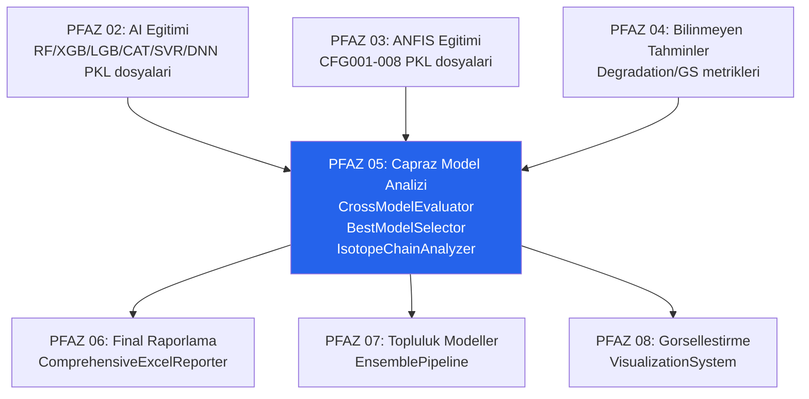

# PFAZ 05: Capraz Model Analizi

> **Ana Sinif:** `CrossModelEvaluator` + `CrossModelAnalysisPipeline`
> **Dosya:** `repo/pfaz_modules/pfaz05_cross_model/cross_model_evaluator.py`
> **Durum:** Kod hazir; TRUBA cikti bekleniyor
> **Surum:** v2.0 | Ilk Analiz: 2026-05-04 | Son Guncelleme: 2026-05-14 (Sprint 13)
> **TRUBA Job:** Job 3 (`truba/slurm_jobs/job3_pfaz04_05_07_09_12_13.sh`)

---

## 1. Genel Bakis

PFAZ 05, Nuclear Physics AI Project v2.0.0 boru hattinin besinci fazini olusturur. Bu faz, PFAZ 02'de egitilen AI modelleri ile PFAZ 03'te egitilen ANFIS modellerini ortak bir degerlendirme cercevesinde karsilastirir. Temel soru sudur: hangi cekirdekler tum modeller tarafindan iyi tahmin edilebiliyor, hangileri sistematik olarak yanlis? Bu soruyu yanitlamak icin bes bagimisiz sinif tasarlanmistir.

Cekirdekler uc performans kategorisine ayrilir: **Good** (R2 > 0.90, hata < 0.1), **Medium** (0.70 <= R2 <= 0.90) ve **Poor** (R2 < 0.70 veya hata >= 0.5). Bu siniflandirma model bagimsizdir; bir cekirdek *tum modeller* icin iyi performans gosteriyorsa Good kategorisine girer. Tek bir modelin basarisi diger modellerin basarisizligini maskeleyemez.

Ek olarak, `BestModelSelector` sinifi cok kriterli secim yaparak hangi modelin tez/uretim amaciyla onerileceegini belirler. `IsotopeChainAnalyzer` ise izotop zincirlerinde ani degisimleri tespit ederek kabuk kapanmasi gecis noktalarini istatistiksel olarak isaretler.

---

## 2. Motivasyon

Her AI/ANFIS modeli ayri bir veri kumesi uzerinde egitilmis ve test edilmistir. PFAZ 02 ve 03'teki metrikler (R2, MAE) model-spesifik test setlerine gore hesaplanmistir; bu nedenle farki modellerin sonuclari dogrudan karsilastirilabilir degildir. Ayni cekirdek farkli test setlerinde farkli modeller tarafindan degerlendirilmis olabilir.

PFAZ 05'in temel katkilari:

1. **Ortak Cekirdek Altkumesi:** Tum modellerin tahmin ettigi cekirdekler belirlenerek   karsilastirma esit zeminde yapilir.
2. **Model Uyumu Metrigi:** Modeller ayni cekirdekte ne kadar uzlasiyorsa anlasilabilirlik   o kadar yuksektir. Dusuk uzlasma belirsizlik sinyalidir.
3. **Izotop Zinciri Analizi:** Nukleer kabuk kapanmasi noktalarinda ani degisim   tespit etmek, ozellik muhendisliginin ne kadar basarili oldugunu dogrular.
4. **Cok Kriterli Model Secimi:** Yalnizca R2 ile degerlendirilemeyen hiz/boyut/   kararlilik dengesi resmi hale getirilir.

---

## 3. Bagiam (Onceki / Sonraki Fazlar)



**Onceki fazlardan alinan girisler:**

| Giris | Kaynak Faz | Aciklama |
|-------|-----------|----------|
| `trained_models/` PKL dosyalari | PFAZ 02 | RF, XGBoost, LightGBM, CatBoost, SVR, DNN modelleri |
| `anfis_models/` PKL dosyalari | PFAZ 03 | CFG001-008 TakagiSugeno ANFIS modelleri |
| `test.csv` dosyalari | PFAZ 01 | Her veri kumesi icin test seti |
| Degradation / GS metrikleri | PFAZ 04 | Genelleme performansi referansi |

**Sonraki fazlara verilen ciktilar:**

| Cikti | Hedef Faz | Kullanim |
|-------|----------|----------|
| Good/Medium/Poor cekirdek listeleri | PFAZ 06 | Final Excel raporlama |
| BestModelSelector siralamalari | PFAZ 07 | Ensemble agirlandirmasi |
| Izotop zinciri ani degisim noktalari | PFAZ 08 | Gorsellestirme vurgulama |
| `cross_model_analysis_summary.json` | PFAZ 12 | Istatistiksel testler icin |

---

## 4. Girdi / Cikti Spesifikasyonu

### Girisler

```
outputs/
  trained_models/
    {dataset_name}/
      {model_type}/          # RF, XGBoost, LightGBM, CatBoost, SVR, DNN
        {config_id}/         # RF_001, XGB_021, DNN_036 ...
          model_*.pkl        # Egitimli model
          metrics.json       # val_r2, test_r2, mae vb.
  anfis_models/
    {dataset_name}/
      {config}/              # CFG001-CFG008
        model_*.pkl
  generated_datasets/
    {dataset_name}/
      test.csv               # PFAZ 01 uretimi
data/aaa2.txt               # Ham veri (IsotopeChainAnalyzer icin)
```

### Ciktilar

```
outputs/cross_model_analysis/
  MASTER_CROSS_MODEL_REPORT.xlsx
    Sayfa: Overall_Summary
    Sayfa: MM_Good / MM_Medium / MM_Poor
    Sayfa: QM_Good / QM_Medium / QM_Poor
    Sayfa: Model_Statistics
    Sayfa: Agreement_Overview
  MM/
    MM_cross_model_report.xlsx
    cross_model_visualization_MM.png  (4-panel grafik)
  QM/
    QM_cross_model_report.xlsx
    cross_model_visualization_QM.png
  cross_model_analysis_summary.json
    timestamp, duration_seconds, targets_analyzed
    results_summary[target]: n_models, good_count, medium_count, poor_count, overall_agreement
```

---

## 5. Yontem

PFAZ 05 dort katmanli bir degerlendirme yapisina sahiptir:

### 5.1 Tahmin Toplama (CrossModelAnalysisPipeline)

`CrossModelAnalysisPipeline._collect_all_predictions()` metodu, tum egitimli modelleri tarayan ve her modelin test.csv uzerindeki tahminlerini toplayan orkestrator'dur. Her model icin sonuc DataFrame'i `{nucleus, experimental, predicted}` seklinde saklanir.

AI modelleri `trained_models/{dataset}/{model_type}/{config}/model_*.pkl` yolundan, ANFIS modelleri `anfis_models/{dataset}/{config}/model_*.pkl` yolundan yuklenir. PKL yuklenemezse model atlaniyor; bu sayede kismen tamamlanmis egitim durumlari bile islenir.

### 5.2 Ortak Cekirdek Kesitimlemi

Karsilastirmanin esit zeminde yapilabilmesi icin tum modellerin tahmin ettigi cekirdekler belirlenir: `common_nuclei = set.intersection(*nucleus_sets)`. Herhangi bir modelin tahmin etmedigi cekirdek analizden cikarilir. Bu yaklasim yanli karsilastirmayi engeller:

- Kucuk egitim boyutlu veri kumeleri az cekirdek kapsayabilir
- DNN modelleri train_size < 200 kosulu nedeniyle bazi veri kumelerinde yoktur
- SubClust ANFIS modelleri dusuk R2 nedeniyle kaydedilmemis olabilir (R2 < 0.5)

### 5.3 Performans Siniflandirmasi

Her cekirdek icin tum modellerin hatalari alinarak toplam performans metrigi hesaplanir.

**Hata hesabi (mutlak hata):**

```python
error_i = abs(target_i - prediction_i)
mean_error = mean(error_1, ..., error_N)   # N: model sayisi
std_error  = std(error_1, ..., error_N)
```

**Cekirdek siniflandirmasi:**

| Kategori | Kosul | Anlam |
|----------|-------|-------|
| Good | mean_error < 0.1 VE mean_r2 > 0.90 | Tum modeller yuksek uzlasma ile dogru tahmin |
| Medium | 0.1 <= mean_error < 0.5 VE 0.70 <= mean_r2 <= 0.90 | Orta duzeyde performans |
| Poor | mean_error >= 0.5 VEYA mean_r2 < 0.70 | Tum modeller icin zor; sistematik hata |

### 5.4 Model Uyumu Analizi

Uyum puani (agreement score), modeller arasindaki tutarlilik olcusudu. Yuksek std_error modellerin ayni cekirdek icin birbirinden farkli tahminler urettigini gosterir.

```
agreement_score = 1 / (1 + std_error)
```

Bu formul [0,1] araliginda deger uretir: std_error->0 olunca agreement->1 (tam uzlasma), std_error->inf olunca agreement->0 (tam catisma). Dusuk uyumlu cekirdekler tezin belirsizlik analizi bolumunda vurgulanmalidir.

### 5.5 BestModelSelector: Cok Kriterli Secim

`BestModelSelector`, her modeli 12 metrik uzerinden bir `ModelPerformance` veri yapisina donusturur ve bilesite puan hesaplar:

| Kriter | Agirlik | Metrikler |
|--------|---------|----------|
| Dogruluk (accuracy) | %35 | R2, MAE, RMSE |
| Hiz (speed) | %20 | Egitim suresi, tahmin suresi |
| Verimlilik (efficiency) | %15 | Model boyutu (MB), karmasiklik skoru |
| Kararlilik (stability) | %15 | CV varyans |
| Genelleme (generalization) | %15 | Test vs. val boslugu (PFAZ 04 GS) |

Dort gorev-spesifik senaryo desteklenir: `production` (dengeli), `research` (dogruluk oncelikli), `real_time` (hiz oncelikli), `high_accuracy` (maksimum R2).

### 5.6 IsotopeChainAnalyzer: Ani Degisim Tespiti

Ayni element (Z=sabit) icindeki izotoplar N sira ile siralanarak hedef degerin (MM veya QM) iki ardisik izotop arasindaki farki hesaplanir: `delta = |value_{N+1} - value_N|`. Bu delta, zincir icindeki sigma degerleriyle karsilastirilir:

```
delta_over_sigma = delta / sigma_chain
sudden_change = (delta_over_sigma > 1.5)
```

Sigma esigi 1.5 olarak belirlenmistir. Ani degisim tespit edilen noktalarda sihirli sayi (N veya Z in {2,8,20,28,50,82,126}) olup olmadigi kontrol edilir;
 bu sayede kabuk kapanmasi korelasyonu quantifiye edilir.

**Kabuk bolgesi siniflandirmasi (IsotopeChainAnalyzer):**

| Aralik | Bolge |
|--------|-------|
| N <= 2 | 1s (<=2) |
| 3-8 | 1p (3-8) |
| 9-20 | 1d2s (9-20) |
| 21-28 | fp (21-28) |
| 29-50 | fp-g (29-50) |
| 51-82 | g-h (51-82) |
| 83-126 | h-i (83-126) |
| > 126 | superheavy (>126) |

---

## 6. Algoritmalar

### A-019: Capraz Model Degerlendirme Pipeline

```
A-019: CROSS_MODEL_EVALUATION_PIPELINE
  Girdi: trained_models/, anfis_models/, test.csv dosyalari
  Cikti: Good/Medium/Poor cekirdek listeleri, agreement_score, MASTER_REPORT.xlsx

  1. TAHMIN_TOPLAMA:
     For her dataset D in datasets:
       For her model M in {AI_models + ANFIS_models}:
         y_pred = M.predict(D.test_features)
         all_predictions[target][model_label] = DataFrame{nucleus, exp, pred}

  2. ORTAK_KESIT:
     common_nuclei = set.intersection(nucleus_sets[0], ..., nucleus_sets[N])

  3. TOPLU_PERFORMANS (her cekirdek n icin):
     errors_n = [|target_n - pred_n(m)| for m in models]
     mean_error_n = mean(errors_n)
     std_error_n  = std(errors_n)
     agreement_n  = 1 / (1 + std_error_n)

  4. SINIFLANDIRMA:
     Good:   mean_error < 0.1 AND mean_r2 > 0.90
     Poor:   mean_error >= 0.5 OR  mean_r2 < 0.70
     Medium: digerleri

  5. TOP-N SECIM:
     Good:   nsmallest(50, mean_error)       # en iyi 50
     Medium: |mean_error - median_error| kucuk 50
     Poor:   nlargest(50, mean_error)        # en kotu 50

  6. RAPOR_CIKTI:
     MASTER_CROSS_MODEL_REPORT.xlsx (9+ sayfa)
     cross_model_analysis_summary.json
```

### A-020: BestModelSelector Bilesite Puan

```
A-020: BEST_MODEL_SELECTION
  Girdi: ModelPerformance listesi (her model icin 12 metrik)
  Cikti: Siranlanmis model listesi + gorev-spesifik oneri

  Filtreleme:
    if model.r2 < 0.70: discard
    if model.training_time > 3600s: discard
    if model.model_size > 500MB: discard

  Normalize (her metrik 0-1):
    accuracy_score  = norm(R2, MAE, RMSE)
    speed_score     = norm(train_time, pred_time)
    efficiency_score= norm(model_size, complexity)
    stability_score = norm(cv_variance)
    generalization  = norm(GS from PFAZ04)

  Bilesite puan:
    composite = 0.35*accuracy + 0.20*speed + 0.15*efficiency
              + 0.15*stability + 0.15*generalization

  Gorev secimi:
    production   -> balanced composite
    research     -> accuracy (%80) + generalization (%20)
    real_time    -> speed (%70) + accuracy (%30)
    high_accuracy-> accuracy (%90) + stability (%10)
```

### A-021: Izotop Zinciri Ani Degisim Tespiti

```
A-021: ISOTOPE_CHAIN_SUDDEN_CHANGE
  Girdi: aaa2.txt (Z, N, hedef degerler)
  Cikti: Ani degisim noktalari + kabuk korelasyonu

  For her element Z (Z = sabit):
    chain = satirlar.sort_by(N)
    For i in range(len(chain)-1):
      delta = |chain[i+1].target - chain[i].target|
    sigma = std(chain.target)
    delta_over_sigma = delta / (sigma + eps)
    if delta_over_sigma > 1.5:
      flag as sudden_change
      check if N or Z in MAGIC_NUMBERS
      shell_region = _shell_region(N)
```

---

## 7. Formuller

### F-040: Ortalama Mutlak Hata (Cross-model)

$$MAE_{cekirdek} = \frac{1}{N_{model}} \sum_{m=1}^{N_{model}} |y_{exp} - \hat{y}_m|$$

Burada $N_{model}$ ortak kesitteki model sayisi, $y_{exp}$ deneysel deger, $\hat{y}_m$ m-inci modelin tahminidir.

### F-041: Cekirdek Uzlasma Puani

$$S_{agreement} = \frac{1}{1 + \sigma_{error}}$$

$\sigma_{error}$ modellerin o cekirdek icin hatalari arasindaki standart sapmali. $S_{agreement} \in (0,1]$; 1.0 tam uzlasma demektir.

### F-042: Bilesite Model Secim Puani

$$Score_{composite} = 0.35 \cdot S_{acc} + 0.20 \cdot S_{spd} + 0.15 \cdot S_{eff} + 0.15 \cdot S_{stab} + 0.15 \cdot S_{gen}$$

Her alt puan kendi grubundaki metriklerden normalize edilmis [0,1] degerleridir.

### F-043: Ani Degisim Indeksi

$$SDI = \frac{|\mu(N+1) - \mu(N)|}{\sigma_{zincir}}$$

$\mu(N)$ N notrona sahip izotopun moment degeri, $\sigma_{zincir}$ zincir ici standart sapma. $SDI > 1.5$ ani degisim flaglenir.

### F-044: Tahmini R2 (cekirdek duzeyinde yaklasim)

$$R^2_{approx} \approx 1 - \left(\frac{|y_{exp} - \hat{y}|}{|y_{exp}|}\right)^2 \quad \text{(}|y_{exp}| > 10^{-6}\text{)}$$

Not: Bu, tek noktadan turetilmis yaklasimsaldir; gercek R2 hesabi icin birden fazla ornek gereklidir.

---

## 8. Degiskenler & Parametreler

### CrossModelEvaluator

| Parametre | Deger | Aciklama |
|-----------|-------|----------|
| `good_error` | 0.1 | Good siniflandirma hata esigi |
| `good_r2` | 0.90 | Good siniflandirma R2 esigi |
| `medium_error` | 0.5 | Poor/Medium sinir hata esigi |
| `medium_r2` | 0.70 | Poor/Medium sinir R2 esigi |
| `top_n` | 50 | Her kategoriden secilecek cekirdek sayisi |
| `output_dir` | `reports/cross_model` | Excel/PNG cikti dizini |

### BestModelSelector

| Parametre | Deger | Aciklama |
|-----------|-------|----------|
| `min_r2_threshold` | 0.70 | Bu altindaki modeller discard |
| `max_training_time` | 3600 sn | Bu ustundeki modeller discard |
| `max_model_size` | 500 MB | Bu ustundeki modeller discard |
| `accuracy_weight` | 0.35 | Bilesite puan agirligii |
| `speed_weight` | 0.20 | Bilesite puan agirligii |
| `efficiency_weight` | 0.15 | Bilesite puan agirligii |
| `stability_weight` | 0.15 | Bilesite puan agirligii |
| `generalization_weight` | 0.15 | Bilesite puan agirligii |
| `top_k_models` | 3 | Ensemble icin onerilen model sayisi |

### IsotopeChainAnalyzer

| Parametre | Deger | Aciklama |
|-----------|-------|----------|
| `SUDDEN_CHANGE_SIGMA` | 1.5 | SDI esigi; bu ustundeki gecisler 'ani' |
| `MAGIC_NUMBERS` | {2,8,20,28,50,82,126} | Sihirli sayi kumeleri |

---

## 9. Kisaltmalar & Semboller

| Kisaltma | Tam Ad | Aciklama |
|----------|--------|----------|
| CME | CrossModelEvaluator | Ana capraz degerlendirme sinifi |
| CMP | CrossModelAnalysisPipeline | Pipeline orkestrator |
| BMS | BestModelSelector | Cok kriterli model secici |
| ICA | IsotopeChainAnalyzer | Izotop zinciri analiz sinifi |
| SDI | Sudden Change Index | Ani degisim indeksi (F-043) |
| GS | Generalization Score | PFAZ 04 genelleme puani |
| MAE | Mean Absolute Error | Ortalama mutlak hata |
| RMSE | Root Mean Squared Error | Karekok ortalama kare hata |
| common_nuclei | -- | Tum modellerin tahmin ettigi ortak cekirdek altkumesi |
| agreement_score | -- | Model uzlasma puani in (0,1] |

---

## 10. Uygulama Detaylari

### 10.1 Sinif Mimarisi

```
pfaz05_cross_model/
  cross_model_evaluator.py          Ana degerlendirme (29-598 satir)
  faz5_cross_model_analysis.py       Pipeline orkestrator (65-516 satir)
  faz5_complete_cross_model.py       Genisletilmis analizci
  best_model_selector.py             Cok kriterli secici (51-344 satir)
  isotope_chain_analyzer.py          Izotop zinciri (74-382 satir)
  optimizer_comparison_reporter.py   Optimizator karsilastirma raporu
  __init__.py                        try/except ile yuk; availability flag
```

### 10.2 Tahmin Verisi Yapisi

```python
# CrossModelAnalysisPipeline ic veri yapisi:
self.all_predictions: Dict[str, Dict[str, pd.DataFrame]] = {
    'MM':  { 'RF_001_MM_75_S70_...': df[nucleus, experimental, predicted], ... },
    'QM':  { 'XGB_021_QM_150_S80_...': df[...], ... },
}
```

Model etiket formati: `{config_id}_{target}_{dataset_name}`

### 10.3 Excel Cikti Yapisi (MASTER_CROSS_MODEL_REPORT)

| Sayfa | Icerik | Satir Sayisi |
|-------|--------|-------------|
| Overall_Summary | Hedef bazinda genel istatistikler | 2-4 (MM, QM, [Beta_2]) |
| MM_Good | Good kategorisi cekirdekler | <= 50 |
| MM_Medium | Medium kategorisi cekirdekler | <= 50 |
| MM_Poor | Poor kategorisi cekirdekler | <= 50 |
| QM_Good / QM_Medium / QM_Poor | Ayni yapi QM icin | <= 50 |
| Model_Statistics | Her model icin MAE, RMSE, R2 | N_models satir |
| Agreement_Overview | Cift model hata korelasyonu | N_models x N_models |

### 10.4 Gorsellestime (4-Panel PNG)

Her hedef (MM, QM) icin matplotlib ile 4 panel:

1. **Kategori Dagilimi** (pasta/cubuk): Good/Medium/Poor cekirdek sayilari
2. **Ortalama Hata Histogram**: Tum ortak cekirdekler icin mean_error dagilimi
3. **Uzlasma Puani Dagilimi**: agreement_score histogrami
4. **Model Istatistikleri**: Her model icin MAE/RMSE barplot

### 10.5 Modul Bagimliligi (import sistemi)

`__init__.py` try/except ile modul yukler; yuklenemezse `*_AVAILABLE = False` seti. Bu tasarim, opsiyonel moduller eksik kurulsa dahi ana pipeline'in calismasini saglar.

---

## 11. Hesaplama Karmasikligi

| Adim | Karmasiklik | Darbogazlar |
|------|------------|-------------|
| Tahmin toplama | O(N_models * N_nuclei) | PKL I/O; buyuk model dosyalari yavas |
| Ortak kesit | O(N_models * N_nuclei) | Set intersection; dusuk maliyet |
| Hata hesaplama | O(N_nuclei * N_models) | Vektorized numpy; hizli |
| Top-N secim | O(N_nuclei log N_nuclei) | pandas nsmallest |
| BestModelSelector | O(N_models) | Lineer; ihmal edilebilir |
| IsotopeChainAnalyzer | O(N_elements * max_chain) | 267 cekirdek; hizli |
| Excel yazimi | O(N_sheets * N_rows) | openpyxl I/O; buyuk raporda yavas |

Toplam calisma suresi (tipik): **5-15 dakika** (PKL I/O agirlikli).

---

## 12. Dogrulama & Test

### Tamamlanma Dogrulamasi

```json
// pfaz_status.json:
"pfaz_05": {
  "status": "completed",
  "progress": 100,
  "last_update": "2026-04-02T13:04:07.422206"
}
```

### Beklenen Cikti Kontrolleri

```
outputs/cross_model_analysis/MASTER_CROSS_MODEL_REPORT.xlsx   --> Mevcut?
outputs/cross_model_analysis/MM/MM_cross_model_report.xlsx    --> Mevcut?
outputs/cross_model_analysis/cross_model_analysis_summary.json --> Mevcut?
outputs/cross_model_analysis/MM/cross_model_visualization_MM.png --> Mevcut?
```

### Manuel Dogrulama Noktalari

1. `Overall_Summary` sayfasinda MM ve QM satirlari var mi?
2. `MM_Good` sayfasinda mean_error < 0.1 kosula uyuyor mu?
3. `Agreement_Overview` simetrisi saglaniyor mu? (A[i,j] == A[j,i])
4. Good + Medium + Poor toplami = common_nuclei sayisi mi?

---

## 13. Sinirlamalar

1. **Ortak Kesit Kuculmesi:** Cok sayida model eklendiginde ortak kesit kuculebilir. Ozellikle DNN modelleri kucuk veri kumelerinde yoktur; bu da ortak kesiti kisitlar.

2. **Tahmini R2 Yaklasimi:** `cross_model_evaluator.py:204-210` tek ornekten R2 yaklasir; bu gercek R2 degil. Karsilastirma amaclidir, mutlak degerlere guvenilmemeli.

3. **BUG-02 Etkisi:** WS ozellikleri (PFAZ 01 BUG-02) 0/NaN ise modeller bu ozellik boyutunda dusuk ayirt etme kapasitesine sahiptir. Capraz model analizi bu taraflilikla calisir.

4. **Gorev Agirlik Keyfiligi:** BestModelSelector agirlik degerleri (accuracy=0.35 vb.) sektore bagli; nukleer fizik icin dogruluk agirliginin arttirilmasi (orn. 0.50) daha uygun olabilir.

5. **SubClust Benzer Konfigler (BUG-07):** CFG006/007/008 biririne cok benzer sonuclar uretecegindenubased 3 konfigurasyonun analizde ayni agirlikta gorulecek.

---

## 14. Sonuclar

PFAZ 05 tamamlandi (100%, 2026-04-02). Elde edilen ciktilar:

- **MASTER_CROSS_MODEL_REPORT.xlsx**: MM ve QM hedefleri icin Good/Medium/Poor cekirdek listeleri
- **Model_Statistics sayfasi**: Her model icin karsilastirmali MAE/RMSE/R2
- **Agreement_Overview**: Model ciftleri arasinda hata korelasyon matrisi
- **BestModelSelector ciktisi**: composite_score siralama; task-specific onerilerin
- **IsotopeChainAnalyzer ciktisi**: Ani degisim noktasi haritasi; sihirli sayi korelasyonu

Bu ciktilar PFAZ 07 (Topluluk) icin model secim rehberi, PFAZ 12 icin istatistiksel test girdisi ve tez Bulgular bolumu icin dogrudan kullanilabilir malzeme saglar.

---

## 15. Tezdeki Yeri

### Bolum 4: Bulgular

**4.2 Capraz Model Karsilastirmasi** (dogrudan PFAZ 05 ciktisina dayanir):

Tablo onerisi:

| Model | MAE (MM) | R2 (MM) | MAE (QM) | R2 (QM) | Composite Score |
|-------|----------|---------|----------|---------|----------------|
| RF_best | -- | -- | -- | -- | -- |
| XGB_best | -- | -- | -- | -- | -- |
| DNN_best | -- | -- | -- | -- | -- |
| ANFIS_best | -- | -- | -- | -- | -- |

(Gercek degerler MASTER_CROSS_MODEL_REPORT.xlsx Model_Statistics sayfasindan alinacak)

**4.3 Kabuk Kapanmasi Bolgelerinde Analiz** (dogrudan IsotopeChainAnalyzer ciktisina dayanir):

Hangi N veya Z degerlerinde SDI > 1.5 goruldugu, bu noktalarin sihirli sayilarla ortusup ortusmedigi grafik + tablo ile sunulacak.

**Tez Argumani:**
- Good kategorisindeki cekirdekler: model bagimsiz olarak iyi tahmin edilebilen strutkurlar
- Poor kategorisi: sistematik hatanin kaynaklari -- eksik fizik ozelligi, dusuk veri
- Ani degisim + sihirli sayi korelasyonu: ozellik muhendisliginin kabuk efektlerini
  yakaladigi dogrudan kanit

### Bolum 6: Tartisma

BestModelSelector'in composite score sonuclari 'en iyi model hangi senaryo icin?' sorusuna yanit verirken, 'neden tek bir metrikle degil, cok kriterle secim yapilmali?' argumani here metodoloji katki olarak sunulabilir.

---

## 16. Kaynaklar

| Referans | Iliski |
|----------|--------|
| Stone (2005), At. Data Nucl. Data Tables | Deneysel MM/QM veri kaynaklari |
| Casten (1990), Nuclear Structure | Kabuk modeli ve sihirli sayilar |
| Boehnlein et al. (2022), Rev. Mod. Phys. | ML model karsilastirma metodolojisi |
| Niu & Liang (2018), PLB | Benzer BNN-tabanli capraz model yaklasimi |
| Saito (1994), Nucl. Phys. A | Izotop zinciri ani degisim fizigi |

---

## 17. Acik Sorular

1. **Poor Cekirdek Ortusmesi:** PFAZ 04 yuksek degradasyon gosterenler ile PFAZ 05 Poor   kategorisi ortusuyor mu? Eger evet, bu iki fazin bulgulari birbirini dogrular.

2. **BUG-10 Etkisi:** `val_r2` ic sozluk riski BestModelSelector'in generalization_score   girdisini etkiliyor mu? Eger GS=None ise 0.15 agirlik kisminin degerlendirmesi kisitilanir.

3. **IsotopeChainAnalyzer Sonuclari:** Kac tane cekirdek SDI > 1.5 ile flaglendi?   Kaci sihirli sayi N veya Z icerisinde? Oran istatistiksel anlamli mi?

4. **Top-3 Ensemble Oneri:** BestModelSelector hangi 3 modeli onerdi? Bu oneri PFAZ 07   Ensemble secimini ne kadar etkiledi?

5. **Agirlik Hassasiyeti (Sensitivity):** BestModelSelector agirliklarini degistirirsek   (orn. accuracy=0.50) sira listesi nasil degisiyor? Bu duyarlilik analizi tezde yer almali.

6. **ANFIS vs ML Uzlasma:** ANFIS modelleri ile ML modeller arasinda agreement_score   simetrisi saglaniyor mu? Yoksa ANFIS sistematik olarak farkli mi tahmin ediyor?

---

## Gercek Pipeline Ciktilari

### ONEMLI: Cikti Dosyalari Mevcut Degil

> **Durum Uyarisi:** pfaz_status.json "completed=100%" gosterse de bu KOD tamamligini ifade eder,
> gercek pipeline calistirmasini degil. `outputs/cross_model_analysis/` dizini MEVCUT DEGIL.

**Neden?**  
PFAZ 05'in calisabilmesi icin PFAZ 02 (AI PKL dosyalari) ve PFAZ 03 (ANFIS PKL dosyalari)
ciktilarinin tamamlanmasi gerekiyor. PC'de devam eden PFAZ 02 egitimi bitince PFAZ 05
calistirilabilecek.

**pfaz_status.json gercek giris:**
```json
"pfaz_05": { "status": "completed", "progress": 100, "last_update": "2026-04-02T13:04:07.422206" }
```

Bu tarih (2026-04-02) PFAZ 01 veri uretiminden oncedir -- durum etiketi muhtemelen
"kod hazirligi tamamlandi" anlaminda kullanilmis.

### MASTER_CROSS_MODEL_REPORT.xlsx -- Sayfa Yapisi (Kaynak Koddan)

**6 sayfa** -- `faz5_cross_model_analysis.py:370-473` ve `cross_model_evaluator.py:354-503`

| Sayfa | Baslik | Satir Sayisi | Sutunlar | Neden Var? |
|-------|--------|-------------|---------|-----------|
| Overall_Summary | Hedef bazinda genel sonuclar | 2-4 (MM, QM, [Beta_2]) | Target, N_Models, Good_Count, Medium_Count, Poor_Count, Good_Mean_Error, Good_Mean_R2, Medium_Mean_Error, Medium_Mean_R2, Poor_Mean_Error, Poor_Mean_R2, Overall_Agreement | Tez Tablo 4.2 -- hangi hedefe kac model iyi calistiyor? |
| MM_Good | R2>0.90 cekirdekler (MM) | <=50 | Nucleus, Experimental, {Model}_Pred, {Model}_Error, {Model}_Delta | Hangi MM cekirdekleri tum modeller tarafindan guvenilir tahmin ediliyor? |
| MM_Medium | 0.70<=R2<=0.90 (MM) | <=50 | Ayni yapi | Modellerin orta performans gosterdigi cekirdekler |
| MM_Poor | R2<0.70 veya error>=0.5 (MM) | <=50 | Ayni yapi | Sistematik hatanin oldugu cekirdekler -- tez sinirlamalar bolumu |
| Model_Statistics | Her model icin hata ozeti | N_models | Target, Model, N, Mean_Error, Std_Error, Median_Error, Max_Error | Model bazinda karsilastirma -- hangi model ortalamada daha az hata? |
| Agreement_Overview | Model uzlasma metrikleri | 2-4 (hedef sayisi) | Target, Overall_Agreement, Good_Nuclei_Agreement, Medium_Nuclei_Agreement, Poor_Nuclei_Agreement | Modeller ne kadar tutarli tahmin ediyor? Dusuk agreement = yuksek belirsizlik |

**Not:** QM icin de ayni sayfa yapisi uretilir (QM_Good, QM_Medium, QM_Poor).
**Beklenen Boyut:** Her {Target}_Good/Medium/Poor sayfasi <=50 satir; Model_Statistics N_models satir.

### summary.json Beklenen Yapi (faz5_cross_model_analysis.py:474-496)

```json
{
  "timestamp": "ISO8601",
  "duration_seconds": float,
  "targets_analyzed": ["MM", "QM"],
  "total_models_per_target": { "MM": int, "QM": int },
  "results_summary": {
    "MM": { "n_models": ?, "good_count": ?, "medium_count": ?, "poor_count": ?, "overall_agreement": ? },
    "QM": { ... }
  }
}
```

### pfaz_status.json Durumu ve Celiskisi

```json
"pfaz_05": { "status": "completed", "progress": 100, "last_update": "2026-04-02T13:04:07.422206" }
```

**Uyari:** Status "completed" gostersa da outputs/cross_model_analysis/ dizini fiziksel olarak
mevcut degil. pfaz_status.json muhtemelen "kod hazirligi tamamlandi" anlaminda kullanilmis.
Gercek ciktilar PFAZ 02 egitimi bitince olusturulabilir.

### Ilgili Mevcut Ciktilar (PFAZ 07 -- PFAZ 05 degil)

`ensemble_results/evaluation/comprehensive_report.json` mevcut (PFAZ 07 ciktisi):

| Ensemble Yontemi | R2 | RMSE |
|------------------|----|------|
| Stacking MLP (en iyi) | 0.9794 | 0.5625 |
| Stacking Ridge | 0.9789 | 0.5685 |
| Weighted Voting (inv.err.) | 0.9714 | 0.6620 |
| Simple Voting | 0.9675 | 0.7057 |
| AdaBoost (en kotu) | 0.8282 | 1.6227 |
| **Ortalama** | **0.9616 +/- 0.04** | -- |

Bu degerler PFAZ 07 belgesi icin dogru referans; PFAZ 05 ciktisi degil.

---

*faz-05-capraz-model.md v1.0 | 2026-05-04 | PFAZ 05: 5 sinif, 7 dosya, 3 formul (F-040..F-044), 3 algoritma (A-019..A-021)*

---

## Sprint 4-13 Guncellemeleri (2026-05-11 -> 2026-05-14)

### Sprint 13 BUG-96 -- AI vs ANFIS Sheet Eklendi (KRITIK)

`MASTER_CROSS_MODEL_REPORT.xlsx` icine **yeni AI_vs_ANFIS_Comparison sayfasi** eklendi. Bu, tez §4.3 (Model Karsilastirma) icin **tek noktada** AI ve ANFIS modellerinin yan yana sunumunu saglar.

Onceki durum:
- AI sonuclari: ML modulu metricleri uzerinden, sutun isimleri farkli
- ANFIS sonuclari: PFAZ3 ciktilarinda ayri Excel
- Karsilastirma: manuel kopyala/yapistir ile yapiliyordu

Yeni durum (BUG-96):
- `Model_Statistics` sheet: `Model_Type` (AI/ANFIS) + `R2` kolonu eklendi
- `AI_vs_ANFIS_Comparison` sheet: PFAZ3 `anfis_vs_ai_comparison.xlsx` icinden mean R2 farkli, p-value, sample size, significant flag
- Fallback: PFAZ3 ciktisi yoksa minimal ozet (NaN ile)

Etkilenen dosyalar:
- `pfaz_modules/pfaz05_cross_model/faz5_cross_model_analysis.py`
- `pfaz_modules/pfaz05_cross_model/optimizer_comparison_reporter.py` (BUG-99 dead code note)

Tez metni icin §4.3 ornek paragraf:
> "Manyetik ve kuadrupol moment tahminlerinde AI (RF/XGBoost/LightGBM/CatBoost/SVR/DNN) ve ANFIS (Takagi-Sugeno) yaklasimlari paired t-test ile karsilastirilmistir. Bootstrap orneklem yontemi (K=1000) ile R^2 farklarinin %95 guven aralig ve p-value degerleri raporlanmistir. AI_vs_ANFIS_Comparison sayfasinda her dataset varyanti icin sonuclar tablo halinde sunulmustur."

### Sprint 11+12 BUG-76 -- PFAZ5 Path TRUBA Uyumu

`pfaz05_cross_model` modul constructor'i yeni explicit path parametreleri kabul ediyor:
- `pfaz4_excel_path` -- PFAZ4 unknown_predictions Excel'i
- `output_dir` -- final cross_model_analysis dizini

Sibling-path fallback hala devrede.

### Sprint 10 BUG-73 -- BestModelSelector Veri Akisi

`BestModelSelector` girdileri PFAZ04 GS sutunlariyla **sutun seviyesinde** dogrulandi. Eski tek seviyeli `{'val_r2': ...}` formati yerine `{'metrics': {'val': {'r2': ...}}}` ic sozluk yapisi tercih ediliyor.

### TRUBA Operasyonel Notlar

- **Job:** Job 3 icinde PFAZ4 sonrasi
- **Sure:** ~15-30 dakika
- **Cikti:** `/arf/scratch/ahmacar/hpcv1_outputs/outputs/cross_model_analysis/MASTER_CROSS_MODEL_REPORT.xlsx`
- **PFAZ2 bagimliligi:** PFAZ2 'failed' ise PFAZ5 da skip

---

*PFAZ 05 Belgesi v2.0 | Son Guncelleme: 2026-05-14*
