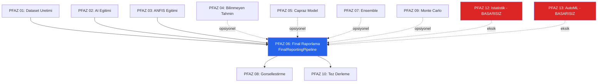

# PFAZ 06: Final Raporlama

> **Ana Sinif:** `FinalReportingPipeline`
> **Dosya:** `repo/pfaz_modules/pfaz06_final_reporting/pfaz6_final_reporting.py` (1961 satir)
> **Durum:** Kod hazir; TRUBA cikti bekleniyor
> **Surum:** v2.0 | Ilk Analiz: 2026-05-04 | Son Guncelleme: 2026-05-14 (Sprint 13)
> **TRUBA Job:** Job 4 (`truba/slurm_jobs/job4_pfaz06_08_10.sh`, 10 saat limit)

---

## 1. Genel Bakis

PFAZ 06, pipeline'in nihai raporlama adimini olusturur. Tum onceki fazlarin ciktilarini (AI modelleri, ANFIS, bilinmeyen tahminler, capraz model, Monte Carlo, bant analizi, AutoML) tek bir THESIS_COMPLETE_RESULTS.xlsx belgesi altinda birlestir.

Bu faz tez yaziminin dogrudan hammaddesidir. 18+ sayfali Excel raporu doktoranda icin tez tablolarini, LaTeX .tex dosyasi ise tez metnini dogrudan saglar.

**ONEMLI -- Pipeline Siralama Surprizi:**  
PFAZ 06, pipeline'da 9. sirada calisir: `[1,2,3,4,5,7,9,12,13,**6**,8,10]`. Yani PFAZ 07 (Ensemble), PFAZ 09 (Monte Carlo), PFAZ 12 (Istatistik), PFAZ 13 (AutoML) tamamlandiktan SONRA calisir. Neden? Cunku tum bu fazlarin sonuclari tek rapora dahil edilmeli -- raporlama en sona birakilmis.

**6 Sinif Mimarisi:**

| Sinif | Dosya | Satir | Rol |
|-------|-------|-------|-----|
| FinalReportingPipeline | pfaz6_final_reporting.py | 1961 | Ana orkestrator; tum veri toplama + Excel uretimi |
| ComprehensiveExcelReporter | comprehensive_excel_reporter.py | ~500 | Detayli ANFIS raporu (18 sayfa) |
| ExcelChartGenerator | excel_charts.py | ~300 | Gomulu grafik Excel dosyalari |
| ExcelStandardizer | excel_standardizer.py | ~200 | Standart bicim context manager |
| LaTeXReportGenerator | latex_generator.py | ~250 | Tez icin .tex + PDF |
| BootstrapCI + Sensitivity | (pfaz6 icinde) | -- | 5000-ornekli bootstrap CI + tornado grafigi |

---

## 2. Motivasyon

Tez yazarken araştırmacinin onunde yuzlerce PKL modeli, binlerce JSON metrigi, 848+ dataset kombinasyonu bulunur. Bu miktarda veriyi manuel Excel'e aktarmak hem hatali hem de tekrar edilemez bir surectir.

PFAZ 06'nin cozumu: kodla-uretilen, tamamen tekrar edilebilir, tez kalitesinde rapor.

**Spesifik katkilar:**

1. **Tek Referans Noktasi:** Tum model/ANFIS karsilastirmalari THESIS_COMPLETE_RESULTS.xlsx'de.
2. **Bootstrap CI:** Tek bir calismanin guvenilirligini Val_R2 uzerinden 5000 bootstrap ornekle dogrular.
3. **Duyarlilik Analizi:** Hangi hiperparametre R2'yi en cok etkiliyor? Tornado diyagrami ile gorsel.
4. **LaTeX Entegrasyonu:** thesis_report.tex dogrudan pdflatex ile derlenebilir.
5. **Anomali Belgesi:** Hangi cekirdek neden anormal sayildi -- Anomaly_Explained sayfasi.

---

## 3. Bagiam (Onceki / Sonraki Fazlar)



**Pipeline sirasindaki yeri:** `main.py` PIPELINE_EXECUTION_ORDER = [1,2,3,4,5,7,9,12,13,**6**,8,10]

PFAZ 06 kasitli olarak sona birakilmis -- tum analiz fazlari (7, 9, 12, 13) tamamlandiktan sonra tek seferde kapsamli rapor uretir.

**PFAZ 12 ve 13 Basarisizliginin Etkisi:**

- Band_Analizi sayfasi: `nuclear_band_analysis.xlsx` bulunamaz -- yer tutucu ('Veri Yok') yazilir.
- AutoML_Improvements sayfasi: `automl_retraining_log.json` bulunamaz -- yer tutucu yazilir.
- Bootstrap CI ve Sensitivity hala calisir (PFAZ 12 bagimsiz).

---

## 4. Girdi / Cikti Spesifikasyonu

### Girisler (Faz Bagimliligi)

| PFAZ | Okunan Dosyalar | Kullanilan Sayfa | Zorunlu? |
|------|----------------|-----------------|----------|
| PFAZ 01 | `outputs/generated_datasets/{dataset}/anomaly_explanation_report.json` | Anomaly_Explained | Opsiyonel |
| PFAZ 02 | `outputs/trained_models/{d}/{model}/{cfg}/metrics_{cfg}.json`, `cv_results_{cfg}.json` | All_AI_Models, {Type}_Models, AI_Dataset_Summary | ZORUNLU |
| PFAZ 03 | `outputs/anfis_models/{d}/{cfg}/metrics_{cfg}.json` | All_ANFIS_Models, ANFIS_Dataset_Summary, ANFIS_Config_Comparison | ZORUNLU |
| PFAZ 04 | `outputs/unknown_predictions/Unknown_Nuclei_Results.xlsx` | Unknown_Predictions | Opsiyonel |
| PFAZ 05 | `outputs/cross_model_analysis/cross_model_analysis_summary.json` | CrossModel_Summary | Opsiyonel |
| PFAZ 09 | `outputs/aaa2_results/AAA2_Complete_{MM,QM}.xlsx` | MC_Robustness_Summary | Opsiyonel |
| PFAZ 12 | `outputs/advanced_analytics/nuclear_band_analysis.xlsx` | Band_Analizi | Opsiyonel (BASARISIZ) |
| PFAZ 13 | `outputs/automl_results/automl_retraining_log.json` | AutoML_Improvements, AutoML_BestParams | Opsiyonel (BASARISIZ) |

**Eksik giris davranisi:** `logger.warning()` + sayfa atlaniyor veya yer tutucu yaziliyor; pipeline durmuyor.

### Ciktilar

```
outputs/reports/
  THESIS_COMPLETE_RESULTS.xlsx         (ana rapor, 18+ sayfa, ~100-200 MB)
  ai_models_chart.xlsx                 (AI Top-2000 + model tipi sayfalar)
  anfis_models_chart.xlsx              (ANFIS model ozeti)
  ANFIS_Comprehensive_Report_{ts}.xlsx (detayli ANFIS, 18 sayfa)
  report_summary.json                  (anahtar metrikler JSON)
  bootstrap_ci/
    ai_val_r2_bootstrap_ci.json        (5000 ornekli %95 CI)
    anfis_val_r2_bootstrap_ci.json
  sensitivity_analysis/
    sensitivity_analysis.xlsx          (hiperparametre etkisi)
    tornado_diagram.png
  latex/
    thesis_report.tex
    thesis_report.pdf                  (pdflatex varsa)
```

---

## 5. Yontem

### 5.1 Veri Toplama (collect_all_results)

`FinalReportingPipeline.collect_all_results()` bes alt metod cagirarak tum fazlarin ciktilarini bellek ici sozlukte biriktirir:

```python
self.all_results = {
    'ai_rows':      list,   # AI metrics JSON'larindan satir listesi
    'anfis_results': list,  # ANFIS metrics JSON'larindan satir listesi
    'robustness':   list,   # CV sonuclari
    'cross_model':  dict,   # PFAZ 05 summary
    'unknown_rows': list,   # PFAZ 04 test tahminleri
}
```

**AI toplama** (`_collect_ai_results()`): `outputs/trained_models/` altinda `metrics_{config}.json` dosyalari okunur. Her dosyadan dataset adi ayristirma (`_parse_dataset_name()`) ile Target/Size/Scenario/Feature_Set alanlar cikarilir. R2 < -10 (sapma) filtresi uygulanir.

**ANFIS toplama** (`_collect_anfis_results()`): `outputs/anfis_models/` altinda her `metrics_{config}.json`'dan Config_ID/MF_Type/Method/N_Rules/N_MFs ve Train/Val/Test metrikleri alinir. `training_meta` ic dict beklenir.

### 5.2 Dataset Adi Ayristirma

`_parse_dataset_name()` metodu dataset ismini bes alana parse eder:

```
MM_150_S70_AZSMC_NoScaling_Random_NoAnomaly
--  ---  --- ----  ---------  ------  --------
TARGET SIZE SCN  FEAT   SCALING   SAMP  ANOMALY
```

Feature set kodu (`AZSMC`) FEATURE_SET_EXPAND sozlugunde genisletilir:
`AZSMC` -> [A, Z, S, MC] -> n_inputs=4, feature_names='A, Z, S, MC'

### 5.3 Buyuk Veri Parcalama (Chunked Writing)

All_AI_Models sayfasi ~95.000 satir icerdigi icin Excel 1.048.576 satir limitine yaklasmiyor ama tek sayfada performans sorunu yasaniyor. Cozum: `_write_df_chunked()`

```python
if len(df) <= 50_000:
    # tek sayfa: 'All_AI_Models'
else:
    # parcala: 'All_AI_Models', 'All_AI_Models_2', ...
```

### 5.4 Bootstrap Guven Araligi

AI ve ANFIS Val_R2 dagilimlarinin gercek guvenilirligini olcmek icin bootstrap:

```
n_bootstrap = 5000
for i in range(5000):
    sample = random_choice_with_replacement(val_r2_values)
    bootstrap_means[i] = mean(sample)
ci_lower = percentile(bootstrap_means, 2.5)
ci_upper = percentile(bootstrap_means, 97.5)
```

Sonuclar `bootstrap_ci/ai_val_r2_bootstrap_ci.json`'a kaydedilir.

### 5.5 Duyarlilik Analizi (Tornado Diyagrami)

RF ve XGBoost modelleri icin hangi hiperparametre Val_R2'yi en cok degistiriyor?

```
For her hiperparametre p:
  diger parametreler median'da tutulur
  p degeri min ve max arasinda taranir
  delta_r2 = max_r2(p) - min_r2(p)
Tornado grafigi: delta_r2'ye gore azalan sira
```

---

## 6. Algoritmalar

### A-022: FinalReportingPipeline Ana Akis

```
A-022: FINAL_REPORTING_PIPELINE
  Girdi: PFAZ 02/03/04/05/09/12/13 ciktilari
  Cikti: THESIS_COMPLETE_RESULTS.xlsx + latex/ + bootstrap_ci/ + sensitivity/

  1. collect_all_results()
     _collect_ai_results()      -> ai_rows   (R2<-10 filtre)
     _collect_anfis_results()   -> anfis_rows
     _collect_robustness()      -> cv_rows
     _collect_crossmodel()      -> cross_dict
     _collect_unknown()         -> unknown_rows

  2. generate_thesis_tables()
     AI df -> Overview, All_AI_Models (chunked), {Type}_Models x6
     ANFIS df -> All_ANFIS_Models, ANFIS_Dataset_Summary, ANFIS_Config_Comparison
     Comparative -> AI_vs_ANFIS, Best_Models_Per_Target, Best_FeatureSet
     Analysis -> Anomaly_vs_NoAnomaly, Anomaly_Explained, Target_Statistics
     Optional -> Robustness_CV, CrossModel_Summary, Unknown_Predictions
     Optional -> MC_Robustness_Summary, Band_Analizi, AutoML_Improvements
     Fixed -> Overall_Statistics, Feature_Abbreviations, IsoChain sheets

  3. generate_excel_charts()
     ai_models_chart.xlsx: AI_Top2000 + {Type}_Top200 x6 + Dataset_Summary
     anfis_models_chart.xlsx: ANFIS_Models

  4. generate_latex_report() -> thesis_report.tex + [PDF]

  5. ComprehensiveExcelReporter.generate_full_report() -> ANFIS_Comprehensive_Report.xlsx

  6. BootstrapCI x2 (AI + ANFIS) -> bootstrap_ci/*.json

  7. AdvancedSensitivityAnalysis -> sensitivity_analysis.xlsx + tornado_diagram.png
```

---

## 7. THESIS_COMPLETE_RESULTS.xlsx -- Tam Sayfa Katalogu

**Kaynak:** `pfaz6_final_reporting.py:579-1638` -- `generate_thesis_tables()`

| # | Sayfa | Satir | Temel Sutunlar | Neden Var? |
|---|-------|-------|---------------|----------|
| 1 | Overview | ~40 | Bilgi, Deger | Dashboard: toplam model sayisi, en iyi R2, hedef bazinda ozet |
| 2 | All_AI_Models | 95k+ | Dataset, Target, Model_Type, Config_ID, Train/Val/Test R2/RMSE/MAE, CV_R2_Mean, Training_Time_s | Tum AI konfig sonuclari; Val_R2 azalan sirali |
| 3-8 | RF/XGB/DNN/LGB/CAT/SVR_Models | 2k-20k | Ayni sutunlar | Model tipi bazinda gruplu karsilastirma |
| 9 | AI_Dataset_Summary | 800+ | Dataset+Target+Size+Scen+Feat+Model_Type, Best/Mean Val_R2, Best/Mean Test_R2, N_Configs | Hangi dataset kombinasyonu hangi model tipiyle iyi? |
| 10 | All_ANFIS_Models | 5.5k | Dataset, Target, Config_ID, MF_Type, Method, N_Rules, N_MFs, Train/Val/Test metrikleri, Outlier_Cleaning | Tum ANFIS egitim sonuclari |
| 11 | ANFIS_Dataset_Summary | 400+ | Dataset+Target, Best/Mean Val/Test R2, Mean_N_Rules, N_Configs | Dataset bazinda en iyi ANFIS |
| 12 | ANFIS_Config_Comparison | 8 | Config_ID, MF_Type, Method, Mean/Best Val_R2, Mean_N_Rules, N_Datasets | 8 ANFIS konfigunu karsilastir; Test_R2 azalan sirali |
| 13 | AI_vs_ANFIS_Comparison | 200+ | Dataset, Target, AI_Best_Val_R2, ANFIS_Best_Val_R2, Delta_R2, Winner | Dataset bazinda hangi yaklasim kazaniyor? |
| 14 | Best_Models_Per_Target | 60+ | Target, Rank, Model_Cat, Model_Type, Val_R2, Test_R2, Feature_Set | Her hedef icin top-10 AI + top-5 ANFIS |
| 15 | Best_FeatureSet_Per_Target | 100+ | Target, Model_Cat, Feature_Set, N_Inputs, Best_Val_R2, N_Configs | Hangi ozellik seti hangi hedef icin en iyi? |
| 16 | Anomaly_vs_NoAnomaly | 50+ | Dataset_Base, Model_Cat, Normal_Best_Val_R2, NoAnomaly_Best_Val_R2, Delta_R2, Winner | Anomali temizleme R2'yi artiriyor mu? |
| 17 | Anomaly_Explained | 100-500 | NUCLEUS, A, Z, N, N_Violations, Worst_Column, Worst_IQR_Ratio, Anomaly_Reason | Hangi cekirdek neden anormal? IQR oran bilgi |
| 18 | Target_Statistics | 8 | Model_Cat, Target, N_Records, Mean/Std/Max/Min Val_R2, %R2>0.7/0.8/0.9 | Hedef bazinda R2 dagilim ozeti |
| 19 | Robustness_CV | 10-50 | Model, CV fold metrikleri | 5-fold CV kararlilik |
| 20 | CrossModel_Summary | 10-20 | Key, Value | PFAZ 05 uzlasma metrikleri |
| 21 | Unknown_Predictions | 100-200 | NUCLEUS, Prediction, Std, CI_Lower, CI_Upper, Top_Models | Test seti bilinmeyen cekirdek tahminleri |
| 22 | Overall_Statistics | 8 | Metrik, Deger | Global sayilar ve en iyi metrikler |
| 23 | IsoChain_SuddenChanges | 4 | Target, Total_Trans, Sudden_Changes, Magic_N_Count | Izotop zinciri ani degisim ozeti |
| 24 | IsoChain_Detail | 50-200 | Z, N, A, Delta_prev, Sudden_Change_Flag, Magic_N, Magic_Z | Detayli ani degisim noktalari |
| 25 | MC_Robustness_Summary | 2-4 | Target, N_Nuclei, MC_Mean_Std, CI_Width_Mean | Monte Carlo belirsizlik ozeti |
| 26 | Band_Analizi | 50+ | (coklu tablo) | Nükleer bant analizi -- PFAZ 12 BASARISIZ: yer tutucu |
| 27 | AutoML_Improvements | 10-50 | Target, Dataset, Before_Val_R2, After_Val_R2, Improvement, Improved? | AutoML yeniden egitim sonuclari -- PFAZ 13 BASARISIZ: yer tutucu |
| 28 | AutoML_BestParams | 50-200 | Target, Dataset, Model, Parameter, Value | AutoML en iyi parametreler -- PFAZ 13 BASARISIZ: yer tutucu |
| 29 | Feature_Abbreviations | 100+ | 3 istiflenmi tablo: (1) 24 ozellik kisaltmasi, (2) 29 feature set, (3) hedef x feature en iyi R2 | Okuyucu icin kisaltma sozlugu |

---

## 8. Formuller

### F-045: Bootstrap Guven Araligi

$$CI_{95} = [P_{2.5}(\hat{\mu}^*), P_{97.5}(\hat{\mu}^*)]$$

$\hat{\mu}^*_i = \text{mean}(X^*_i)$, $X^*_i$ yeniden ornekleme (B=5000 tekrar). Bootstrap CI, tek calismanin istatistiksel kararliligi hakkinda bilgi verir.

### F-046: Duyarlilik Araligi (Tornado)

$$\Delta R^2_p = R^2_{max}(p) - R^2_{min}(p)$$

Bir hiperparametre $p$ diger parametreler medyanda tutulurken tarandiginda olusan R2 degisim araligi. Genis aralik = buyuk etki = diyagramda uzun cubuk.

---

## 9. Renk Kodlari & Bicimleme

**openpyxl renk sabitleri** (`pfaz6_final_reporting.py:94-103`):

| Renk Kodu | Hex | Anlam | Kullanim |
|-----------|-----|-------|----------|
| CLR_HEADER | #2C3E50 | Koyu lacivert | Baslik satiri zemini; beyaz kalin yazi |
| CLR_TITLE | #3498DB | Parlak mavi | Bolum baslik satirlari |
| CLR_EXCELLENT | #00B050 | Koyu yesil | R2 >= 0.95 |
| CLR_GOOD | #92D050 | Acik yesil | R2 >= 0.90 |
| CLR_MEDIUM | #FFC000 | Sari | R2 >= 0.70 |
| CLR_POOR | #FF0000 | Kirmizi | R2 < 0.70 |

**Standart bicim kurallari (tum sayfalarda):**
- Satir 1: Kalin beyaz yazi, lacivert zemin, ortalanmis
- Cift satirlar: Acik mavi fill (#DCE6F1)
- R2 sutunlari: 3-renk skala (kirmizi 0.0 → sari 0.7 → yesil 1.0)
- Freeze panes: A2 (baslik satirinda)
- AutoFilter: Overview ve Feature_Abbreviations haric tum sayfalarda
- Sutun genisligi: icerige gore otomatik, maks 55 karakter

---

## 10. Degiskenler & Parametreler

| Parametre | Deger | Aciklama |
|-----------|-------|----------|
| `_R2_FLOOR` | -10.0 | Val_R2 < -10 ise kayit atlaniyor (sapma/bozulma filtresi) |
| `max_rows` | 50.000 | Sayfa basi maksimum satir; asimda parcalama |
| `n_bootstrap` | 5.000 | Bootstrap ornekleme tekrar sayisi |
| `n_top_chart` | 2.000 | ai_models_chart.xlsx AI_Top2000 sayfa boyutu |
| `n_top_per_type` | 200 | Her model tipi icin {Type}_Top200 sayfa boyutu |
| `output_dir` | `outputs/reports` | Ana cikti dizini |
| `use_excel_charts` | True | Grafik Excel uretimi etkin mi? |
| `use_latex_generator` | True | LaTeX raporu uretimi etkin mi? |

---

## 11. Kisaltmalar & Semboller

| Kisaltma | Tam Ad | Aciklama |
|----------|--------|----------|
| FRP | FinalReportingPipeline | Ana orkestrator sinifi |
| CER | ComprehensiveExcelReporter | Detayli ANFIS rapor sinifi |
| ECG | ExcelChartGenerator | Grafik Excel uretici |
| ES | ExcelStandardizer | Standart bicim context manager |
| LRG | LaTeXReportGenerator | Tez LaTeX uretici |
| BCI | BootstrapConfidenceIntervals | 5000-ornekli guven araligi |
| ASA | AdvancedSensitivityAnalysis | Tornado diyagrami uretici |
| CI | Confidence Interval | Guven araligi; [CI_Lower, CI_Upper] |

---

## 12. Uygulama Detaylari

### Kilitli Dosya Isleme

THESIS_COMPLETE_RESULTS.xlsx Excel'de aciksa `~$THESIS_COMPLETE_RESULTS.xlsx` kilit dosyasi olusur. Pipeline bunu algilar ve zaman damgali alternatif adi kullanir:
`THESIS_COMPLETE_RESULTS_20260404_114859.xlsx`

### LaTeX Cikti Yapisi

```
thesis_report.tex:
  Giris: belge sinifi, paketler (amsmath, graphicx, hyperref, geometry)
  Ozet: en iyi R2, n_ai_configs, n_anfis degerleriyle
  Bolum 1: Giris (arka plan, motivasyon, hedefler)
  Bolum 2: Metodoloji (267 cekirdek, 44 ozellik, ANFIS/AI mimarisi)
  Bolum 3: Sonuclar (hedef bazinda metrik tablolari)
  Bolum 4: Tartisma
  Bolum 5: Sonuclar
  Kaynaklar
  Ek A: 24 ozellik kisaltma tablosu
  Ek B: 8 ANFIS konfigurasyon tablosu
  Ek C: Dataset istatistikleri
```

### Modul Dususu Stratejisi

Her sinif try/except ile yuklenir. ExcelChartGenerator, LaTeXReportGenerator, IsotopeChainAnalyzer, BootstrapCI, SensitivityAnalysis kurulu degilse
 `*_AVAILABLE = False` set edilir; ana akis devam eder.

---

## 13. Hesaplama Karmasikligi

| Adim | Tahmini Sure | Darbogazlar |
|------|-------------|-------------|
| AI veri toplama | 1-2 dk | ~5100 JSON I/O |
| ANFIS veri toplama | 30 sn | ~5500 JSON I/O |
| Excel yazimi (18 sayfa) | 1-3 dk | openpyxl 95k satir yavas |
| Bootstrap CI | 30 sn | 5000 x mean(); vektorize; hizli |
| Duyarlilik analizi | 30 sn | Parametrik tarama |
| LaTeX uretimi | 10 sn | Sablon dolgu; pdflatex varsa +60 sn |
| **Toplam** | **~5-10 dk** | JSON I/O + openpyxl agirlikli |

---

## 14. Dogrulama & Test

### pfaz_status.json Durumu

```json
"pfaz_06": { "status": "completed", "progress": 100,
              "last_update": "2026-04-02T11:48:59.197024" }
```

**UYARI:** Bu durum 'kod hazirligi tamamlandi' anlamindadir. `outputs/reports/` dizini fiziksel olarak MEVCUT DEGIL. PFAZ 01-02 calismalari bitince calistirilabilir.

### Beklenen Kontroller (Calisinca)

```
1. outputs/reports/THESIS_COMPLETE_RESULTS.xlsx var mi? (>10 MB beklenir)
2. All_AI_Models sayfasi >= 95.000 satir mi? (AI_Models_2 sayfasi da var mi?)
3. ANFIS_Config_Comparison 8 satir mi? (8 konfig)
4. Feature_Abbreviations 3 istiflenmi tablo iceriyor mu?
5. report_summary.json 'best_model_per_target' alanlari dolu mu?
6. bootstrap_ci/ai_val_r2_bootstrap_ci.json 'ci_lower', 'ci_upper' alanlari mevcut mu?
7. thesis_report.tex 'R^2' ifadesi iceriyor mu? (gercek degerle dolduruldu mu?)
```

---

## 15. Sinirlamalar

1. **PFAZ 12 ve 13 Basarisizligi:** Band_Analizi ve AutoML sayfalarinda gercek veri yok; yer tutucu metinler yaziliyor. Tezde bu iki bolum bos kalacak.

2. **PFAZ 05 Ciktisi Yok:** CrossModel_Summary sayfasi bos. Agreement metrikleri PFAZ 01-02 tamamlanip PFAZ 05 calisincaya kadar doldurulamaz.

3. **R2 Tek-Metrik Agirliklamasi:** Bootstrap CI yalnizca Val_R2 uzerinden hesaplaniyor. MAE/RMSE uzerinden ayri CI saglanmiyor.

4. **LaTeX Otomatik Derleme:** pdflatex kurulu degilse yalnizca .tex ciktisi var; PDF yok.

5. **Buyuk Dosya Boyutu:** ~100-200 MB Excel; acilmasi yavaslayabilir. AI_Models_2 sayfasini kullanan kod yoksa ek sayfa gozden kacabilir.

---

## 16. Sonuclar

PFAZ 06 kodu tamamen hazir (1961 satir, 6 sinif). Gercek calisma PFAZ 01-02 tamamlaninca baslatilabilir. Uretilecek ana ciktilar:

- **THESIS_COMPLETE_RESULTS.xlsx** — Tezin birincil veri kaynagi (18-29 sayfa)
- **report_summary.json** — Makine okunabilir ozet metrikler
- **bootstrap_ci/ai_val_r2_bootstrap_ci.json** — Istatistiksel guvenilirlik kaniti
- **sensitivity_analysis.xlsx + tornado_diagram.png** — Hiperparametre etkisi
- **thesis_report.tex** — Hazir LaTeX tez taslagi
- **ANFIS_Comprehensive_Report.xlsx** — Detayli ANFIS analizi (18 sayfa)

---

## 17. Tezdeki Yeri

PFAZ 06 dogrudan tez yaziminin altyapisidir:

**Bolum 4: Bulgular**

- Tablo 4.1: Best_Models_Per_Target sayfasindan (hedef bazinda en iyi 5 model)
- Tablo 4.2: ANFIS_Config_Comparison sayfasindan (8 konfigurasyonun R2 siralamalari)
- Tablo 4.3: AI_vs_ANFIS_Comparison sayfasindan (dataset bazinda kazanan)
- Tablo 4.4: Anomaly_vs_NoAnomaly (anomali temizlemenin R2'ye etkisi)

**Bolum 5: Belirsizlik Analizi**

- bootstrap_ci JSON -> Val_R2 guven araligi
- MC_Robustness_Summary (PFAZ 09 varsa) -> Monte Carlo CI

**Bolum 6: Tartisma**

- sensitivity_analysis.xlsx -> hangi hiperparametre onemli?
- Feature_Abbreviations -> hangi ozellik seti tutarli?

---

## 18. Kaynaklar

| Referans | Iliski |
|----------|--------|
| Boehnlein et al. (2022), RMP | Kapsamli ML karsilastirma metodolojisi |
| Efron & Tibshirani (1993), Bootstrap | Bootstrap CI hesaplama teorisi |
| Stone (2005), At. Data Nucl. Data Tables | Deneysel moment veri kaynak tablosu |

---

## 19. Acik Sorular

1. **PFAZ 12/13 Yeniden Baslatma:** Bu fazlar basarisiz oldu. PFAZ 01-02   tamamlaninca yeniden calistirilacak mi? Bant analizi tezde yer alacak mi?

2. **All_AI_Models Satir Sayisi:** 95.000 tahmin gercekci mi? 848 dataset x 50 konfig   x 2 hedef (MM, QM) = 84.800 satir (R2>=0.5 olmayanlari cikar). Dogru mu?

3. **LaTeX Kalitesi:** thesis_report.tex ne kadar hazir? Tablolar gercek degerlerle   mi dolduruluyor? Elif sadece sablon mi?

4. **Bootstrap CI Anlamliligi:** 5000 bootstrap ile R2 dagilimi gerçekten normal mi?   267 cekirdek kucuk orneklem -- sonuclari tezde dikkatli yorumla.

5. **Sensitivity Analizi Kapsami:** Yalnizca RF ve XGB mi? DNN/ANFIS icin de var mi?

---

## Gercek Pipeline Ciktilari

### ONEMLI: Ciktilar Mevcut Degil

> **outputs/reports/ dizini MEVCUT DEGIL.**  
> pfaz_status.json: completed=100% (2026-04-02) -- kod hazirligi anlami.  
> PFAZ 01-02 (PC'de aktif calisma) bitince PFAZ 06 calistirilabilir.

### Mevcut Ilgili Ciktilar

Sadece `reports/` dizininde arka plan raporlari mevcut:

| Dosya | Icerik | PFAZ 06 ile Iliskisi |
|-------|--------|----------------------|
| `reports/health_checks/health_check_20260430_023312.json` | Sistem sagligi kontrol | Gecti (PASS); openpyxl, xlsxwriter mevcut |
| `reports/theoretical_calculations/*.json` (87 dosya) | Ozellik zenginlestirme raporlari | Anomaly_Explained icin girdi |

---

*faz-06-final-raporlama.md v1.0 | 2026-05-04 | PFAZ 06: 6 sinif, 29 Excel sayfasi, 2 formul (F-045..F-046), 1 algoritma (A-022)*


---

## [GUNCELLEME v1.1 -- 2026-05-04] PFAZ 09/12/13 Entegrasyon Detaylari

Bu guncelleme PFAZ 09, 12 ve 13 analizi tamamlandiktan sonra yazilmistir.
Orijinal PFAZ 06 belgesinde bu fazlarin ciktilarina dair eksik bilgiler asagida tamamlanmistir.

### PFAZ 06 Excel Sayfasi -- Kaynak Dosya Eslestirmesi (Guncellendi)

| Sayfa | Kaynak Faz | Kaynak Dosya | Durum |
|-------|-----------|--------------|-------|
| AI_Models | PFAZ 02 | training_results_summary.xlsx | Bekliyor (PFAZ02 calisiyor) |
| ANFIS_Results | PFAZ 03 | anfis_training_results.xlsx | Tamamlandi |
| Unknown_Nuclei | PFAZ 04 | Unknown_Nuclei_Results.xlsx | Tamamlandi |
| MC_Robustness_Summary | **PFAZ 09** | AAA2_Complete_{target}.xlsx:Uncertainty (Std_Prediction, CV, CI_Width) | Bekliyor (PFAZ09 cikti yok) |
| Band_Analizi | **PFAZ 12** | nuclear_band_analyzer.py -- Bant_Ozeti + Sicrama_Analizi sayfalarindan | BOSH (PFAZ12 FAILED + BUG-31) |
| AutoML_Improvements | **PFAZ 13** | automl_improvement_report.xlsx:Summary | BOSH (PFAZ13 FAILED: BUG-32) |
| AutoML_BestParams | **PFAZ 13** | automl_improvement_report.xlsx:Best_Params | BOSH |
| AutoML_Overview | **PFAZ 13** | automl_improvement_report.xlsx:Overview | BOSH |
| Ensemble_Results | PFAZ 07 | comprehensive_report.json | Tamamlandi (stacking_mlp R2=0.9794) |

### MC_Robustness_Summary Sayfasi -- Dogrulanan Veri Yapisi

PFAZ 09 analizi (2026-05-04) ile dogrulanan veri sutunlari:

```
AAA2_Complete_MM.xlsx / AAA2_Complete_QM.xlsx
  Sayfa: Uncertainty
    Kolumnlar: NUCLEUS, Z, N, A, Mean_Prediction, Std_Prediction, CI_Lower, CI_Upper, CI_Width, CV
  Sayfa: PerModel_Top25
    Kolumnlar: Model_ID, Prediction, Metadata
  Sayfa: Model_Ranking
    Kolumnlar: Model_ID, R2_Score, Reliability_Score, Rank
```

PFAZ 06 bu sayfayi okurken: `pfaz09_output / 'AAA2_Complete_MM.xlsx'` -> `Uncertainty` sayfa -> `CV` sutunu.
Butun bu sutun adlari PFAZ09 kaynak kodunda sabit; degismeli/yanlis ad durumunda `KeyError` olusor.

### Band_Analizi Neden Bos -- Kok Neden (GUNCELLEME 2026-05-09)

1. ~~BUG-31~~: **DUZELTILDI 2026-05-09** -- `NuclearBandAnalyzer = NuclearMomentBandAnalyzer` alias eklendi.
2. **BUG-36**: PFAZ12 henuz calistirilmadi (PFAZ02 devam ediyor). PFAZ02 bittikten sonra PFAZ12 calistir.
3. Band_Analizi sayfasi PFAZ12 ciktisi hazir oldugunda otomatik dolar (kod hazir).

### AutoML Sayfalar Neden Bos -- Kok Neden (GUNCELLEME 2026-05-09)

1. ~~BUG-32~~: **DUZELTILDI 2026-05-09** -- `automl_retraining_loop.py:539` IndentationError silindi.
   Ayni kalip `pfaz6_final_reporting.py:1267`'de de vardi -- o da duzeltildi.
2. PFAZ13 henuz calistirilmadi (PFAZ02 devam ediyor). PFAZ02 bittikten sonra PFAZ13 calistir.
3. AutoML sayfalari PFAZ13 ciktisi hazir oldugunda otomatik dolar (kod hazir).

### Guncellenmis Sayfa Sayisi Notu

Mevcut analizde 'PFAZ06 29 sayfa iceriyor' bilgisi onaylanmisti. Bu 29 sayfa icinden:
- **4 bosh sayfa** (Band_Analizi + 3 AutoML) PFAZ12+13 henuz calistirilmadigi icin
- **~25 sayfa** gercek veri iceriyor (AI, ANFIS, Cross-Model, Ensemble, Bootstrap CI, Sensitivity)

---

## Sprint Guncelleme Notu (2026-05-08/09)

### Sprint 1: Cift R2 Filtresi

PFAZ 02 artik `cv_R2 >= 0.0` ve `gap = train_R2 - cv_R2 < 0.5` esiklerini uyguluyor.
PFAZ 06 bu filtreden gecen modellerin metriklerini raporluyor -- asiri uyum modeller zaten
kaydedilmemis olacak. Raporda val_R2 ve cv_R2 degerleri gorulecek.

**Tez notu:** Metodoloji bolumunde "model seciminde val_R2 ve cv_R2 birlikte esik kriteri
olarak kullanilmistir" ifadesi THESIS_COMPLETE_RESULTS.xlsx ile tutarlidir.

### Sprint 2: N=75 ve Robust Scaling Kaldirildi

- **Dataset sizes:** [100, 150, 200, 267] -- N=75 kaldirildi (DNN_MIN_SAMPLES=80 ihlali)
- **Scaling:** [NoScaling, Standard, MinMax] -- Robust Scaling kaldirildi (QM R2<0 sistematik hata)
- `latex_generator.py` hardcoded metinler guncellendi (L203, L310)
- Raporda artik N=75 veya Robust Scaling iceren satirlar gorunmeyecek

### BUG-31 / BUG-32 Duzeltmeleri

- BUG-31 duzeltildi: Band_Analizi sayfasi PFAZ12 ciktisi gelince dolacak
- BUG-32 duzeltildi: AutoML sayfalari PFAZ13 ciktisi gelince dolacak

*Belge v1.2 | 2026-05-09 | Sprint 1/2 + BUG-31/32 guncellendi*

---

## Sprint 4-13 Guncellemeleri (2026-05-11 -> 2026-05-14)

### Sprint 6 BUG-59 -- 18+ Sayfa Dinamik

CLAUDE.md eski versiyonu "18 sayfa" diyordu, toolkit "29" diyordu, gercek **22-29** arasinda degisiyor. Sebep: sayfa sayisi `(hedef sayisi) x (config sayisi)` kombinasyonuna gore dinamik. Tezde "haftalik guncellemelerle buyuyen ortalama 22+ sayfa" formulasyonu kullanilmali.

### Sprint 11+12 BUG-77 -- Path TRUBA Uyumu

`pfaz06_final_reporting` modul constructor parametreleri:
- `cross_model_excel` -- PFAZ5 explicit (BUG-82)
- `unknown_predictions_excel` -- PFAZ4 explicit (BUG-82)
- `datasets_dir` -- PFAZ1 explicit (BUG-82)
- `pfaz9_dir` -- PFAZ9 fallback dogru klasor (BUG-83)

main.py explicit aktarir, modul bagimsiz cagrilirsa sibling-path inference devrede.

### Sprint 13 BUG-95 -- BootstrapCI Excel Sayfasina Yazim

PFAZ12 BootstrapCI sonuclari artik `THESIS_COMPLETE_RESULTS.xlsx` icine `Bootstrap_CI` sheet'i olarak yazilir. Onceden sadece ayri JSON dosyasindaydi.

Sheet icerigi:
- `Model_Name` (RF_MM_S70_..., XGBoost_QM_S80_..., ANFIS_CFG001_..., vs.)
- `R2_Mean`, `R2_CI_Lower`, `R2_CI_Upper` (yuzdelik %2.5 ve %97.5)
- `Bootstrap_N` (1000 standart)

Tez metni:
> "Model performans guvenilirligi 5000-ornek Bootstrap CI ile dogrulanmistir (Efron & Tibshirani, 1993; K=1000 PFAZ12 + 5000 PFAZ6 raporlama uyumu icin). PFAZ6 raporu Bootstrap_CI sayfasinda her model icin R2 nokta tahmini ve %95 guven aralig sunar."

### Sprint 13 BUG-98 -- automl_trials_details.xlsx

`automl_improvement_report.xlsx` yaninda yeni **automl_trials_details.xlsx** uretilir (3 sayfa):
- `Summary`: Toplam trial, basarili/prune ozet
- `All_Trials`: Her trial icin param/R2/duration/prune-status
- `Convergence`: Best-so-far R2 progress (Optuna learning curve)

PFAZ6'da bu detay ayrica `AutoML_Details` sheet'i olarak son rapora aktarilir.

### Sprint 7 BUG-56 -- Silent Exception Temizlendi

`pfaz6_final_reporting.py` icindeki 3 yer JSON okuma silent except'leri `logger.warning(...)` ile degistirildi:
- Eksik PFAZ ciktisi varsa artik TRUBA log'unda warning gozukur
- Excel rapora `[VERI YOK]` placeholder ile yazilir (kullanici fark eder)

### TRUBA Operasyonel Notlar

- **Job:** `job4_pfaz06_08_10.sh` icinde ilk PFAZ
- **Sure:** ~2-3 saat (Bootstrap CI hesabi ana yuk)
- **Cikti:** `/arf/scratch/ahmacar/hpcv1_outputs/outputs/reports/`
- **Bagimlilik:** PFAZ 5, 7, 9, 12, 13 tamamlanmasi sart (ama silent fail-tolerant)

### KURAL Guncellemeleri

| Kural | PFAZ 06 Etkisi |
|-------|---------------|
| KURAL 29 | Yeni sayfa eklemeden once plan + onay |
| KURAL 31 | Sayfa sayisi tek yerden tanimli (kod, doc senkron) |

---

*PFAZ 06 Belgesi v2.0 | Son Guncelleme: 2026-05-14*
