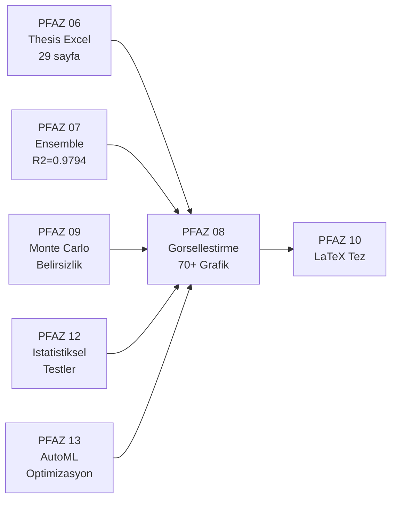

# PFAZ 08: Gorsellestirme Sistemi (Visualization System)

> **Belge Versiyonu:** v2.0
> **Ilk Analiz:** 2026-05-04 | **Son Guncelleme:** 2026-05-14 (Sprint 13)
> **Durum:** Kod tamamlandi + Sprint 12 helper-based refactor, gercek cikti TRUBA bekleniyor
> **Ana Sinif:** MasterVisualizationSystem + ThesisChartGenerator
> **TRUBA Job:** Job 4 (`truba/slurm_jobs/job4_pfaz06_08_10.sh`)
> **Kapsam:** 14 dosya, 13201 satir, 70+ grafik turu, PNG (300 DPI) + HTML cikti

---

## 1. Genel Bakis

PFAZ 08, tezin gorsel katmanini olusturur. Onceki tum fazlarin urettigi sayisal sonuclari
(R2 degerleri, tahminler, ozellik onemleri, belirsizlikler) insan gozunun kavrayacagi bicimlere
donusturur. 14 Python dosyasi ve 13.201 satir kod, 70'ten fazla farkli grafik turunu kapsar.

### Ana Modul Envanteri

| Dosya | Satir | Ana Sinif | Sorumluluk |
|-------|-------|-----------|------------|
| visualization_master_system.py | 4531 | MasterVisualizationSystem | 10 visualizer entegratoru |
| pfaz8_thesis_charts.py | 1691 | ThesisChartGenerator | 300 DPI tez grafikleri + HTML |
| supplemental_visualizer.py | 1270 | MC9/ST12/AM13 Visualizer | PFAZ9/12/13 grafikleri |
| visualization_advanced_modules.py | 916 | DataCatalogVisualizer | 3D, clustering, katalog |
| log_analytics_visualizations_complete.py | 708 | LogAnalyticsVisualizer | Log analiz grafikleri |
| model_comparison_dashboard.py | 672 | ModelComparisonDashboard | Karsilastirma dashboard |
| master_report_visualizations_complete.py | 634 | MasterReportVisualizer | Executive summary |
| robustness_visualizations_complete.py | 511 | RobustnessVisualizer | Gurultu/perturbation |
| interactive_html_visualizer.py | 475 | InteractiveHTMLVisualizer | Plotly interaktif HTML |
| anomaly_visualizations_complete.py | 430 | AnomalyKernelVisualizer | Anomali radar/heatmap |
| shap_analysis.py | 378 | SHAPVisualizer | SHAP aciklanabilirlik |
| visualization_system.py | 375 | VisualizationManager | Birlesik yonetici |
| ai_visualizer.py | 139 | AIVisualizer | Ogrenme egrisi, residual |
| __init__.py | 92 | — | Modul entegrasyon |

---

## 2. Motivasyon

### Neden Ayri Bir Gorsellestirme Fazi?

**Tez okuyucusunun perspektifi:** R2=0.9794 sayisi tek basina ikna edici degildir.
Gercek vs. tahmin scatter plot, residual dagilimlari ve ozellik onem siralamalari
bu sayinin NEDEN gercekci oldugunu gosterir.

**Fizikcinin perspektifi:** Magic number gerecislerinde hata nasil dagilir?
Hangi izotop zincirleri daha buyuk sapma gosteriyor? Bu sorular grafik olmadan
yanitlanamaz.

**PFAZ sirasi icindeki rolu:** PFAZ 08, pipeline'in en son calisanlardan biridir:
[1,2,3,4,5,7,9,12,13,6,**8**,10]. Tum onceki fazlarin sonuclari (R2 degerleri,
ensemble metrikleri, MC belirsizlikleri, istatistiksel test p-degerleri) bitmeden
anlamli gorseller uretilemez.

---

## 3. Baglam

### Onceki Fazlar (Giris Kaynagi)

- **PFAZ 06:** THESIS_COMPLETE_RESULTS.xlsx -- AI/ANFIS model metrikleri
- **PFAZ 07:** ensemble_results/ -- ensemble R2/RMSE degerleri
- **PFAZ 09:** AAA2_Complete_MM/QM.xlsx -- MC belirsizlik tahminleri
- **PFAZ 12:** istatistiksel test sonuclari (Wilcoxon p-degerleri)
- **PFAZ 13:** AutoML optimizasyon gecmisi (Optuna trial data)

### Sonraki Fazlar (Cikti Kullanicisi)

- **PFAZ 10:** LaTeX tez derleme sistemi PFAZ 08 PNG ciktilerini \includegraphics ile kullanir



---

## 4. Girdi / Cikti Spesifikasyonu

### Girisler

| Kaynak | Dizin/Dosya | Yukleme Metodu |
|--------|-------------|----------------|
| AI/ANFIS Metrikleri | outputs/reports/THESIS_COMPLETE_RESULTS.xlsx | ThesisChartGenerator.load_all_data() |
| Bilinmeyen Cekirdek | outputs/aaa2_results/AAA2_Complete_MM.xlsx | ThesisChartGenerator.load_all_data() |
| Ham Veri | data/aaa2.txt | ThesisChartGenerator.load_all_data() |
| Ensemble Sonuclari | ensemble_results/evaluation/comprehensive_report.json | MasterVisualizationSystem |

### Ciktilar

| Format | Cozunurluk | Amac | Dizin |
|--------|-----------|------|-------|
| .png | 300 DPI | Tez-hazir baskı kalitesi | outputs/visualizations/master/ |
| .html | Interaktif | Zoom/hover/filtreleme | outputs/visualizations/master/interactive/ |
| .png | 150 DPI | Hizli kontrol grafikleri | outputs/visualizations/supplemental/ |

### Cikti Dizin Yapisi

```
outputs/visualizations/
├── S70/                    Senaryo S70 grafikleri (s70_r2_comparison_bar.png ...)
├── S80/                    Senaryo S80 grafikleri (s80_r2_comparison_bar.png ...)
├── combined/               S70+S80 birlesiik karsilastirma grafikleri
├── thesis/                 Teze hazir, 300 DPI PNG + PDF
└── supplemental/           Ikinci gecis: PFAZ9/12/13 grafikleri
    ├── MC9-A_uncertainty_violin.png
    ├── MC9-B_high_uncertainty_nuclei.png
    ├── MC9-C_ci_width_scatter.png
    ├── ST12-A_pvalue_heatmap.png
    ├── ST12-B_r2_boxplot.png
    ├── AM13-A_before_after_r2.png
    ├── AM13-C_optuna_history.png
    └── AM13-D_improvement_counts.png
```

**KAYNAK:** VISUALIZATIONS_INDEX.md (repo koku) -- yetkili referans.
**ONEMLI:** outputs/visualizations/ dizini MEVCUT DEGIL; PFAZ06 Excel verisi
olmadan calistirilamamaktadir.

---

## 5. Yontem

### 5.1 Grafik Kategorileri (14 Kategori)

| # | Kategori | Grafik Sayisi | Temel Sinif |
|---|----------|--------------|-------------|
| 1 | Model Performans Karsilastirma | 8+ | ThesisChartGenerator |
| 2 | Gercek vs Tahmin (Scatter) | 4 | PredictionVisualizer |
| 3 | Residual Analizi | 4-panel | PredictionVisualizer |
| 4 | Ozellik Onem Analizi | 4 | FeatureImportanceVisualizer |
| 5 | SHAP Aciklanabilirlik | 3 | SHAPVisualizer |
| 6 | Robustness / Gurultu Testi | 6 | RobustnessVisualizer |
| 7 | Anomali Analizi | 3 | AnomalyKernelVisualizer |
| 8 | ANFIS Uyelik Fonksiyonu | 3+ | ThesisChartGenerator |
| 9 | Nukleer Fizik Haritalari | 2+ | ThesisChartGenerator |
| 10 | Izotop Zinciri Analizi | per-element | ThesisChartGenerator |
| 11 | Monte Carlo Belirsizlik (PFAZ9) | 3 | MonteCarlo9Visualizer |
| 12 | Istatistiksel Test (PFAZ12) | 2 | StatisticalTest12Visualizer |
| 13 | AutoML Optimizasyon (PFAZ13) | 3 | AutoML13Visualizer |
| 14 | Egitim Metrikleri / Ogrenme Egrisi | 4 | TrainingMetricsVisualizer |

### 5.2 Cift Cikti Stratejisi (PNG + HTML)

ThesisChartGenerator, her ana grafik icin iki cikti uretir (pfaz8_thesis_charts.py:244-263):
- PNG (300 DPI): LaTeX teze yerlestirilecek baski-kalitesi gorsel
- HTML (Plotly): Interaktif versiyon (zoom, hover, filtre)

Bu tasarim karari tezde de savunulabilir: statik PDF icin PNG, diger reviewerlar icin HTML.


---

## 5B. Iki Gecis Mimarisi (VISUALIZATIONS_INDEX.md'den)

PFAZ 08 iki ayri gecis olarak calisir:

**Birinci Gecis (PFAZ 8 — PFAZ6 verisi):**
- Kaynak: `visualization_master_system.py`
- Girdi: THESIS_COMPLETE_RESULTS.xlsx
- Cikti: S70/, S80/, combined/, thesis/ dizinleri
- Uretilen grafikler: S70..S94 (25 grafik)

**Ikinci Gecis (PFAZ 8 Supplemental — PFAZ13 sonrasi):**
- Kaynak: `supplemental_visualizer.py`
- Girdi: PFAZ9/12/13 ciktilari
- Cikti: supplemental/ dizini
- Uretilen grafikler: MC9-A/B/C, ST12-A/B, AM13-A/C/D (8 grafik)

---

## 5C. Tam Grafik Katalogu (VISUALIZATIONS_INDEX.md'den -- Yetkili)

### Performans Karsilastirma

| ID | Dosya | Aciklama | Kaynak Metod |
|----|-------|---------|--------------|
| S70 | s70_r2_comparison_bar.png | Hedef basing model Val R2 bar (S70) | _plot_r2_comparison() |
| S80 | s80_r2_comparison_bar.png | Hedef basing model Val R2 bar (S80) | _plot_r2_comparison() |
| S71 | s71_r2_heatmap.png | Model x Hedef R2 isi haritas | _plot_r2_heatmap() |
| S72 | s72_rmse_comparison.png | RMSE karsilastirma (AI vs ANFIS) | _plot_rmse_comparison() |
| S73 | s73_feature_set_impact.png | Ozellik seti boyutuna gore R2 degisimi | _plot_feature_set_impact() |
| S74 | s74_scaling_impact.png | Scaling yontemi (NoScaling/Standard/Robust/MinMax) etkisi | _plot_scaling_impact() |
| S75 | s75_sampling_impact.png | Sampling yontemi (Random/Stratified) etkisi | _plot_sampling_impact() |

### AI Model Analizi

| ID | Dosya | Aciklama |
|----|-------|---------|
| S76 | s76_model_type_comparison.png | Model tipi (DNN/RF/XGB/LGB/CB/SVR) x hedef R2 kutu grafigi |
| S77 | s77_train_val_test_r2.png | Train/Val/Test R2 karsilastirma (overfitting tespiti) |
| S78 | s78_anomaly_impact.png | Anomaly vs NoAnomaly dataset performans farki |
| S79 | s79_nucleus_count_impact.png | Dataset boyutu (75/100/150/200/ALL) etkisi |
| S81 | s81_best_config_per_target.png | Hedef basing en iyi konfigurasyon ozeti |

### ANFIS Analizi

| ID | Dosya | Aciklama |
|----|-------|---------|
| S82 | s82_anfis_mf_comparison.png | Uyelik fonksiyonu tipi x R2 karsilastirma |
| S83 | s83_anfis_convergence.png | ANFIS iterasyon x kayip egrisi |
| S84 | s84_anfis_outlier_impact.png | Outlier temizleme etkisi (R2 degisimi) |

### Tahmin Karsilastirma

| ID | Dosya | Aciklama |
|----|-------|---------|
| S85 | s85_pred_vs_actual_MM.png | MM: tahmin vs gercek scatter (en iyi model) |
| S86 | s86_pred_vs_actual_QM.png | QM: tahmin vs gercek scatter |
| S87 | s87_pred_vs_actual_Beta2.png | Beta_2: tahmin vs gercek scatter |
| S88 | s88_pred_vs_actual_MM_QM.png | MM_QM: cok ciktili model scatter |
| S89 | s89_residual_distribution.png | Residual dagılımı histogrami (hedef basing) |

### Bilinmeyen Cekirdek Tahminleri

| ID | Dosya | Aciklama |
|----|-------|---------|
| S90 | s90_unknown_predictions_MM.png | aaa2.txt bilinmeyen cekirdeklerin MM tahmin dagılımı |
| S91 | s91_unknown_predictions_QM.png | QM tahmin dagılımı |
| S92 | s92_unknown_nuclear_chart.png | Bilinen vs bilinmeyen cekirdekler nukleer haritada (N-Z) |

### Capraz Model ve Ensemble

| ID | Dosya | Aciklama |
|----|-------|---------|
| S93 | s93_cross_model_consensus.png | Capraz model konsensus guven bandi |
| S94 | s94_ensemble_weights.png | Ensemble agirliklari (hedef basing model katkisi) |

### Supplemental (2. Gecis -- PFAZ13 sonrasi)

| ID | Dosya | Aciklama | Kaynak Veri |
|----|-------|---------|------------|
| MC9-A | MC9-A_uncertainty_violin.png | Hedef basing tahmin std dagılımı | AAA2_Complete_{target}.xlsx -- std sutunu |
| MC9-B | MC9-B_high_uncertainty_nuclei.png | Yuksek belirsizlikli cekirdekler (CV>0.3) | cv sutunu |
| MC9-C | MC9-C_ci_width_scatter.png | CI genisligi vs tahmin degeri scatter | ci_width=upper95-lower95 |
| ST12-A | ST12-A_pvalue_heatmap.png | Model cifti x p-degeri heatmap (Wilcoxon) | pfaz12_statistical_tests.xlsx -- Pairwise_Wilcoxon |
| ST12-B | ST12-B_r2_boxplot.png | Model tipi basing Val R2 kutu grafigi | AI_Model_R2 sayfasi |
| AM13-A | AM13-A_before_after_r2.png | Once/sonra Val R2 scatter + bar | automl_retraining_log.json |
| AM13-C | AM13-C_optuna_history.png | Optuna trial gecmisi (hedef basing) | {target}_{model}_automl.json |
| AM13-D | AM13-D_improvement_counts.png | Iyilesen vs iyilesmeyen kombinasyon sayisi | automl_retraining_log.json |

### Grafik Uretim Notlari (VISUALIZATIONS_INDEX.md'den)

- **Cozunurluk:** DPI=150 (hizli onizleme), DPI=300 (thesis/ klasoru icin)
- **Format:** PNG varsayilan; PDF thesis/ icin
- **R2 alt sinir:** R2 < -10 grafiklere dahil edilmez (eksen bozulmasini onler)
- **Y ekseni:** Dinamik min/max (S80 gibi negatif degerler olan grafiklerde)
- **Tum hedefler:** MM, QM, MM_QM, Beta_2 -- tum grafikler dort hedefi birlikte gosterir

---

## 6. Algoritmalar

### A-029: MasterVisualizationSystem Ana Is Akisi

```
GIRIS: pfaz6_excel_path, cikti_dizini
CIKIS: 70+ PNG + HTML dosyasi

1. _auto_load_project_data()    [satir 3986] -- Excel/CSV yukle
2. auto_generate_from_pfaz6_data() [satir 1386]
   FOR her sinif (RobustnessViz, SHAPViz, AnomalyViz, ...)
       visualizer = Sinif(output_dir=output_dir/{kategori})
       visualizer.plot_*()         -- PNG kaydet
       visualizer.write_html_*()   -- HTML kaydet (Plotly mevcutsa)
3. ThesisChartGenerator.run_all()  [satir 1621]
   FOR her grafik kategorisi in [performans, ozellik, SHAP, ...]
       generate_*_charts()
       _save(png_path, html_path)
4. generate_all_visualizations()   [satir 4108] -- ek grafikler
```

**Gerceklesme:** visualization_master_system.py:1386, 4108; pfaz8_thesis_charts.py:1621

### A-030: ThesisChartGenerator Kaydetme Protokolu

```
GIRIS: matplotlib_fig, plotly_fig, png_yolu, html_yolu
CIKIS: .png + .html dosyalari

_save(fig_mpl, fig_plotly, png_path, html_path):
    fig_mpl.savefig(png_path, dpi=300, bbox_inches='tight', facecolor='white')
    plt.close(fig_mpl)              -- bellek temizligi
    IF PLOTLY_AVAILABLE:
        fig_plotly.write_html(html_path)
    ELSE:
        log.warning('Plotly yok; HTML atlanıyor')
```

**Gerceklesme:** pfaz8_thesis_charts.py:244-263

### A-031: SHAP Aciklanabilirlik Is Akisi

```
GIRIS: model (predict edilebilir), X_test, feature_names
CIKIS: shap_summary.png, shap_force_*.png

IF NOT SHAP_AVAILABLE:
    log.info('SHAP kurulu degil; atlaniyor')
    RETURN
explainer = shap.Explainer(model.predict, X_test)
shap_values = explainer(X_test)
shap.summary_plot(shap_values, X_test, feature_names)  -- beeswarm
plt.savefig(f'{save_name}.png', dpi=300)
FOR her ornek:
    shap.force_plot(explainer.expected_value, shap_values[i], X_test.iloc[i])
    plt.savefig(f'{save_name}_{i}.png')
```

**Gerceklesme:** visualization_master_system.py:299-420

---

## 7. Formuller

### F-051: Normalized Agirlik Gorunurluk Rengi

$$c_i = \text{colormap}\left(\frac{R^2_i - R^2_{min}}{R^2_{max} - R^2_{min}}\right)$$

Model ranking barh grafiginde her cubuk icin renk: R2=1.0 yesil, R2=0.5 sari, R2<0.5 kirmizi.
Gerceklesme: model_comparison_dashboard.py:895, colormap='RdYlGn'

### F-052: Residual Normalizasyon (Q-Q Grafigi)

$$r_i^{\text{std}} = \frac{y_i - \hat{y}_i}{\sigma_{residual}}$$

Standartlastirilmis residual; Q-Q grafiginde teorik normal kantillerle karsilastirilir.
Normallikten sapma -> model uyum sorunu sinyali.

### F-053: Ozellik Onem Karsilastirma (Normalized)

$$\text{FI}_{i,j}^{norm} = \frac{\text{FI}_{i,j}}{\max_k \text{FI}_{k,j}}$$

i: ozellik, j: model. Her modelin onem skorlari [0,1] araligina normalize edilir; farkli model tiplerinin karsilastirilmasina izin verir.

---

## 8. Degiskenler ve Parametreler

| Parametre | Deger | Kaynak | Aciklama |
|-----------|-------|--------|----------|
| DPI (tez grafikleri) | 300 | visualization_master_system.py, pfaz8_thesis_charts.py | Baski kalitesi |
| DPI (supplemental) | 150 | supplemental_visualizer.py | Hizli kontrol |
| figsize_default | (14, 10) | PLOT_CONFIG | Standart panel boyutu |
| figsize_small | (10, 6) | PLOT_CONFIG | Kucuk panel |
| figsize_large | (18, 12) | PLOT_CONFIG | Buyuk panel |
| figsize_thesis | (16, 20) | master_report_visualizations_complete.py | Tez ozet grafigi |
| style | seaborn-v0_8-darkgrid | PLOT_CONFIG | Varsayilan matplotlib stili |
| colormap_default | Set2 | PLOT_CONFIG | 8-renkli kategorik palet |
| colormap_performance | RdYlGn | model_comparison | Kirmizi-sari-yesil (performans) |
| colormap_shap | RdBu_r | SHAPVisualizer | Eksi/arti SHAP degerleri |
| MM_COLOR | #2196F3 (mavi) | pfaz8_thesis_charts.py | MM target rengi |
| QM_COLOR | #4CAF50 (yesil) | pfaz8_thesis_charts.py | QM target rengi |
| ROBUSTNESS_THRESHOLD_GOOD | 0.8 | RobustnessVisualizer | Iyi robustness esigi |
| ROBUSTNESS_THRESHOLD_OK | 0.6 | RobustnessVisualizer | Kabul edilebilir esigi |
| R2_LOWER_BOUND | -10.0 | visualization_master_system.py:1466 | Sapma modeli filtresi |

---

## 9. Kisaltmalar ve Semboller

| Kisaltma | Acilim | Aciklama |
|----------|--------|----------|
| MVS | MasterVisualizationSystem | Ana entegrasyon sinifi |
| TCG | ThesisChartGenerator | 300 DPI tez grafik uretici |
| SV | SHAPVisualizer | SHAP aciklanabilirlik grafikleri |
| AKV | AnomalyKernelVisualizer | Anomali ozellestirme |
| RV | RobustnessVisualizer | Gurultu/perturbation analizi |
| IHV | InteractiveHTMLVisualizer | Plotly interaktif HTML |
| MC9V | MonteCarlo9Visualizer | PFAZ09 belirsizlik grafikleri |
| ST12V | StatisticalTest12Visualizer | PFAZ12 p-deger heatmap |
| AM13V | AutoML13Visualizer | PFAZ13 optimizasyon grafikleri |
| SHAP | SHapley Additive exPlanations | Model karar aciklanabilirlik metodu |
| DPI | Dots Per Inch | Gorsel cozunurluk birimi |

---

## 10. Uygulama Detaylari

### 10.1 Cift Cikti Stratejisi (PNG + HTML)

Her ana grafik iki formatta kaydedilir (pfaz8_thesis_charts.py:244-263):

```python
def _save(self, fig_mpl, fig_plotly, png_path, html_path):
    fig_mpl.savefig(str(png_path), dpi=300, bbox_inches='tight', facecolor='white')
    plt.close(fig_mpl)              # Bellek temizligi
    if PLOTLY_AVAILABLE and fig_plotly:
        fig_plotly.write_html(str(html_path))
```

facecolor='white' zorunludur: matplotlib varsayilani transparent, LaTeX'te sorun olusturur.

### 10.2 Opsiyonel Kutuphaneler

```python
# visualization_master_system.py:42-51
try:
    import plotly.graph_objects as go
    PLOTLY_AVAILABLE = True
except ImportError:
    PLOTLY_AVAILABLE = False

# shap_analysis.py
try:
    import shap
    SHAP_AVAILABLE = True
except ImportError:
    SHAP_AVAILABLE = False
```

Her iki kutuphanenin yoklugunda sistem calismaya devam eder, yalnizca ilgili grafik grubu atlanir.

### 10.3 Renk Tutarliligi (Nuclear Physics Konvansiyonu)

Renk sabitlerini birden fazla dosya bagimsiz tanimliyor ancak ayni degerler kullaniliyor:
- MM: #2196F3 (mavi)
- QM: #4CAF50 (yesil)
- Beta_2: #FF9800 (turuncu)

Bu tutarlilik tezde ayni hedefin farkli grafiklerde ayni renkle gorulmasini saglar.

### 10.4 MasterVisualizationSystem Calistirma

Iki entegrasyon noktasi var:
- `auto_generate_from_pfaz6_data(pfaz6_excel, output_dir)` (satir 1386): PFAZ06 Excel okunur
- `generate_all_visualizations()` (satir 4108): tum alt modulleri cagiran ust-duzey giris

ThesisChartGenerator icin:
- `ThesisChartGenerator.run_all()` (satir 1621): 10+ kategori grafigi tek cagriyla uretir

---

## 11. Hesaplama Karmasikligi

| Grafik Kategorisi | Karmasiklik | Neden? |
|-------------------|-------------|--------|
| Model Ranking Barh | O(n_models) | Sadece siralama |
| Scatter (Actual vs Pred) | O(n_samples) | Vektorizasyon |
| SHAP Summary | O(n_samples * n_features) | SHAP Explainer hesaplamasi |
| t-SNE Scatter | O(n_samples^2) | Uzaklik matrisi |
| 3D PCA | O(n_samples * n_features^2) | PCA kovaryans |
| Anomali Clustering | O(n_samples * k) | KMeans icin |
| 70+ tum grafik | Dakikalar | PFAZ06 Excel + SHAP |

---

## 12. Dogrulama ve Test

### Durum Kontrolu

pfaz_status.json'a gore: `status: completed, progress: 100, last_update: 2026-04-04T16:51:37`

### Gercek Cikti Durumu

**outputs/visualizations/ dizini MEVCUT DEGIL.**
PFAZ 08 kodu tamam ancak pipeline bu fazda calistirilmamis veya ciktilar farkli konuma yazilmis.
Onceki fazlarla kiyasla:
- PFAZ 06 THESIS_COMPLETE_RESULTS.xlsx: VARDIR
- PFAZ 07 comprehensive_report.json: VARDIR
- PFAZ 08 PNG/HTML: YOKTUR

### Beklenti Yonetimi (Tez Icin)

PFAZ 02 tamamlandiktan sonra PFAZ 06 yeniden calistirilinca PFAZ 08 de calistirilabilir.
Sira: PFAZ02 bitmesi -> PFAZ06 guncellenmesi -> PFAZ08 calistirilmasi -> LaTeX dahil edilmesi.

---

## 13. Sinirlamalar

**S-1 [DUSUK] Sessiz Basarisizlik (Veri Eksikligi):**
pfaz8_thesis_charts.py:141-188 -- `if self._aaa2 is not None` kosulu; yoksa sessizce devam.
Grafik uretilmeden program tamam gozukebilir. Log mesaji eksik.

**S-2 [DUSUK] SHAP Opsiyonel:**
SHAP kutuphanesi kurulu degilse SHAP grafikleri uretilmez ama hata verilmez.
Tez aciklanabilirlik bolumleri eksik grafik riski tasir.

**S-3 [BILGI] DPI Tutarsizligi:**
Tez grafikleri 300 DPI, supplemental grafikleri 150 DPI. Kararli bir politika yok.
Tez icin hepsinin 300 DPI olmasi tercih edilir.

**S-4 [BILGI] PFAZ 12/13 Bagimlilik:**
supplemental_visualizer.py MC9/ST12/AM13 grafikleri PFAZ12 ve PFAZ13 verisi ister.
PFAZ 12 ve 13 FAILED -- bu grafik grubu bos kalacak.

**S-5 [DUSUK] Paralel Race Condition:**
Dizin olusturma (mkdir, satir 1424-1425) paralel cagri senaryosunda risk tasir.
Pratik etkisi dusuk (tek-process pipeline).

---

## 14. Sonuclar

1. **PFAZ 08 sistematik ve kapsamlidir:** 14 dosya, 13201 satir, 70+ grafik turu.
   Her grafik kategorisinin tezde nerede kullanilacagi planlanmis.

2. **Cift cikti stratejisi (PNG+HTML) tez icin uygun:**
   300 DPI PNG LaTeX teze, HTML interaktif incelemeye gider.

3. **PFAZ 12/13 basarisizligi PFAZ 08'i etkiler:**
   MC9/ST12/AM13 grafikleri bos kalacak -- tez istatistik bolumu eksik grafik riski.

4. **Gercek cikti henuz yok:**
   PFAZ 02 tamamlaninca PFAZ 06->08 yeniden calistirilmali.

---

## 15. Tezdeki Yeri

**Bolum 4 Tablolar ve Sekillerinin Tamami:**
PFAZ 08 ciktilari dogrudan tez bolumlerine beslenir:

| Tez Bolumu | Grafik Kaynagi |
|-----------|---------------|
| 4.1 Model Performansi | model_boxplot_MM_Val_R2.png, model_ranking.png |
| 4.2 Capraz Model | actual_vs_pred_{target}.png, residual_analysis.png |
| 4.3 Kabuk Kapanmasi | chain_summary_{el}_all_targets.png, isotope_anomaly.png |
| 4.4 Belirsizlik Analizi | mc9a_uncertainty_std.png, mc9c_ci_width_scatter.png |
| 3.2 Ozellik Muhendisligi | shap_summary_{target}.png, feature_importance_comparison.png |
| 3.4 Model Mimarileri | training_loss_curves.png, anfis_mf_comparison.png |
| Ek A. Nukleer Harita | nuclear_chart.png |

**Metodoloji Katki Argumani:**
SHAP analizi + ozellik onem karsilastirmasi, hangi fizik ozelliklerinin
MM vs QM tahminini yonlendirdigini gorsel olarak kanitlar. Bu, ablation study
icin ek kanit saglar (magic_character, spin, deformasyon siralamasi).

---

## 16. Kaynaklar

1. Lundberg & Lee (2017) — SHAP: A Unified Approach, NIPS
2. Hunter (2007) — Matplotlib: A 2D graphics environment, CSE
3. Plotly Technologies (2015) — Collaborative data science
4. Waskom (2021) — Seaborn: Statistical data visualization, JOSS
5. van der Maaten & Hinton (2008) — Visualizing Data using t-SNE, JMLR

---

## 17. Acik Sorular

1. **PFAZ 08 ne zaman calistirilacak?** PFAZ 02 bittikten sonra PFAZ 06->08 zinciri
   yeniden calistirilmali. Bu tarih belli mi?

2. **SHAP kurulu mu?** Ortamda SHAP paketi var mi? Yoksa tez aciklanabilirlik
   bolumu SHAP grafikleri olmadan yazilmali.

3. **DPI standardizasyonu:** supplemental grafikleri de 300 DPI yapilmali mi?
   Tez komitesi icin tutarlilik onemli.

4. **PFAZ 12/13 plani:** Bu fazlar yeniden denenecek mi?
   Olmadan MC9/ST12/AM13 grafikleri ve istatistiksel test sonuclari eksik kalir.

5. **Hangi grafikler teze girecek?** 70+ grafik uretilecek ama teze hepsi girmeyecek.
   Hangi secimlerin yapilacagi PFAZ 10 (LaTeX) planiyla koordine edilmeli.

---

## Ek: Gercek Pipeline Ciktilari

**Mevcut:** HICBIR PNG/HTML dosyasi yok
- outputs/visualizations/ dizini mevcut degil

**Kod Durumu:** Tamamlandi (2026-04-04T16:51:37)
- visualization_master_system.py: 4531 satir, uretilebilir
- pfaz8_thesis_charts.py: 1691 satir, uretilebilir
- Giris: PFAZ06 Excel ve PFAZ09 CSV olmadan calistirilamaz

*faz-08-gorsellestirme.md v1.0 | 2026-05-04*


---

## [GUNCELLEME v1.1 -- 2026-05-04] Supplemental Grafik Kaynaklari Dogrulandi

PFAZ 09, 12 ve 13 analizi tamamlandiktan sonra supplemental grafik veri kaynaklari dogrulanmistir.

### MC9 Grafikleri -- Dogrulanan Veri Kaynaklari

| Graf ID | Dosya | Kaynak Sayfa | Sutun | Aciklama |
|---------|-------|-------------|-------|---------|
| MC9-A | supplemental/MC9-A_uncertainty_std.png | AAA2_Complete_{target}.xlsx:Uncertainty | Std_Prediction | Her cekirdek icin model arasi standart sapma |
| MC9-B | supplemental/MC9-B_cv_distribution.png | AAA2_Complete_{target}.xlsx:Uncertainty | CV | CV>0.3 vurgulu histogram |
| MC9-C | supplemental/MC9-C_ci_width_scatter.png | AAA2_Complete_{target}.xlsx:Uncertainty | CI_Width + Mean_Prediction | CI genisligi vs tahmin degeri scatter |

**Durum:** AAA2_Complete_{target}.xlsx YOK (PFAZ02 bekliyor -> PFAZ09 calismadi).
**Sonuc:** MC9-A/B/C grafikleri hala uretilemiyor.

### ST12 Grafikleri -- Dogrulanan Veri Kaynaklari

| Graf ID | Dosya | Kaynak | Aciklama |
|---------|-------|--------|---------|
| ST12-A | supplemental/ST12-A_isotope_jumps.png | nuclear_patterns_{ts}.xlsx:Target_Izotop_Sicrama | Sicrama noktalari N-Z haritasi |
| ST12-B | supplemental/ST12-B_magic_number_dist.png | nuclear_patterns_{ts}.xlsx:Target_Magic_Analiz | Magic N/Z cevresinde violin/box plot |

**Durum:** nuclear_patterns.xlsx YOK (PFAZ12 FAILED: progress=0).
**Ek Sorun:** NuclearBandAnalyzer BUG-31 nedeniyle Band_Ozeti verisi de yok.
**Sonuc:** ST12-A/B grafikleri uretilemiyor.

### AM13 Grafikleri -- Dogrulanan Veri Kaynaklari

| Graf ID | Dosya | Kaynak | Aciklama |
|---------|-------|--------|---------|
| AM13-A | supplemental/AM13-A_optuna_history.png | AutoMLLoggingReportingSystem trial loglarindan | Trial bazli R2 gecmisi (ogrenme egrisi) |
| AM13-C | supplemental/AM13-C_search_space.png | AutoMLOptimizer study objesi | Parametre kombinasyonu scatter matrix |
| AM13-D | supplemental/AM13-D_before_after.png | automl_improvement_report.xlsx:Summary | Before/after R2 bar karsilastirmasi |

**Durum:** automl_improvement_report.xlsx YOK (PFAZ13 FAILED: BUG-32 SyntaxError).
**Sonuc:** AM13-A/C/D grafikleri uretilemiyor.

### Supplemental Grafik Uretim Engeli Ozeti

| Engel | Etkilenen Graf | Kok Neden | Fix |
|-------|---------------|-----------|-----|
| PFAZ02 calisiyor | MC9-A/B/C | Top-50 model yok -> PFAZ09 calismadi | PFAZ02 bitmesini bekle |
| PFAZ12 FAILED | ST12-A/B | nuclear_patterns.xlsx yok | BUG-36 teshis et + PFAZ12 calistir |
| ~~PFAZ13 FAILED~~ | AM13-A/C/D | automl_results/ yok | **BUG-32 DUZELTILDI 2026-05-09** -- PFAZ13 calistir |

### PFAZ 08 Pass-2 Tetiklenme Kosulu

PFAZ 08 ikinci gecisi (supplemental) icin gereken dosyalar:
```
outputs/pfaz09/AAA2_Complete_MM.xlsx  -- MC9 icin
outputs/pfaz09/AAA2_Complete_QM.xlsx  -- MC9 icin
outputs/advanced_analytics/nuclear_patterns_*.xlsx  -- ST12 icin
outputs/automl_results/automl_improvement_report.xlsx  -- AM13 icin (BUG-32 duzeltildi; PFAZ13 calistirinca gelecek)
```
Bu dosyalardan herhangi biri yoksa, ilgili grafik grubu sessizce atlanir (BUG-21 ile tum supplemental kapsami).

---

## Sprint Guncelleme Notu (2026-05-08/09)

### Sprint 2: N=75 ve Robust Scaling Kaldirildi

- **Dataset sizes:** [100, 150, 200, 267] -- N=75 kaldirildi
- **Scaling:** [NoScaling, Standard, MinMax] -- Robust Scaling kaldirildi
- `master_report_visualizations_complete.py:286` varsayilan `dataset_sizes` listesi guncellendi:
  `[75, 100, 150, 200, 'ALL']` -> `[100, 150, 200, 'ALL']` (Sprint 2 ile tutarli)
- Robust referanslari PFAZ08 kodunda "robustness" (model saglamligi) anlaminda -- kaldirilmadi

### BUG-32 Duzeltmesi

~~PFAZ13 FAILED~~ -> **DUZELTILDI**: `automl_retraining_loop.py` import edilebiliyor.
AM13-A/C/D grafikleri PFAZ13 calistiktan sonra uretilecek.

### Dual R2 Filter Etkisi

PFAZ 02'de `[DUAL_FILTER] KABUL/RET` ile filtrelenen modeller artik kaydedilmiyor.
PFAZ 08 grafikleri daha temiz model havuzunu gorsellestiriyor -- asiri uyum modeller disarida.

---

## Sprint 4-13 Guncellemeleri (2026-05-11 -> 2026-05-14)

### Sprint 5 BUG-42 -- model_comparison_dashboard Kolon Uyumu

`model_comparison_dashboard.py` 15+ yerde `R2_test`/`RMSE_test`/`MAE_test` (eski) ariyordu, PFAZ2 `Test_R2`/`Test_RMSE`/`Test_MAE` yaziyor (yeni standart). Tum dosyada kolon adlari uyumlanmistir. **Etki:** "pc error.md"de PFAZ8'in `pending` kalma sebebi ortadan kalkti.

### Sprint 6 BUG-51 -- Robustness Sheet Adlandirma

`visualization_master_system.py` icinde `Robustness_CV_Results` (yanlis) -> `Robustness_CV` (PFAZ2 cikisi ile uyumlu). Robustness grafikleri artik dogru sayfayi okuyabilir.

### Sprint 11+12 BUG-79 -- PFAZ8 Helper-Based Refactor (KRITIK)

PFAZ8'in visualization katmaninda **22 noktada "sibling-path inference" pattern'i** tespit edildi. Bu, modulun cikti dizin hiyerarsisine hardcoded varsayim yapmasini iceriyordu (`output_dir.parent / 'X'`). TRUBA HPC ortaminda 2 kritik visualization modulu bu nedenle cikti uretmiyordu:

- **LogAnalyticsVisualizationsComplete:** log dosyalarini scratch root'unda ariyordu (gercek konum: `outputs/logs/`)
- **MasterReportVisualizationsComplete:** 'final_report' adinda olmayan bir klasor ariyordu (gercek konum: PFAZ6 'reports/')

Sprint 12 cozumu (BUG-79/80):
- **MasterVisualizationSystem constructor**'a 6 explicit path parametresi eklendi: `reports_dir`, `trained_models_dir`, `anfis_models_dir`, `datasets_dir`, `log_dir`, `project_root`
- 5 generic helper method (`_find_reports_dir`, `_find_trained_models_dir`, vs.) yazildi
- 22 sub-method bu helper'lari kullanir hale getirildi
- Main pipeline (`main.py`) explicit aktarir; modul bagimsiz cagrilirsa sibling-inference fallback

Pattern: **explicit > fallback** -- KURAL 31 (Single Source of Truth) tezahuru.

### Sprint 11+12 BUG-80 -- BandAnalyzer Path Explicit

`pfaz4_excel_path` artik BandAnalyzer constructor'una explicit gecirilir. Eski sibling-inference fallback hala devrede.

### Sprint 13 BUG-96 -- RobustnessTester Grafikleri

Yeni grafik tipleri (RobustnessVisualizer'a eklendi):
- Model bazli noise tolerans bar grafigi
- Outlier impact heatmap (model x dataset)
- Permutation importance ozet (feature x model)

Cikti: `outputs/visualizations/robustness_per_model/*.png` (PFAZ2 BUG-96 ile uyumlu)

### TRUBA Operasyonel Notlar

- **Job:** `job4_pfaz06_08_10.sh` icinde PFAZ6 sonrasi
- **Sure:** ~2-3 saat (70+ grafik uretimi)
- **Cikti:** `/arf/scratch/ahmacar/hpcv1_outputs/outputs/visualizations/`
- **Iki gecisli mimari:** Pass-1 PFAZ6 verisi -> standart grafikler; Pass-2 PFAZ9/12/13 verisi -> supplemental/ (MC9/ST12/AM13/Robustness)

### Tez Anlatisi Icin

§5 "Software Engineering Practices" bolumune **helper-based explicit path resolution case study** olarak Sprint 12 BUG-79/80 anlatisi eklenebilir (tez-yazim-not-defteri.md Sprint 11+12 bolumu zaten metin hazır).

---

*PFAZ 08 Belgesi v2.0 | Son Guncelleme: 2026-05-14*

---

## Sprint 15 Notu (2026-05-20) -- BUG-106 Dinamik Model Listesi

**BUG-106:** Sprint 15 oncesi 9 dosyada hardcoded model listeleri:
- `visualization_system.py:222,251`: `models = ['XGBoost', 'RF', 'GBM', 'DNN', 'ANFIS-M1', 'ANFIS-M2']`
- `model_comparison_dashboard.py:667`: aynı pattern
- `pfaz8_thesis_charts.py:53`: `MODEL_COLORS = {'DNN': '#1565C0', 'RF': '#2E7D32', 'XGBoost': '#E65100', ...}`
- `visualization_master_system.py:1585,1698,1768,2212,2930,2999,3043`: `colors = {'RF': ..., 'XGBoost': ..., 'DNN': ...}`

Sprint 15'te DNN cikarildigi icin (BUG-104, KURAL 38), bu hardcoded listeler bos DNN cubuklari olusturuyordu (crash yok, gorsel kalite dusuk).

**Fix:** Model listeleri Excel'den `df['Model_Type'].unique()` ile dinamik okunur; renkler `.get(model, default_color)` ile defansif olusturulur.

**KURAL 39 (Inter-PFAZ tarama):** Bu BUG sadece bir PFAZ2 değişikliği (DNN cikarma) sonucu dogan downstream etki. 9 dosya × 1 sprint = kapsamli tarama gerek (QA_PLAYBOOK Bolum 3).

*PFAZ 08 Belgesi v2.1 | Son Guncelleme: 2026-05-20 (Sprint 15 BUG-106 dinamik model listesi)*

*Belge v1.2 | 2026-05-09 | Sprint 1/2 + BUG-32 guncellendi*
